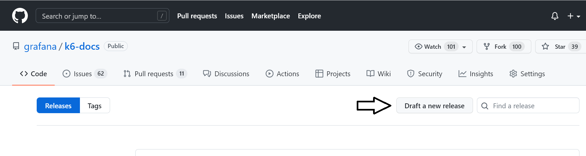
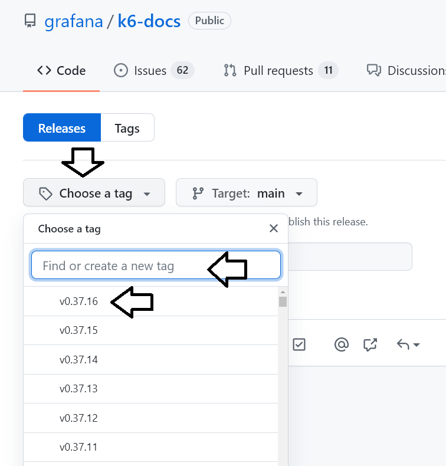

# Contributor's guide

When you contribute to the docs, it helps to know how things work.

<!-- markdown-toc start - Don't edit this section. Run M-x markdown-toc-refresh-toc -->
**Table of Contents**

- [Important directories](#important-directories)
- [Build locally](#build-locally)
    - [Necessary software](#necessary-software)
    - [Build procedure](#build-procedure)
- [Write](#write)
    - [Style Guides](#style-guides)
    - [Gatsby components](#gatsby-components)
    - [Troubleshooting](#troubleshooting)
- [Deploy](#deploy)
    - [Upgrade a main release](#upgrade-a-main-release)

<!-- markdown-toc end -->


## Important directories

For writers, these are the most important directories:
- [`src/data/markdown`](../src/data/markdown) is where the docs live
  - `translated-guides` has the principle OSS docs
- [`gatsby-node.js`](../gatsby-node.js) is where URI redirects are programmed.
- [`src/templates/docs`](../src/templates/docs)  has the "landing pages" for major docs sections: cloud, guides, examples, et cetera.
- [`src/components/shared`](../src/components/shared) has the reusable writing enhancements, like our stylish `<blockquote>`

## Build locally

For any substantial changes, a local, live preview hugely improves writer comfort, which translates to better doc quality.

### Necessary software

If you don't want to build with Docker (refer to repo README), you'll need the following
- [NodeJS](https://nodejs.org/en/download/), version 16.0.0 or higher
- A node version manager like [`nvm`](https://github.com/nvm-sh/nvm#installing-and-updating) or `fnm`
- `npm` or `yarn`

### Build procedure

To build locally:

1. Clone the project.

  ```bash
  git clone git@github.com:grafana/k6-docs.git
  cd k6-docs
  ```

2. Use the version manager to install a version of node compatible with the version in `package.json`.

 ```bash
  nvm install 16.16
  nvm use 16.16
  ```

3. Install dependencies (only necessary the first time).

  ```bash
  npm install  # or yarn install
  ```

4. Run the docs locally.

  ```bash
  npm start  # or yarn start
  ```

If everything works, a live preview should be serving on http://localhost:8000.
Things don't always work, though. The [Troubleshooting](./troubleshooting) section covers some common breaks.

## Write

Each Markdown page should start with the following frontmatter.

```yaml
---
title: <page title>
excerpt: <summary text for social shares. Aim for 170 characters>.
---
```

### Style guides

- k6 follows the style prescribed in the [Grafana Writers' Toolkit](https://grafana.com/docs/writers-toolkit/), which itself inherits most of its rules from the [Google developer documentation style guide](https://developers.google.com/style).


### Gatsby components

- To organize your pages on the site, Gatsby has a specific way to make paths and organize topics.
We've also added a number of writing enhancements, like nested tables, tabbed code fences, and collapsible sections. For all syntax and components you can use, checkout the [Contributor's reference](./gatsby-reference.md). 

### Troubleshooting

- [Troubleshooting](troubleshooting.md) has fixes for common breaks.

## Deploy

GitHub actions build previews of the site in multiple stages:

1. Each PR to main gets a build preview at `https://mdr-ci.staging.k6.io/docs/refs/pull/<PR-NUMBER>/merge`. With every commit to the PR branch, the preview updates.
1. The main branch deploys to `staging.k6.io`
1. **After the repo release number is upgraded, the main branch deploys to `k6.io`**


### Upgrade a main release

>  #### ⚠️ Versions
>
> Versions follow the same major and minor numbers as github.com/grafana/k6. When cutting a new release of the docs between k6 releases, only increment the patch digits.

Before you upgrade versions, it's a good idea to give the updated docs a final look at `https://staging.k6.io`
**Especially check that redirects work and components render correctly!**

Unless k6 OSS has a version upgrade, increment the version by 0.0.1. For example, `0.43.1` → `0.43.2`
As the UI might change, refer to the GitHub [Managing releases](https://docs.github.com/en/repositories/releasing-projects-on-github/managing-releases-in-a-repository) doc for the canonical instructions.

Each release has a tag, which you can create either through the Github CLI or from https://github.com/grafana/k6-docs/releases.
To upgrade through the UI:

1. From the releases page, select **Draft a new Release**.


1. In the next screen, select **Choose a tag**, type a version number increasing the one below (in image, it  should be v0.37.17).


1. For a small release (fixing a typo or broken link), you can manually add a short description. Otherwise, select **Generate release notes** to automatically include more information about what's changed, and then select **Publish release**.
