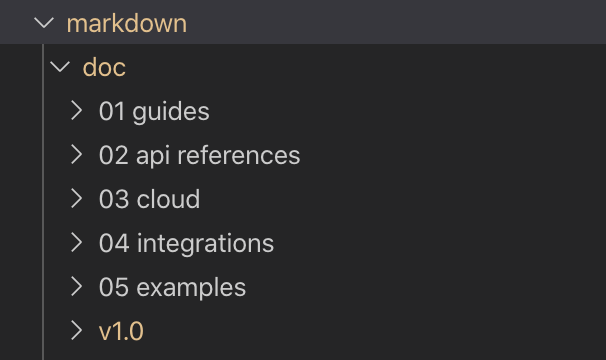
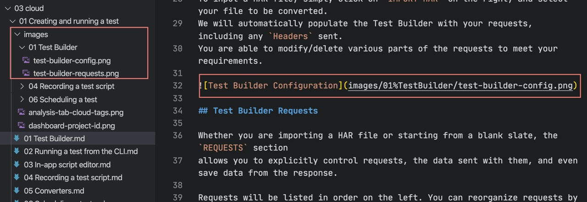
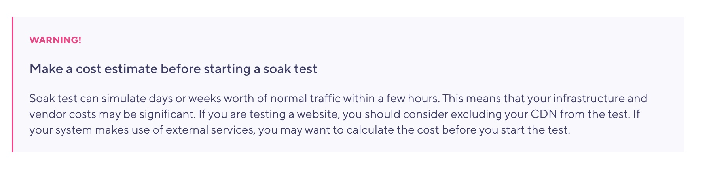
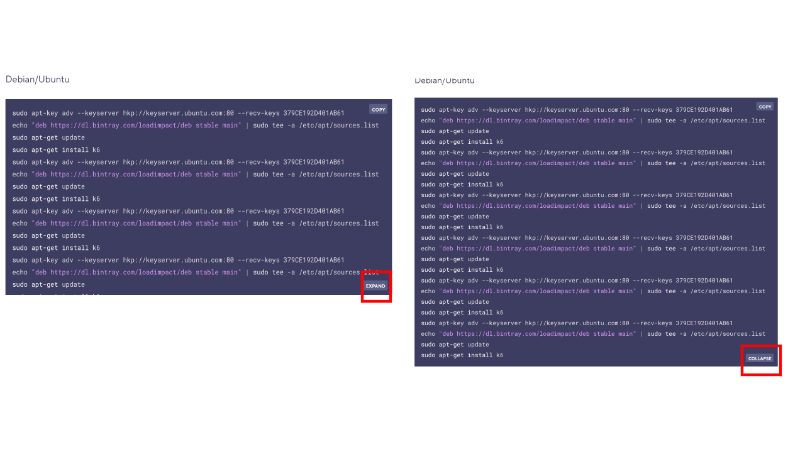
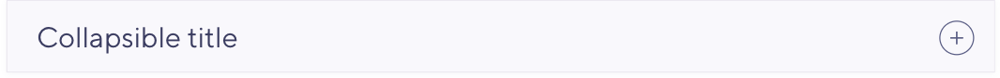
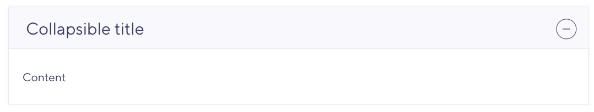
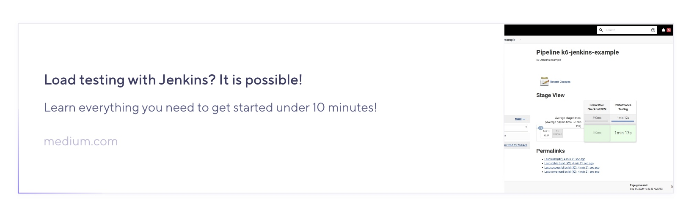

# Contributing File Formats

The k6 documentation is a Gatsby application using React components and markdown files for the content of the different pages.

There are two types of pages: Welcome Pages and Documentation articles.

[Welcome Pages](src/templates/docs) are the pages shown on the header menu: `Guides`, `JavaScript API`, `Cloud Docs`, `Integration`, and `Examples`. They are made as separate React Components for maximum customisation.

Documentation articles are markdown files structured under the [`src/data/markdown/docs`](src/data/markdown/docs) folder.

## Folder structure

Root folders represent main categories at the top of the page.  
Use numbers in front of the folder name to set the order.

Pattern: {number}{space}{page name}

Example: 02 Hello world



The same pattern used to define orders not only root folders but also pages(md files) inside the category.


## Headers

Use typical `##` markdown definition to format headers.

```md
## Making HTTP requests
```

Make sure you are using '##' which stands for a h2 tag - h1 _is reserved for the title of a page_, that gets parsed from the frontmatter. Also the table of content that is being dynamically created on each page based on h2 tags.


You can use `h2` and `h3` headers as landmarks. `h3` won't make to autogenerated table of content.`h4` tag is designed to be used in your blockquote heading, like that:


And `h5`,`h6` have no specified styles, therefore will be rendered by default very similar to `h1`, so you probably do not want to use them, but if there are use cases, please, let us know.

## Images

Default image syntax for markdown files

```md

```

Note, that path begins with `/`, not just `images/`.

Store images relative to a source `.md` file, and access them from `.md` files by using relative path. `image-sharp-plugin` will handle your image: compress, convert and lazy load.

### Example file structure

```
.
├── markdown
│   └── article
|       ├── article.md
|       ├── image.png
```

or

```
.
├── markdown
│   └── article
|       ├── article.md
|       ├── images
|           ├── image.png
```

or, in more comples scenarios:

```
.
├── markdown
│   └── article cluster
│       └── images
│           └── article-1
|               ├── image.png
│           └── article 2
|               ├── image.png
│           └── article 3
|               ├── image.png
│       └── article 1
|           ├── article 1.md
│       └── article 2
|           ├── article 2.md
│       └── article 3
|           ├── article 3.md
```

If you really have to put there some remote picture, write it like that:

```md

```

But keep in mind the size of an image on the other side of a link to prevent page overweighting.

There are also cases when the path to an image contains white space characters. You have to replace them with `%` sign, like on the screenshot below:



Note, that for some reason not every `%`-ed path with spaces works everytime. The truly foolproof solution is using kebab only case: like `[](/images/kebab-cased-folder-name/kebab-cased-image-name.png)`

## Blockquotes

Here things are getting a bit hairy. It is still default md, so it is perfectly fine to write blockquotes like:

```md
> #### Docker syntax
>
> When using the `k6` docker image, you can't just give the script name since
> the script file will not be available to the container as it runs. Instead
> you must tell k6 to read `stdin` by passing the file name as `-`. Then you
> pipe the actual file into the container with `<` or equivalent. This will
> cause the file to be redirected into the container and be read by k6.
>
> **Note**: If your script imports other files (JS modules), piping like this
> will not work since the extra files will not be visible inside the container.
> To use modules you need to first mount your host/local directory into the
> Docker container, see [Modules with Docker](https://docs.k6.io/v1.0/docs/modules#section-using-local-modules-with-docker)."
```

And you'll get a fine quote block:


In case of a 'attention' mod for a blockquote, you just add an ⚠️ emoji, like this:

```md
> #### ⚠️ Docker syntax
>
> When using the `k6` docker image, you can't just give the script name since
> the script file will not be available to the container as it runs. Instead
> you must tell k6 to read `stdin` by passing the file name as `-`. Then you
> pipe the actual file into the container with `<` or equivalent. This will
> cause the file to be redirected into the container and be read by k6.
>
> **Note**: If your script imports other files (JS modules), piping like this
> will not work since the extra files will not be visible inside the container.
> To use modules you need to first mount your host/local directory into the
> Docker container, see [Modules with Docker](https://docs.k6.io/v1.0/docs/modules#section-using-local-modules-with-docker)."
```

And our default blockquote will take a form of:


Another option is 'warning' mod, the syntax is following:

```md
<Blockquote mod="warning">

#### Make a cost estimate before starting a soak test

Soak test can simulate days or weeks worth of normal traffic within a few hours. This means that your infrastructure and vendor costs may be significant.

If you are testing a website, you should consider excluding your CDN from the test.

If your system makes use of external services, you may want to calculate the cost before you start the test.

</Blockquote>
```

And the result is:



_Pay attention to those empty lines between md block and a wrapper, they are required to correctly parsing._

_Also pay attention, that usage of `Blockquote` requires omitting native `md` blockquote syntax, so you just put your content inside withou any `>` and you are good to go._

At the moment there are only three mods available: `default`, `attention` (wrapper for both is optional) and warning (wrapper is required). If you need more, let us know.

## Code blocks

So, there are basically three types of code blocks, small ones, headerless ones and headerfull ones,

that last two have one possible modification - line numbers.

### Small

No hardwork required, just wrap your small stuff like keywords in backticks:

    `API_VARIABLE` should be stored under a pillow

and you are good to go!


If your code contains backticks, use `<CodeInline>` wrapper instead:

    Hide a field with <CodeInline>`js: "-"`</CodeInline>


### Headerless

We are going to write them a bit differently, half-native md:

````md
<!-- some other content -->

    ```javascript
    for (var id = 1; id <= 100; id++) {
       http.get(http.url`http://example.com/posts/${id}`)
    }

    // tags.name="http://example.com/posts/${}",
    // tags.name="http://example.com/posts/${}"
    ```

<!-- some other content -->
````

And, as a result:


If we want line numbers to be rendered, we shall add the wrapper and adjust our props to:

    <CodeGroup labels={[]} lineNumbers={[true]}>

    ```javascript
    for (var id = 1; id <= 100; id++) {
     http.get(http.url`http://example.com/posts/${id}`)
    }

    // tags.name="http://example.com/posts/${}",
    // tags.name="http://example.com/posts/${}"
    ```

    </CodeGroup>

Here you go:


### Headerfull

Pretty much the same routine as with headerless ones, but with one difference in props, labels field, but I bet, you already got that:

    <CodeGroup labels={["Nice code!"]} lineNumbers={[true]}>

    ```javascript
    for (var id = 1; id <= 100; id++) {
     http.get(http.url`http://example.com/posts/${id}`)
    }

    // tags.name="http://example.com/posts/${}",
    // tags.name="http://example.com/posts/${}"
    ```

    </CodeGroup>


### Multiple tabs

To be able to switch between different code tabs, we have to repeat the headerfull routine, but extend labels and md code blocks:

    <CodeGroup labels={["Nice code!", "This one is better", "Oh my.."]} lineNumbers={[true, true, true]}>

    ```javascript
    for (var id = 1; id <= 100; id++) {
     http.get(http.url`http://example.com/posts/${id}`)
    }

    // tags.name="http://example.com/posts/${}",
    // tags.name="http://example.com/posts/${}"
    ```

    ```javascript
    for (var id = 1; id <= 100; id++) {
     http.get(http.url`http://example.com/posts/${id}`)
    }

    // tags.name="http://example.com/posts/${}",
    // tags.name="http://example.com/posts/${}"
    ```

    ```javascript
    for (var id = 1; id <= 100; id++) {
     http.get(http.url`http://example.com/posts/${id}`)
    }

    // tags.name="http://example.com/posts/${}",
    // tags.name="http://example.com/posts/${}"
    ```


    </CodeGroup>


### Notes on code blocks

#### Languages

There is a curated list of available languages that you should use when working with code blocks:

1. `bash` covers all terminal code
2. `javascript` for blocks with JS code
3. `json` for JSON structures
4. `diff` for showing diffs
5. `markup` covers html and xml
6. `go` for Go code
7. `plain` for everything else, plain unhighlighted text

Every other language, including languages from list but with grammar or case mistakes will be rendered as a `plain` by default.

Let us know if there is necessity to bring highlight support for another language.

#### Copy button

    '<CodeGroup labels={["CLI", "Docker"]} showCopyButton={[false, true]}>'

showCopyButton: whether to show or hide the `copy` button. Default is true.

#### Line numbers

    '{"labels": ["Nice code!", "This one is better", "Oh my.."], "lineNumbers": [true, true, true]}'

Line numbers are optional not for the whole code block, but for each tab. That is why here we have an array of `bool`.

#### Text in-between tabs

See _'Then do this?'_ text line between tabs? **You can not do that**. Put nothing in `code-group` except code blocks, or you'll broke the page.

    <CodeGroup labels={["Nice code!"]} lineNumbers={[true]}>

    ```javascript
    for (var id = 1; id <= 100; id++) {
     http.get(http.url`http://example.com/posts/${id}`)
    }

    ```

    Then do this:

    ```javascript
    for (var id = 1; id <= 100; id++) {
    http.get(http.url`http://example.com/posts/${id}`)
    }

    ```

    </CodeGroup>

#### Height control

You can provide large code blocks (>400px, ~20 LoC) with expand/collapse toggler that will allow users to control code block's height.



Prop `heightTogglers` passed to `CodeGroup` component makes it possible, which works very similar to `labels` and `lineNumbers` props:

    <CodeGroup labels={["Nice code!", "This one is better", "Oh my.."]} lineNumbers={[true, true, true]} heightTogglers={[true, false, false]}>

    ```javascript
    // a lot of lines of code,
    // maxHeight of this code block will be set to `400px`
    // and a toggler will appear
    ```

    ```javascript
    // a lot of lines of code, default behavior
    ```

    ```javascript
    // a lot of lines of code, default behavior
    ```


    </CodeGroup>

## Table data

In md file it should look like this to be formatted as a table. You could use online markdown tables generator to simplify the process – [https://www.tablesgenerator.com/text_tables](https://www.tablesgenerator.com/text_tables)

    |                                     |                                     |
    |-------------------------------------|-------------------------------------|
    |[batch()](https://docs.k6.io/docs/batch-requests) | Issue multiple HTTP requests in parallel (like e.g. browsers tend to do) |
    |[del()](https://docs.k6.io/docs/del-url-body-params) | Issue an HTTP DELETE request. |
    |[get()](https://docs.k6.io/docs/get-url-body-params) | Issue an HTTP GET request. |
    |[options()](https://docs.k6.io/docs/options-url-body-params) | Issue an HTTP OPTIONS request. |
    |[patch()](https://docs.k6.io/docs/patch-url-body-params) | Issue an HTTP PATCH request. |
    |[post()](https://docs.k6.io/docs/post-url-body-params) | Issue an HTTP POST request. |
    |[put()](https://docs.k6.io/docs/put-url-body-params) | Issue an HTTP PUT request. |
    |[request()](https://docs.k6.io/docs/request-method-url-body-params) | Issue any type of HTTP request. |

Result:


## LdScript

`LdScript` is used to deliver [JSON-LD](https://json-ld.org/) content on a certain page, you can use it this way:

```md
<LdScript script='{"@context": "https://schema.org"}'>
```

As you can see, the `LdScript` expects a sole prop `script` of type string of JSON-LD data, which it will render appropriately on its own.

## Collapsible

Collapsible accordion elements that allow to expand and collapse content by clicking on them. Could be used to hide content that is not immediately relevant to the user.

To add a collapsible to your article, use the following syntax in the `.md` file:

```md
<!-- other content -->

<Collapsible title="Collapsible title">
<!-- the content that will expand/collapse -->
</Collapsible>

<!-- other content -->
```

The result:


After clicking on the `+` button the content becomes visible:


The `Collapsible` expects a string `title` and some content.

If you want the component to be expanded by default, use optional`isOpen` prop and set it to `true`: `<Collapsible title="Collapsible title" isOpen="true">`.

If you want the component title to be displayed in the Table of Contents, please set `tag` prop to `h2`: `<Collapsible title="Collapsible title added to ToC" tag="h2">`.

## External Link Card (Blog only)

This is a component that represents a common pattern of external link decoration. Here is how you would use it:

1. Find a place in your article where you'd like to see the card
2. Write down the following snippet:

```md
<!-- other content -->

<ExternalCardLink title="Card title" description="Card description" link="https://card-link.com">
<!-- note empty line -->

<!-- note empty line -->
</ExternalCardLink>

<!-- other content -->
```

3. Replace `title`, `description`, `link` and image inside with your data. Note, that `title` and `link` are **required**, while `description` field and image inside are **optional**, though without an image it will look much less appealing.

4. Result will be something like that:



Currently, this component is absent in docs repo, though could be added anytime the need arises.

## Custom

It is also possible that you want to use a custom UI block in a certain `.md` document, not defined in this guide, like CTA button, or really any other piece of content from normal react page. By no means _do not copypast generated html into md file_: we are using `gatsby-plugin-mdx`, so please, just import the component you need right into `md` exactly the way you would import it on any react page and provide necessary props.

See example how it is done with `IntegrationsCiIconBlock` in `Using k6/Testing Guides/Automated Performance Testing`

## The rest

The rest of elements you could write as you would in native md. It includes `p`, `ul`, `ol`, `em`, `strong` etc.

## Additional information

Check out the [project Wiki](https://github.com/k6io/docs/wiki) for additional information
