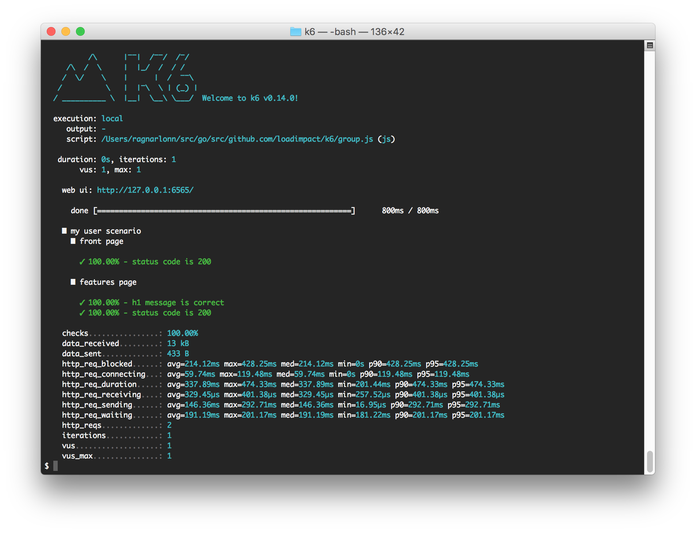

## Overview

By default, k6 will print runtime information and general results to `stdout` while the test is running, and a summary after the test has ended.

## Runtime output to stdout



By default, k6 sends its output to stdout only. When started up, it will display a very tasteful ASCII splash screen with the k6 logo and version information, plus details about the test and options active. We will go through the things one by one here:

- `execution: local` k6 is not being used to control another k6 instance (distributed execution).
- `output: -` Output is sent to stdout only.
- `script: group.js (js)` Shows what script we are running. The `(js)` at the end indicates that k6 thinks this file contains JavaScript code (that should be executed by the VUs).
- `duration: 0s, iterations: 1` The VUs in the test will only perform one single script iteration (calling the default function once) each, and there is no time limit set.
- `vus: 1, max: 1` Simulate 1 VU (virtual user), allocate resources for a "max" of 1 VU (meaning we can't scale up the load level in this case).
- `done [==============] 800ms / 800ms` This is the progress bar that updates while the test is running, to indicate how far the test has come and how much time has passed.
- `█ my user scenario` is the name of a group we have created in our JS script.
- `█ front page` is the name of a sub-group that was created inside the previously mentioned group ("my user scenario").
- `✓ 100.00% - status code is 200` is the result from a check() that was executed inside the "front page" group. Note how this check result is indented, to indicate that it belongs to the "front page" group. The "front page" group name, in turn, is indented to indicate it belongs to its parent group ("my user scenario").
- `█ features page` is another group that belongs to the parent group "my user scenario".
- `✓ 100.00% - status code is 200` and `✓ 100.00% - h1 message is correct` are two more checks that belong to the "features page" group.
- `checks................: 100.00%` tells us the percentage of our checks that passed.

And then comes the HTTP timing information. There are several metrics being reported here, and percentiles etc. for each of them:

- `http_req_blocked` The time VUs spent waiting to be allocated a TCP connection from the connection pool.
- `http_req_connecting` The time VUs spent performing TCP handshakes (setting up TCP connections to the remote host).
- `http_req_looking_up` The time spent performing DNS lookups.
- `http_req_sending` The time spent transmitting HTTP requests to the remote host.
- `http_req_waiting` The time spent waiting for a response to come back from the remote host (after having sent a request).
- `http_req_receiving` The time spent receiving a reply from the remote host.
- `http_req_duration` Total time for the request. It's equal to `http_req_sending + http_req_waiting + http_req_receiving` (i.e. how long did the remote server take to process the request and respond, without the initial DNS lookup/connection times).

All of these are metrics of the Trend type, which means you can extract max, min, [percentile](https://en.wikipedia.org/wiki/Percentile), average values from them. On stdout they are printed like this:

<div class="code-group" data-props='{"labels": ["Percentile"]}'>

```shell
http_req_duration.....: avg=46.32ms, max=46.32ms, med=46.32ms, min=46.32ms, p90=46.32ms, p95=46.32ms
```

</div>

After the HTTP timing metrics, there will be a few final lines of output:

- `http_reqs........: 2` The total number of HTTP requests made during the whole load test.
- `iterations........: 1` The total number of times all VUs in the test managed to run through the default() function.
- `vus.................: 1` How many VUs the test was configured to simulate.
- `vus_max........: 1` The number of pre-allocated VU slots the test was configured for (vus_max allows you to scale up the number of VUs in the test to max that number).

## Output result data

k6 may also output more granular result data using special output plugins. Currently, there are a few plugins that can output data:

- [JSON](/getting-started/results-output/json) plugin that writes data in JSON format to a file
- Plugins that push the metrics to:
  - [Apache Kafka](/getting-started/results-output/apache-kafka)
  - [Datadog](/getting-started/results-output/datadog)
  - [InfluxDB](/getting-started/results-output/influxdb)
  - [StatsD](/getting-started/results-output/statsd)
- [Cloud](/getting-started/results-output/cloud) plugin that streams your test results to the k6 Cloud platform

To know more about the metrics k6 collects, please see the [Metrics management page](/using-k6/metrics)

## Multiple outputs

You can simultaneously send the emitted metrics to several outputs by using the CLI `--out` flag multiple times, for example:

<div class="code-group" data-props='{"labels": ["Multiple Outputs"]}'>

```shell
$ k6 run --out json=test.json --out influxdb=http://localhost:8086/k6
```

</div>

## Summary export

> _New in v0.26.0_

It's also possible to export the end-of-test summary report to a JSON
file that includes data for all test metrics, checks and thresholds.
This is useful to get the aggregated test results in a
machine-readable format, for integration with dashboards, external
alerts, etc.

### Example

Running `k6 run --summary-export=export.json github.com/loadimpact/k6/samples/stages.js`
would generate the following file:

<div class="code-group" data-props='{"labels": [ "export.json" ] }'>

```json
{
  "metrics": {
    "checks": {
      "fails": 0,
      "passes": 434,
      "value": 0
    },
    "data_received": {
      "count": 4267088,
      "rate": 213353.42114517145
    },
    "data_sent": {
      "count": 33726,
      "rate": 1686.2922633754104
    },
    "http_req_blocked": {
      "avg": 2.2303510806451645,
      "max": 466.009823,
      "med": 0.006873000000000001,
      "min": 0.001265,
      "p(90)": 0.0093969,
      "p(95)": 0.01104339999999999
    },
    "http_req_connecting": {
      "avg": 1.4719108986175116,
      "max": 176.017402,
      "med": 0,
      "min": 0,
      "p(90)": 0,
      "p(95)": 0
    },
    "http_req_duration": {
      "avg": 146.13434929493093,
      "max": 663.812323,
      "med": 115.237707,
      "min": 104.336176,
      "p(90)": 204.6849077,
      "p(95)": 205.27533795
    },
    "http_req_receiving": {
      "avg": 0.32699811981566856,
      "max": 5.86652,
      "med": 0.135682,
      "min": 0.026588,
      "p(90)": 1.4118543,
      "p(95)": 1.6629313999999984
    },
    "http_req_sending": {
      "avg": 0.031275672811059876,
      "max": 0.149365,
      "med": 0.028853,
      "min": 0.006069,
      "p(90)": 0.041769099999999997,
      "p(95)": 0.05106769999999998
    },
    "http_req_tls_handshaking": {
      "avg": 0,
      "max": 0,
      "med": 0,
      "min": 0,
      "p(90)": 0,
      "p(95)": 0
    },
    "http_req_waiting": {
      "avg": 145.77607550230408,
      "max": 663.551133,
      "med": 114.90324000000001,
      "min": 103.389659,
      "p(90)": 204.4926965,
      "p(95)": 205.02902265
    },
    "http_reqs": {
      "count": 434,
      "rate": 21.699900441941768
    },
    "iteration_duration": {
      "avg": 148.59040099078345,
      "max": 671.970894,
      "med": 115.69334950000001,
      "min": 104.558313,
      "p(90)": 205.0391277,
      "p(95)": 209.87447475000002
    },
    "iterations": {
      "count": 434,
      "rate": 21.699900441941768
    },
    "vus": {
      "max": 5,
      "min": 1,
      "value": 1
    },
    "vus_max": {
      "max": 5,
      "min": 5,
      "value": 5
    }
  },
  "root_group": {
    "name": "",
    "path": "",
    "id": "d41d8cd98f00b204e9800998ecf8427e",
    "groups": {},
    "checks": {
      "status is 200": {
        "name": "status is 200",
        "path": "::status is 200",
        "id": "6210a8cd14cd70477eba5c5e4cb3fb5f",
        "passes": 435,
        "fails": 0
      }
    }
  }
}
```

</div>
