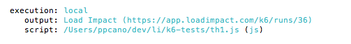

You can also stream your test results in real time to the k6 Cloud.

[k6 Cloud](/cloud) provides support to automatically interpret and visualize your results.

<div class="code-group" data-props='{"labels": ["Cloud"]}'>

```shell
$ K6_CLOUD_TOKEN=<your-load-impact-token> k6 run --out cloud script.js
```

</div>

<div class="doc-blockquote" data-props='{"mod": "warning"}'>

> ### `K6CLOUD_TOKEN` is now `K6_CLOUD_TOKEN`
>
> Starting with v0.18.0 `K6CLOUD_TOKEN` has been renamed `K6_CLOUD_TOKEN`. The old spelling will still work in v0.18.0 but a deprecation message will be printed to the terminal.

</div>

After running the command, the console shows the URL to access your test results.



You can read more about [k6 Cloud](/cloud)
