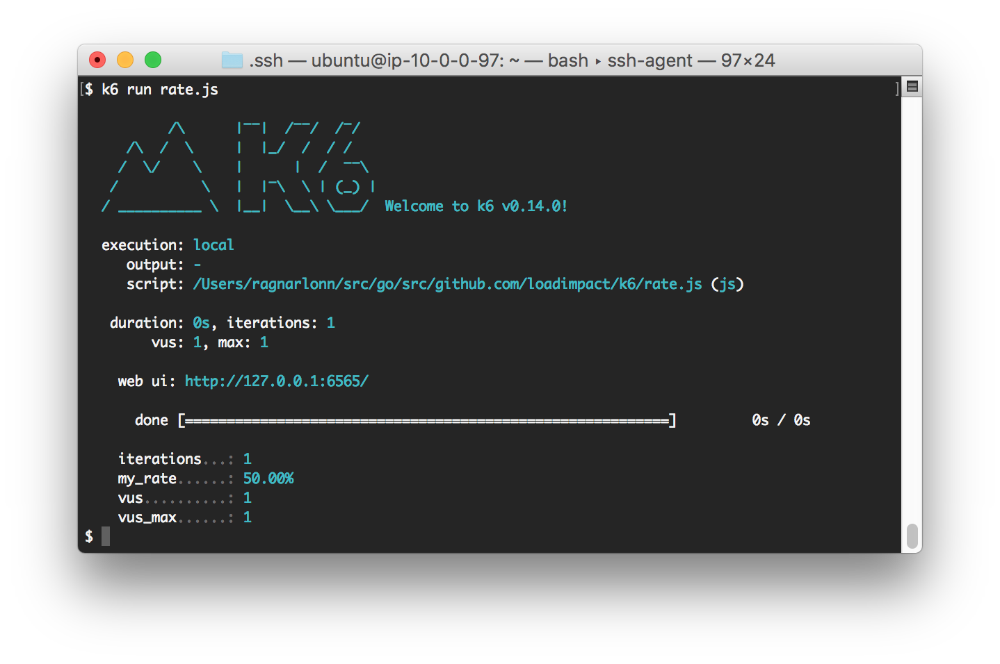

This section covers the important aspect of metrics management in k6. How and what kind of metrics k6 collects automatically (_built-in_ metrics), and what custom metrics you can make k6 collect.

## Built-in metrics

The _built-in_ metrics are the ones you can see output to stdout when you run the simplest possible k6 test, e.g. `k6 run github.com/loadimpact/k6/samples/http_get.js` which will output something like the below:


All the `http_req_...` lines and the ones after them are _built-in_ metrics that get written to stdout at the end of a test.

The following _built-in_ metrics will **always** be collected by k6:

| Metric Name          | Type    | Description                                                                                                                                                                                                     |
| -------------------- | ------- | --------------------------------------------------------------------------------------------------------------------------------------------------------------------------------------------------------------- |
| `vus`                | Gauge   | Current number of active virtual users                                                                                                                                                                          |
| `vus_max`            | Gauge   | Max possible number of virtual users (VU resources are pre-allocated, to ensure performance will not be affected when scaling up the load level)                                                                |
| `iterations`         | Counter | The aggregate number of times the VUs in the test have executed the JS script (the `default` function).                                                                                                         |
| `iteration_duration` | Trend   | The time it took to complete one full iteration of the default/main function.                                                                                                                                   |
| `dropped_iterations` | Counter | Introduced in k6 v0.27.0, the number of iterations that could not be started due to lack of VUs (for the arrival-rate executors) or lack of time (due to expired maxDuration in the iteration-based executors). |
| `data_received`      | Counter | The amount of received data. Read [this example](/examples/track-transmitted-data-per-url) to track data for an individual URL.                                                                                 |
| `data_sent`          | Counter | The amount of data sent. Read [this example](/examples/track-transmitted-data-per-url) to track data for an individual URL.                                                                                     |
| `checks`             | Rate    | The rate of successful checks.                                                                                                                                                                                  |

## HTTP-specific built-in metrics

_built-in_ metrics will only be generated when/if HTTP requests are made:

| Metric Name                | Type    | Description                                                                                                                                                                                                                                  |
| -------------------------- | ------- | -------------------------------------------------------------------------------------------------------------------------------------------------------------------------------------------------------------------------------------------- |
| `http_reqs`                | Counter | How many HTTP requests has k6 generated, in total.                                                                                                                                                                                           |
| `http_req_blocked`         | Trend   | Time spent blocked (waiting for a free TCP connection slot) before initiating the request. `float`                                                                                                                                           |
| `http_req_connecting`      | Trend   | Time spent establishing TCP connection to the remote host. `float`                                                                                                                                                                           |
| `http_req_tls_handshaking` | Trend   | Time spent handshaking TLS session with remote host                                                                                                                                                                                          |
| `http_req_sending`         | Trend   | Time spent sending data to the remote host. `float`                                                                                                                                                                                          |
| `http_req_waiting`         | Trend   | Time spent waiting for response from remote host (a.k.a. \"time to first byte\", or \"TTFB\"). `float`                                                                                                                                       |
| `http_req_receiving`       | Trend   | Time spent receiving response data from the remote host. `float`                                                                                                                                                                             |
| `http_req_duration`        | Trend   | Total time for the request. It's equal to `http_req_sending + http_req_waiting + http_req_receiving` (i.e. how long did the remote server take to process the request and respond, without the initial DNS lookup/connection times). `float` |

### Accessing HTTP timings from a script

If you want to access the timing information from an individual HTTP request, the _built-in_ HTTP timing metrics are also available in the [HTTP Response](/javascript-api/k6-http/response) object:

<CodeGroup labels={["timings.js"]} lineNumbers={[true]}>

```javascript
import http from 'k6/http';
export default function () {
  var res = http.get('http://httpbin.org');
  console.log('Response time was ' + String(res.timings.duration) + ' ms');
}
```

</CodeGroup>

In the above snippet, `res` is an [HTTP Response](/javascript-api/k6-http/response) object containing:

| Property                      | Description                                                           |
| ----------------------------- | --------------------------------------------------------------------- |
| `res.body`                    | `string` containing the HTTP response body                            |
| `res.headers`                 | `object` containing header-name/header-value pairs                    |
| `res.status`                  | `integer` containing HTTP response code received from server          |
| `res.timings`                 | `object` containing HTTP timing information for the request in **ms** |
| `res.timings.blocked`         | = `http_req_blocked`                                                  |
| `res.timings.connecting`      | = `http_req_connecting`                                               |
| `res.timings.tls_handshaking` | = `http_req_tls_handshaking`                                          |
| `res.timings.sending`         | = `http_req_sending`                                                  |
| `res.timings.waiting`         | = `http_req_waiting`                                                  |
| `res.timings.receiving`       | = `http_req_receiving`                                                |
| `res.timings.duration`        | = `http_req_duration`                                                 |

## Custom metrics

You can also create your own metrics, that are reported at the end of a load test, just like HTTP timings:

<CodeGroup labels={["trend.js"]} lineNumbers={[true]}>

```javascript
import http from 'k6/http';
import { Trend } from 'k6/metrics';

let myTrend = new Trend('waiting_time');

export default function () {
  let r = http.get('https://httpbin.org');
  myTrend.add(r.timings.waiting);
}
```

</CodeGroup>

The above code will create a Trend metric named “waiting_time” and referred to in the code using the variable name myTrend.
Custom metrics will be reported at the end of a test. Here is how the output might look:


## Metric types

All metrics (both the _built-in_ ones and the custom ones) have a type. The four different metric types in k6 are:

| Metric type                                   | Description                                                                                              |
| --------------------------------------------- | -------------------------------------------------------------------------------------------------------- |
| [Counter](/javascript-api/k6-metrics/counter) | A metric that cumulatively sums added values.                                                            |
| [Gauge](/javascript-api/k6-metrics/gauge)     | A metric that stores the min, max and last values added to it.                                           |
| [Rate](/javascript-api/k6-metrics/rate)       | A metric that tracks the percentage of added values that are non-zero.                                   |
| [Trend](/javascript-api/k6-metrics/trend)     | A metric that allows for calculating statistics on the added values (min, max, average and percentiles). |

All values added to a custom metric can optionally be [tagged](/using-k6/tags-and-groups) which can be useful when analysing the test results.

### Counter _(cumulative metric)_

<CodeGroup labels={["counter.js"]} lineNumbers={[true]}>

```javascript
import { Counter } from 'k6/metrics';

let myCounter = new Counter('my_counter');

export default function () {
  myCounter.add(1);
  myCounter.add(2);
}
```

</CodeGroup>

The above code will generate the following output:


The value of `my_counter` will be 3 (if you run it one single iteration - i.e. without specifying --iterations or --duration).

Note that there is currently no way of accessing the value of any custom metric from within JavaScript. Note also that counters that have value zero (`0`) at the end of a test are a special case - they will **NOT** be printed to the stdout summary.

### Gauge _(keep the latest value only)_

<CodeGroup labels={["gauge.js"]} lineNumbers={[true]}>

```javascript
import { Gauge } from 'k6/metrics';

let myGauge = new Gauge('my_gauge');

export default function () {
  myGauge.add(3);
  myGauge.add(1);
  myGauge.add(2);
}
```

</CodeGroup>

The above code will result in an output like this:


The value of `my_gauge` will be 2 at the end of the test. As with the Counter metric above, a Gauge with value zero (`0`) will **NOT** be printed to the stdout summary at the end of the test.

### Trend _(collect trend statistics (min/max/avg/percentiles) for a series of values)_

<CodeGroup labels={["trend.js"]} lineNumbers={[true]}>

```javascript
import { Trend } from 'k6/metrics';

let myTrend = new Trend('my_trend');

export default function () {
  myTrend.add(1);
  myTrend.add(2);
}
```

</CodeGroup>

The above code will make k6 print output like this:


A trend metric is a container that holds a set of sample values, and which we can ask to output statistics (min, max, average, median or percentiles) about those samples.
By default, k6 will print average, min, max, median, 90th percentile, and 95th percentile.

### Rate _(keeps track of the percentage of values in a series that are non-zero)_

<CodeGroup labels={["rate.js"]} lineNumbers={[true]}>

```javascript
import { Rate } from 'k6/metrics';

let myRate = new Rate('my_rate');

export default function () {
  myRate.add(true);
  myRate.add(false);
  myRate.add(1);
  myRate.add(0);
}
```

</CodeGroup>

The above code will make k6 print output like this:


The value of `my_rate` at the end of the test will be 50%, indicating that half of the values
added to the metric were non-zero.

### Notes

- custom metrics are only collected from VU threads at the end of a VU iteration, which means that
  for long-running scripts, you may not see any custom metrics until a while into the test.

## Metric graphs in k6 Cloud Results

If you use [k6 Cloud Results](/cloud/analyzing-results/overview), you have access to all test
metrics within the [Analysis Tab](/cloud/analyzing-results/analysis-tab). You can use this tab to further analyze and
compare test result data, to look for meaningful correlations in your data.


