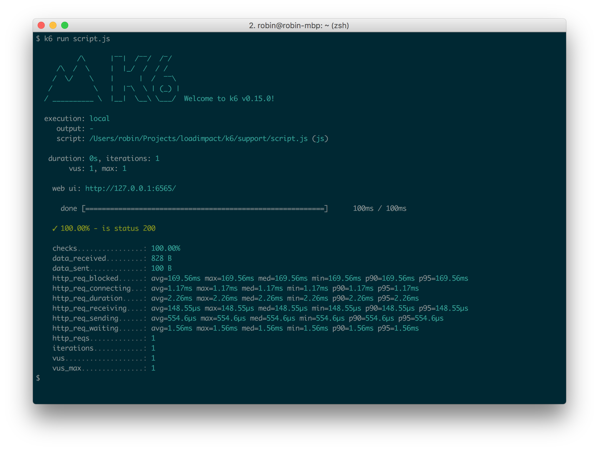
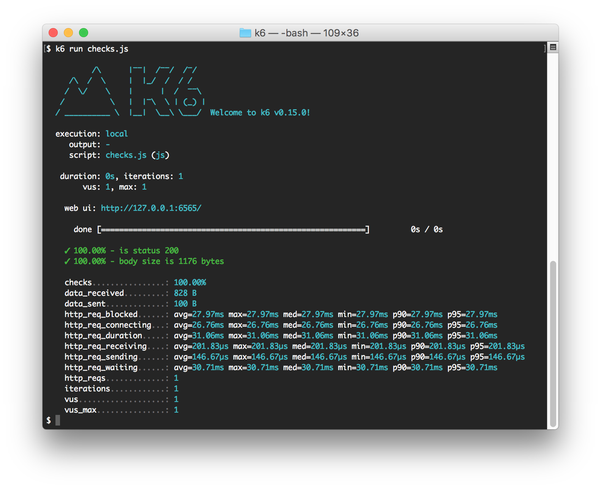

## What is a check?

Checks are like asserts but differ in that they don't halt the execution, instead, they just
store the result of the check, pass or fail, and let the script execution continue. Take a look at
[thresholds](/using-k6/thresholds) for a way to halt the execution. Checks are great for
codifying assertions relating to HTTP requests/responses, making sure the response code is 2xx
for example:

<div class="code-group" data-props='{"labels": ["check.js"], "lineNumbers": [true]}'>

```js
import { check } from 'k6';
import http from 'k6/http';

export default function () {
  let res = http.get('http://test.k6.io/');
  check(res, {
    'is status 200': (r) => r.status === 200,
  });
}
```

</div>

In the above example, one check was specified but you can add as many as you need in a call to
[`check()`](/javascript-api/k6/check-val-sets-tags). When the above script is run you can see
how k6 displays the results of the check calls in the following output:



In the output above you can see that our check "is status 200" was successful 100% of the times it was called.

You may also add multiple checks within a single check() statement, like this:

<div class="code-group" data-props='{"labels": ["checks.js"], "lineNumbers": [true]}'>

```js
import { check } from 'k6';
import http from 'k6/http';

export default function () {
  let res = http.get('http://test.k6.io/');
  check(res, {
    'is status 200': (r) => r.status === 200,
    'body size is 1176 bytes': (r) => r.body.length == 1176,
  });
}
```

</div>



## Using checks in a CI setting

One important thing to understand regarding checks is that a failed check _will not fail the whole
load test_.

Checks help to keep your code organized and easy to read, but when you're running a load test in
a CI test suite you may want to check for error conditions that fail the whole load test. In this
case you may want to combine checks with [thresholds](/using-k6/thresholds) to
get what you want:

<div class="code-group" data-props='{"labels": ["check_thresholds.js"], "lineNumbers": [true]}'>

```js
import http from 'k6/http';
import { check } from 'k6';
import { Rate } from 'k6/metrics';

export let errorRate = new Rate('errors');
export let options = {
  thresholds: {
    errors: ['rate<0.1'], // <10% errors
  },
};

export default function () {
  const res = http.get('http://httpbin.org');
  const result = check(res, {
    'status is 200': (r) => r.status == 200,
  }) || errorRate.add(1);
}
```

</div>

The above script declares a custom [Rate](/javascript-api/k6-metrics/rate)
metric (called "errors") to hold information about the errors we have seen during the test, then
it uses a threshold on that custom metric to fail the test when it encounters too many errors.
If we replace the "http://httpbin.org" URL with one that will generate an error, k6 will exit with
a nonzero exit value, indicating a FAIL result to e.g. a CI system that may have executed it:


As you can see above, the exit code generated by k6 after this run was `99`. Any nonzero exit code
is commonly interpreted by Un\*x shells, CI servers, and monitoring systems as a "failure".

Note also the expression `check() || errorRate.add(1)`. When any one of the check conditions
inside a check() call fails, check() returns false, which causes the code after `||` to be
executed. In this case, it means we add one data point to our Rate metric. Only if _all_ check
conditions pass will check() return true.

See [check()](/javascript-api/k6/check-val-sets-tags) in the script API reference for
more details on how check() works.

## Checks in k6 Cloud Results

In [k6 Cloud Results](/cloud/analyzing-results/overview) `Checks` are available in their [own tab](/cloud/analyzing-results/checks-tab) for analysis.

Here we can quickly see what checks are failing, and upon clicking on any check, see the count of passes/failures
at given points in the test. You can also add the check to the analysis tab, for further comparison with other metrics.


