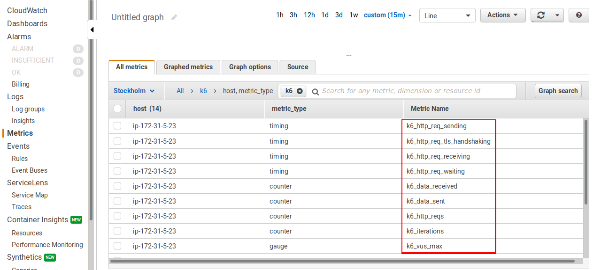
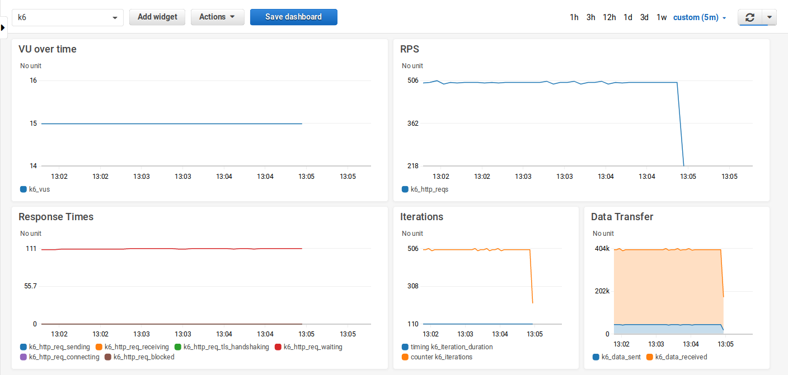

k6 can send metrics data to [Amazon CloudWatch](https://aws.amazon.com/cloudwatch/) through the [CloudWatch Agent](https://docs.aws.amazon.com/AmazonCloudWatch/latest/monitoring/Install-CloudWatch-Agent.html), which is effectively a StatsD integration. These metrics can then be visualized in dashboards.

This guide covers running the CloudWatch integration and visualizing the results:

- Run the CloudWatch agent
- Run the k6 test
- Visualize k6 metrics in Amazon CloudWatch

## Run the CloudWatch agent

We presume that you already have a machine that supports both running k6 and CloudWatch agent, which either runs a flavor of GNU/Linux or Windows. Just go ahead and [download](https://docs.aws.amazon.com/AmazonCloudWatch/latest/monitoring/download-cloudwatch-agent-commandline.html) the suitable CloudWatch agent version for your operating system.

1. Create an [IAM role](https://docs.aws.amazon.com/AmazonCloudWatch/latest/monitoring/create-iam-roles-for-cloudwatch-agent.html) to be able to send metrics to CloudWatch via the agent. Then, if you are running on Amazon EC2, just [attach](https://docs.aws.amazon.com/AWSEC2/latest/WindowsGuide/iam-roles-for-amazon-ec2.html#attach-iam-role) the role to your EC2 instance, so that you can be able to send metrics to CloudWatch. Otherwise, if you are running on-premises servers, follow this [guide](https://docs.aws.amazon.com/AmazonCloudWatch/latest/monitoring/install-CloudWatch-Agent-commandline-fleet.html#install-CloudWatch-Agent-iam_user-first).

2. Download the CloudWatch Agent package suitable for your operating system. For example, on Debian 10 (Buster), we've used the following link. For other operating systems, please refer to this [guide](https://docs.aws.amazon.com/AmazonCloudWatch/latest/monitoring/download-cloudwatch-agent-commandline.html):

    ```bash
    $ wget https://s3.amazonaws.com/amazoncloudwatch-agent/debian/amd64/latest/amazon-cloudwatch-agent.deb
    ```

3. Install the package:

    ```bash
    $ sudo dpkg -i amazon-cloudwatch-agent.deb
    ```

4. Configure the agent to receive data from k6. For this, create a file called "*/opt/aws/amazon-cloudwatch-agent/etc/statsd.json*" and paste the following JSON config object into it. This configuration means that the agent would listen on port number 8125, which is the default port number for k6 and StatsD. The interval for collecting metrics is 5 seconds and we don't aggregate them, since we need the raw data later in CloudWatch.

    ```js
    {
        "metrics": {
            "namespace": "k6",
            "metrics_collected": {
                "statsd": {
                    "service_address": ":8125",
                    "metrics_collection_interval": 5,
                    "metrics_aggregation_interval": 0
                }
            }
        }
    }
    ```

5. Run the following command to start the agent:

    ```bash
    $ sudo amazon-cloudwatch-agent-ctl -a fetch-config -m ec2 -s -c file:/opt/aws/amazon-cloudwatch-agent/etc/statsd.json
    ```

6. You can check the status of the agent using the following command:

    ```bash
    $ amazon-cloudwatch-agent-ctl -a status
    ```

## Run the k6 test

Once the agent is running, run the k6 test and send the metrics to the agent with:

```bash
$ k6 run --out statsd script.js
```

The following options can be configured as environment variables, depending on the agent's configuration:

| Name  | Value |
| ------------- | ------------- |
| `K6_STATSD_ADDR` | Address of the statsd service, currently only UDP is supported. The default value is `localhost:8125`. |
| `K6_STATSD_NAMESPACE` | The namespace used as a prefix for all the metric names. The default value is `k6`. |
| `K6_STATSD_PUSH_INTERVAL` | Configure how often data batches are sent. The default value is `1s`. |
| `K6_STATSD_BUFFER_SIZE` | The buffer size. The default value is `20`. |

## Visualize k6 metrics in Amazon CloudWatch

Visualization of the exported metrics to CloudWatch is done by creating a dashboard and selecting desired metrics to be displayed.



Here's an example dashboard we've created to visualize the test results.



You can use the following export to create the above dashboard. Just replace **REGION** and **ADDRESS** with relevant information from your environment, that is the AWS regions and the private IP address of the EC2 instance.

```js
{
    "widgets": [
        {
            "type": "metric",
            "x": 0,
            "y": 0,
            "width": 12,
            "height": 6,
            "properties": {
                "metrics": [
                    [ "k6", "k6_vus", "host", "<ip-ADDRESS>", "metric_type", "gauge" ]
                ],
                "view": "timeSeries",
                "stacked": false,
                "region": "<REGION>",
                "title": "Virtual Users",
                "stat": "Average",
                "period": 1
            }
        },
        {
            "type": "metric",
            "x": 12,
            "y": 0,
            "width": 12,
            "height": 6,
            "properties": {
                "metrics": [
                    [ "k6", "k6_http_reqs", "host", "<ip-ADDRESS>", "metric_type", "counter" ]
                ],
                "view": "timeSeries",
                "stacked": false,
                "region": "<REGION>",
                "title": "RPS",
                "stat": "Average",
                "period": 1
            }
        },
        {
            "type": "metric",
            "x": 0,
            "y": 6,
            "width": 12,
            "height": 6,
            "properties": {
                "metrics": [
                    [ "k6", "k6_http_req_sending", "host", "<ip-ADDRESS>", "metric_type", "timing" ],
                    [ ".", "k6_http_req_receiving", ".", ".", ".", "." ],
                    [ ".", "k6_http_req_tls_handshaking", ".", ".", ".", "." ],
                    [ ".", "k6_http_req_waiting", ".", ".", ".", "." ],
                    [ ".", "k6_http_req_connecting", ".", ".", ".", "." ],
                    [ ".", "k6_http_req_blocked", ".", ".", ".", "." ]
                ],
                "view": "timeSeries",
                "stacked": false,
                "region": "<REGION>",
                "stat": "Average",
                "period": 1,
                "title": "Response Times"
            }
        },
        {
            "type": "metric",
            "x": 12,
            "y": 6,
            "width": 6,
            "height": 6,
            "properties": {
                "metrics": [
                    [ "k6", "k6_iteration_duration", "host", "<ip-ADDRESS>", "metric_type", "timing" ],
                    [ ".", "k6_iterations", ".", ".", ".", "counter" ]
                ],
                "view": "timeSeries",
                "stacked": false,
                "title": "Iterations",
                "region": "<REGION>",
                "stat": "Average",
                "period": 1
            }
        },
        {
            "type": "metric",
            "x": 18,
            "y": 6,
            "width": 6,
            "height": 6,
            "properties": {
                "metrics": [
                    [ "k6", "k6_data_sent", "host", "<ip-ADDRESS>", "metric_type", "counter" ],
                    [ ".", "k6_data_received", ".", ".", ".", "." ]
                ],
                "view": "timeSeries",
                "stacked": true,
                "title": "Data Transfer",
                "region": "<REGION>",
                "stat": "Sum",
                "period": 1
            }
        }
    ]
}
```
