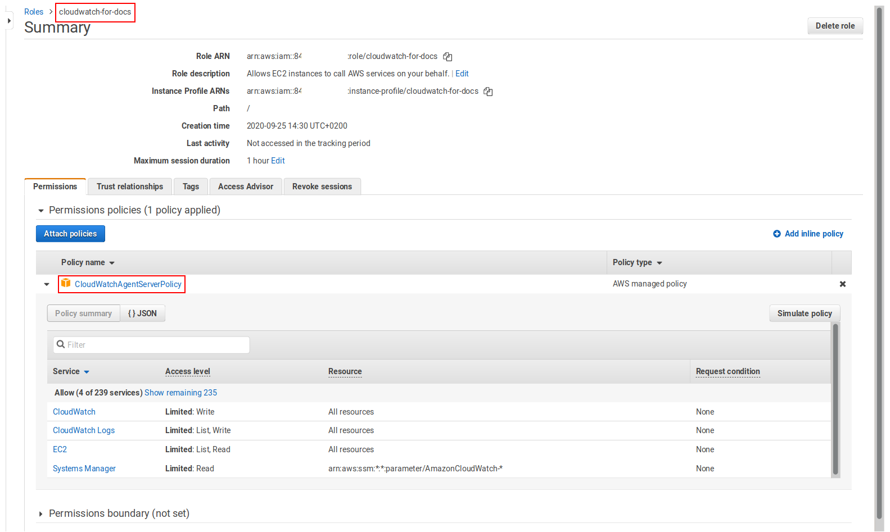

k6 can send metrics data to [Amazon CloudWatch](https://aws.amazon.com/cloudwatch/) through the [CloudWatch Agent](https://docs.aws.amazon.com/AmazonCloudWatch/latest/monitoring/Install-CloudWatch-Agent.html), which is effectively a StatsD integration. These metrics can then be visualized in dashboards.

This guide covers running the CloudWatch integration and visualizing the results:

- Run the CloudWatch agent
- Run the k6 test
- Visualize k6 metrics in Amazon CloudWatch

## Prerequisites

- [k6](https://k6.io/open-source), an open-source load testing tool for testing the performance of APIs, microservices, and websites.
- [Amazon EC2](https://aws.amazon.com/ec2/), an scalable virtual server solution to quickly have an up and running environment for your applications.
- [Amazon CloudWatch](https://aws.amazon.com/cloudwatch/), a monitoring and observability solution.

## Install k6

For more information about how to install k6, please visit our [installation](https://k6.io/docs/getting-started/installation) guide. For Amazon EC2 instances running Debian 10 (Buster), you also need to install [GnuPG](https://www.gnupg.org/) software to verify repository signature before attempting to install k6 from the official repository:

```bash
sudo apt install -y gnupg
```

## Run the CloudWatch agent

We presume that you already have [launched an EC2 instance](https://docs.aws.amazon.com/AWSEC2/latest/UserGuide/EC2_GetStarted.html) and you're connected to it. Once you are connected to your EC2 instance, [download, install and configure](https://docs.aws.amazon.com/AmazonCloudWatch/latest/monitoring/download-cloudwatch-agent-commandline.html) the CloudWatch agent:

1. Create an [IAM role](https://docs.aws.amazon.com/AmazonCloudWatch/latest/monitoring/create-iam-roles-for-cloudwatch-agent.html) for CloudWatch agent and [attach](https://docs.aws.amazon.com/AWSEC2/latest/WindowsGuide/iam-roles-for-amazon-ec2.html#attach-iam-role) it to your EC2 instance, so that we'll be able to send metrics to CloudWatch.

    This is what the role should look like:
    

    The role is attached to the EC2 instance:
    

2. Download the CloudWatch Agent package suitable for your operating system. For Debian 10 (Buster), we've used the following link, but for other operating systems, please refer to this [guide](https://docs.aws.amazon.com/AmazonCloudWatch/latest/monitoring/download-cloudwatch-agent-commandline.html):

    ```bash
    $ wget https://s3.amazonaws.com/amazoncloudwatch-agent/debian/amd64/latest/amazon-cloudwatch-agent.deb
    ```

3. Install the package:

    ```bash
    $ sudo dpkg -i amazon-cloudwatch-agent.deb
    ```

4. Configure the agent to receive data from k6. For this, create a file called **/opt/aws/amazon-cloudwatch-agent/etc/statsd.json** and paste the following JSON config object into it. This configuration means that the agent would listen on port number 8125, which is the default port number for k6 and StatsD. The interval for collecting metrics is 5 seconds and we don't aggregate them, since we need the raw data later in CloudWatch.

    ```js
    {
        "metrics": {
            "namespace": "k6",
            "metrics_collected": {
                "statsd": {
                    "service_address": ":8125",
                    "metrics_collection_interval": 5,
                    "metrics_aggregation_interval": 0
                }
            }
        }
    }
    ```

5. Run the following command to start the agent:

    ```bash
    $ sudo amazon-cloudwatch-agent-ctl -a fetch-config -m ec2 -s -c file:/opt/aws/amazon-cloudwatch-agent/etc/statsd.json
    ```

6. You can check the status of the agent using the following command:

    ```bash
    $ amazon-cloudwatch-agent-ctl -a status
    ```

## Run the k6 test

For testing purposes, we use this script, which is an example of the [scenarios](https://k6.io/docs/using-k6/scenarios) using the `constant-arrival-rate` executor. For more information, please visit this [blog post](https://k6.io/blog/how-to-generate-a-constant-request-rate-with-the-new-scenarios-api).

<div class="code-group" data-props='{"labels": ["test.js"], "lineNumbers": [true]}'>

```js
import http from 'k6/http';

export let options = {
    scenarios: {
        constant_request_rate: {
            executor: 'constant-arrival-rate',
            rate: 100,
            timeUnit: '1s',
            duration: '300s',
            preAllocatedVUs: 10,
            maxVUs: 20,
        }
    }
};

export default function () {
    http.get('http://test.k6.io/contacts.php');
}
```

</div>

Run the above file using this command. It will send the collected metrics to CloudWatch agent, which in turn sends it to CloudWatch.

```bash
$ k6 run --out statsd test.js
```

This is the result output produced by k6:

```bash

          /\      |‾‾| /‾‾/   /‾‾/
     /\  /  \     |  |/  /   /  /
    /  \/    \    |     (   /   ‾‾\
   /          \   |  |\  \ |  (‾)  |
  / __________ \  |__| \__\ \_____/ .io

  execution: local
     script: test.js
     output: statsd (localhost:8125)

  scenarios: (100.00%) 1 scenario, 20 max VUs, 5m30s max duration (incl. graceful stop):
           * constant_request_rate: 100.00 iterations/s for 5m0s (maxVUs: 10-20, gracefulStop: 30s)


running (5m00.1s), 00/15 VUs, 29990 complete and 0 interrupted iterations
constant_request_rate ✓ [======================================] 15/15 VUs  5m0s  100 iters/s

    data_received..............: 21 MB  71 kB/s
    data_sent..................: 2.6 MB 8.8 kB/s
    dropped_iterations.........: 11     0.03665/s
    http_req_blocked...........: avg=59.55µs  min=1.81µs   med=3.31µs   max=113.43ms p(90)=5.04µs   p(95)=6.23µs
    http_req_connecting........: avg=55.13µs  min=0s       med=0s       max=113.36ms p(90)=0s       p(95)=0s
    http_req_duration..........: avg=110.57ms min=108.65ms med=110.29ms max=128.3ms  p(90)=112.23ms p(95)=113.85ms
    http_req_receiving.........: avg=57.87µs  min=16.53µs  med=49.01µs  max=14.66ms  p(90)=75.01µs  p(95)=91.82µs
    http_req_sending...........: avg=25.77µs  min=5.84µs   med=21.77µs  max=8.58ms   p(90)=31.41µs  p(95)=35.12µs
    http_req_tls_handshaking...: avg=0s       min=0s       med=0s       max=0s       p(90)=0s       p(95)=0s
    http_req_waiting...........: avg=110.49ms min=108.61ms med=110.22ms max=128.21ms p(90)=112.15ms p(95)=113.76ms
    http_reqs..................: 29990  99.922514/s
    iteration_duration.........: avg=110.79ms min=108.78ms med=110.44ms max=225.55ms p(90)=112.39ms p(95)=114.03ms
    iterations.................: 29990  99.922514/s
    vus........................: 15     min=15 max=15
    vus_max....................: 15     min=15 max=15
```

## Visualize k6 metrics in Amazon CloudWatch

Visualization of the exported metrics to CloudWatch is done by creating a dashboard and selecting desired metrics to be displayed.


Here's an example dashboard we've created to visualize the test results.


You can use the following export to create the above dashboard. Just replace **REGION** and **ADDRESS** with relevant information from your environment, that is the AWS regions and the private IP address of the EC2 instance.

```js
{
    "widgets": [
        {
            "type": "metric",
            "x": 0,
            "y": 0,
            "width": 12,
            "height": 6,
            "properties": {
                "metrics": [
                    [ "k6", "k6_vus", "host", "<ip-ADDRESS>", "metric_type", "gauge" ]
                ],
                "view": "timeSeries",
                "stacked": false,
                "region": "<REGION>",
                "title": "Virtual Users",
                "stat": "Average",
                "period": 1
            }
        },
        {
            "type": "metric",
            "x": 12,
            "y": 0,
            "width": 12,
            "height": 6,
            "properties": {
                "metrics": [
                    [ "k6", "k6_http_reqs", "host", "<ip-ADDRESS>", "metric_type", "counter" ]
                ],
                "view": "timeSeries",
                "stacked": false,
                "region": "<REGION>",
                "title": "RPS",
                "stat": "Average",
                "period": 1
            }
        },
        {
            "type": "metric",
            "x": 0,
            "y": 6,
            "width": 12,
            "height": 6,
            "properties": {
                "metrics": [
                    [ "k6", "k6_http_req_sending", "host", "<ip-ADDRESS>", "metric_type", "timing" ],
                    [ ".", "k6_http_req_receiving", ".", ".", ".", "." ],
                    [ ".", "k6_http_req_tls_handshaking", ".", ".", ".", "." ],
                    [ ".", "k6_http_req_waiting", ".", ".", ".", "." ],
                    [ ".", "k6_http_req_connecting", ".", ".", ".", "." ],
                    [ ".", "k6_http_req_blocked", ".", ".", ".", "." ]
                ],
                "view": "timeSeries",
                "stacked": false,
                "region": "<REGION>",
                "stat": "Average",
                "period": 1,
                "title": "Response Times"
            }
        },
        {
            "type": "metric",
            "x": 12,
            "y": 6,
            "width": 6,
            "height": 6,
            "properties": {
                "metrics": [
                    [ "k6", "k6_iteration_duration", "host", "<ip-ADDRESS>", "metric_type", "timing" ],
                    [ ".", "k6_iterations", ".", ".", ".", "counter" ]
                ],
                "view": "timeSeries",
                "stacked": false,
                "title": "Iterations",
                "region": "<REGION>",
                "stat": "Average",
                "period": 1
            }
        },
        {
            "type": "metric",
            "x": 18,
            "y": 6,
            "width": 6,
            "height": 6,
            "properties": {
                "metrics": [
                    [ "k6", "k6_data_sent", "host", "<ip-ADDRESS>", "metric_type", "counter" ],
                    [ ".", "k6_data_received", ".", ".", ".", "." ]
                ],
                "view": "timeSeries",
                "stacked": true,
                "title": "Data Transfer",
                "region": "<REGION>",
                "stat": "Sum",
                "period": 1
            }
        }
    ]
}
```
