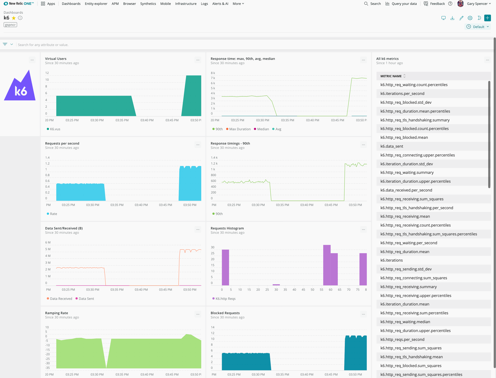

k6 can send telemetry data to [New Relic](https://newrelic.com/) through the New Relic [StatsD integration](https://docs.newrelic.com/docs/integrations/host-integrations/host-integrations-list/statsd-monitoring-integration-version-2). Within New Relic you can find your k6 performance data alongside your real users data and server side performance. This data can be visualised in dashboards and shared with colleagues, used to compare load impact with system performance, and alert on metrics too.

This guide covers running the New Relic integration:

- Run the New Relic StatsD integration
- Run the k6 test
- Visualise k6 telemetry in New Relic

## Run the New Relic StatsD integration

To get k6 metrics into New Relic, k6 sends metrics to the New Relic StatsD integration which will take care of collecting, aggregate, format and send the telemetry to the New Relic Telemetry Data Platform. You can run this with or without a New Relic agent.

Run the New Relic integration as a Docker container with this command:


<div class="code-group" data-props='{"labels": [""]}'>

```shell
docker run \
  -d --restart unless-stopped \
  --name newrelic-statsd \
  -h $(hostname) \
  -e NR_ACCOUNT_ID=<NR-ACCOUNT-ID> \
  -e NR_API_KEY="<NR-INSERT-API-KEY>" \
  -p 8125:8125/udp \
  newrelic/nri-statsd:latest
```

</div>

Replace `<NR-ACCOUNT-ID>` with your [New Relic Account ID](https://docs.newrelic.com/docs/accounts/accounts-billing/account-setup/account-id#:~:text=If%20you%20have%20a%20single,account%20ID%20is%20displayed%20there.) and `<NR-INSERT-API-KEY>` with your [New Relic Insert API Key](https://docs.newrelic.com/docs/insights/insights-data-sources/custom-data/introduction-event-api#register).

If your account is hosted in the New Relic EU region, then also add this to the above command: `-e NR_EU_REGION=true \`

### About the New Relic integration

The New Relic StatsD integration installed above can run standalone. Installing a New Relic agent is optional. 

Everything provided in the command above is enough to send k6 performance metrics to New Relic. You can optionally however [add further configuration](https://docs.newrelic.com/docs/integrations/host-integrations/host-integrations-list/statsd-monitoring-integration-version-2#configure), [further define metrics and their formats](https://docs.newrelic.com/docs/integrations/host-integrations/host-integrations-list/statsd-monitoring-integration-version-2#metric-format) (you can however do this on the New Relic side configuration), [add custom tags](https://docs.newrelic.com/docs/integrations/host-integrations/host-integrations-list/statsd-monitoring-integration-version-2#add-tags), and [create alerts](https://docs.newrelic.com/docs/integrations/host-integrations/host-integrations-list/statsd-monitoring-integration-version-2#alerts). This is covered in the optional table below.

## Run the k6 test

Once the integration is running, run the k6 test and send the metrics to the integration with:

<div class="code-group" data-props='{"labels": [""]}'>

```shell
$ k6 run --out statsd script.js
```

</div>


The *(required)* environment variables used in the above command are:

| Name  | Value |
| ------------- | ------------- |
| `NR_ACCOUNT_ID` | The Account ID used in New Relic You can find your account ID [here](https://docs.newrelic.com/docs/accounts/accounts-billing/account-setup/account-id#:~:text=If%20you%20have%20a%20single,account%20ID%20is%20displayed%20there.). |
| `NR_API_KEY` | The Insert API Key for your New Relic account to send k6 telemetry to the account ID specified above. You can generate an Insert API key [here](https://docs.newrelic.com/docs/insights/insights-data-sources/custom-data/introduction-event-api#register). |

There are also *optional* environment variables you can use:

| Name  | Value |
| ------------- | ------------- |
| `NR_EU_REGION` | Setting this to `true` tells the integration your account is housed in the New Relic EU region. |
| `TAGS` | Setting tags in key"value format separated by a space lets you further understand your data in New Relic. For example identifying different test runs or machines running the tests. In the docker command add: `-e TAGS="k6Test:Search revision:4" \`. |
| `NR_LOG_METRICS` | Setting this to `true` activates verbose logging for the integration. |

## Visualisation in New Relic

As your k6 test is running, k6 is sending performance metrics to the New Relic StatsD integration which in turn is sending these metrics to the New Relic Telemetry Data Platform. These will be prefixed with `k6.` so you can identify them.

You can visualise the metrics sent from this integration in the [data explorer](https://docs.newrelic.com/docs/insights/use-insights-ui/explore-data/metric-explorer-search-chart-metrics-sent-new-relic-agents) in the top right of New Relic (*query your data*). You can also add these metrics to [dashboards](https://docs.newrelic.com/docs/query-your-data/explore-query-data/dashboards/introduction-new-relic-one-dashboards) and [alert on k6 metrics](https://docs.newrelic.com/docs/alerts-applied-intelligence/new-relic-alerts/alert-conditions/create-nrql-alert-conditions). At the bottom of this guide is a sample k6 dashboard with the JSON that you can add to your account using the [New Relic Dashboard API](https://rpm.newrelic.com/api/explore/dashboards/create).



Here is the JSON for adding this custom dashboard to your account. Make sure to set the account ID at the bottom of this snippet before adding to your account. You can use your preferred method or use the [API Explorer](https://rpm.newrelic.com/api/explore/dashboards/create).

```json
{
   "title":"k6",
   "icon":"line-chart",
   "grid_column_count":12,
   "filter":null,
   "owner":{
      "email":"bob@servability.com"
   },
   "widgets":[
      {
         "title":"",
         "nrql":null,
         "width":1,
         "height":3,
         "row":1,
         "column":1,
         "notes":null,
         "event_types":null,
         "facet":null,
         "agent_ids":[

         ],
         "duration":null,
         "metrics":null,
         "raw_metric_name":null,
         "end_time":null,
         "cds_params_payload":null,
         "renderer":null,
         "renderer_props":null,
         "extension_type":null,
         "customizations":{
            "markdown":""
         }
      },
      {
         "title":"Virtual Users",
         "nrql":"SELECT latest(k6.vus) FROM Metric TIMESERIES SINCE 1800 seconds ago",
         "process_as":"faceted_area_chart",
         "width":4,
         "height":3,
         "row":1,
         "column":2,
         "event_types":null,
         "facet":null,
         "customizations":null,
         "notes":null
      },
      {
         "title":"Response time: max, 90th, avg, median",
         "nrql":null,
         "width":4,
         "height":3,
         "row":1,
         "column":6,
         "notes":null,
         "event_types":null,
         "facet":null,
         "agent_ids":[

         ],
         "duration":null,
         "metrics":null,
         "raw_metric_name":null,
         "end_time":null,
         "cds_params_payload":null,
         "renderer":null,
         "renderer_props":null,
         "extension_type":"MULTIQUERY",
         "customizations":{
            "drilldown":{

            }
         }
      },
      {
         "title":"All k6 metrics",
         "nrql":"FROM Metric select uniques(metricName) where metricName like 'k6%' limit max",
         "process_as":"uniques_list",
         "width":3,
         "height":12,
         "row":1,
         "column":10,
         "event_types":null,
         "facet":null,
         "customizations":null,
         "notes":null
      },
      {
         "title":"Requests per second",
         "nrql":"select rate(max(k6.http_reqs.per_second), 1 seconds) from Metric timeseries 10 second since 30 minutes ago",
         "process_as":"faceted_area_chart",
         "width":4,
         "height":3,
         "row":4,
         "column":2,
         "event_types":null,
         "facet":null,
         "customizations":null,
         "notes":null
      },
      {
         "title":"Response timings - 90th",
         "nrql":"SELECT sum(k6.http_req_duration.sum.percentiles) as '90th' FROM Metric WHERE percentile = 90 TIMESERIES 10 seconds SINCE 1800 seconds ago",
         "process_as":"line_chart",
         "width":4,
         "height":3,
         "row":4,
         "column":6,
         "event_types":null,
         "facet":null,
         "customizations":null,
         "notes":null
      },
      {
         "title":"Data Sent/Received (B)",
         "nrql":"SELECT sum(k6.data_received) as 'Data Received', max(k6.data_sent) as 'Data Sent' FROM Metric TIMESERIES 10 seconds since 30 minutes ago",
         "process_as":"line_chart",
         "width":4,
         "height":3,
         "row":7,
         "column":2,
         "event_types":null,
         "facet":null,
         "customizations":null,
         "notes":null
      },
      {
         "title":"Requests Histogram",
         "nrql":"SELECT histogram(`k6.http_reqs`, 80, 20) FROM Metric SINCE 30 minutes AGO UNTIL NOW ",
         "process_as":"histogram",
         "width":4,
         "height":3,
         "row":7,
         "column":6,
         "event_types":null,
         "facet":null,
         "customizations":null,
         "notes":null
      },
      {
         "title":"Request Rate",
         "nrql":"select derivative(k6.http_reqs, 30 seconds) as 'Ramping Rate /reqs' from Metric timeseries since 30 minutes ago",
         "process_as":"faceted_area_chart",
         "width":4,
         "height":3,
         "row":10,
         "column":2,
         "event_types":null,
         "facet":null,
         "customizations":null,
         "notes":null
      },
      {
         "title":"Blocked Requests",
         "nrql":"FROM Metric SELECT sum(k6.http_req_blocked.per_second) as 'Blocked Requests' timeseries 10 seconds since 30 minutes ago",
         "process_as":"faceted_area_chart",
         "width":4,
         "height":3,
         "row":10,
         "column":6,
         "event_types":null,
         "facet":null,
         "customizations":null,
         "notes":null
      }
   ],
   "dashboard_account_id":12345
}
```
