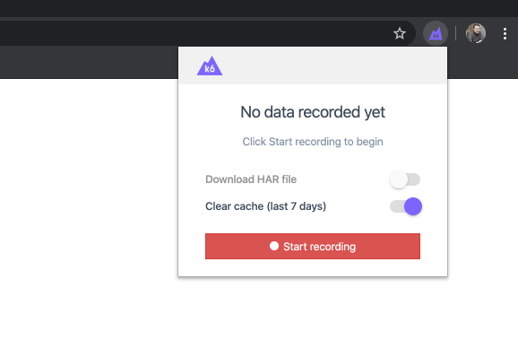
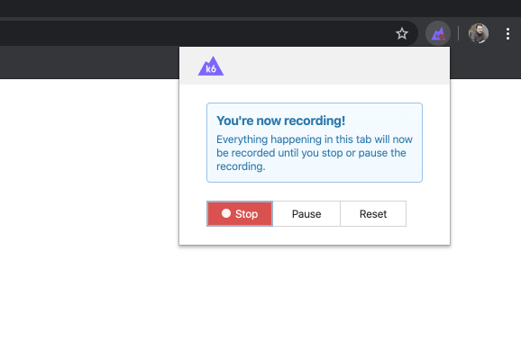
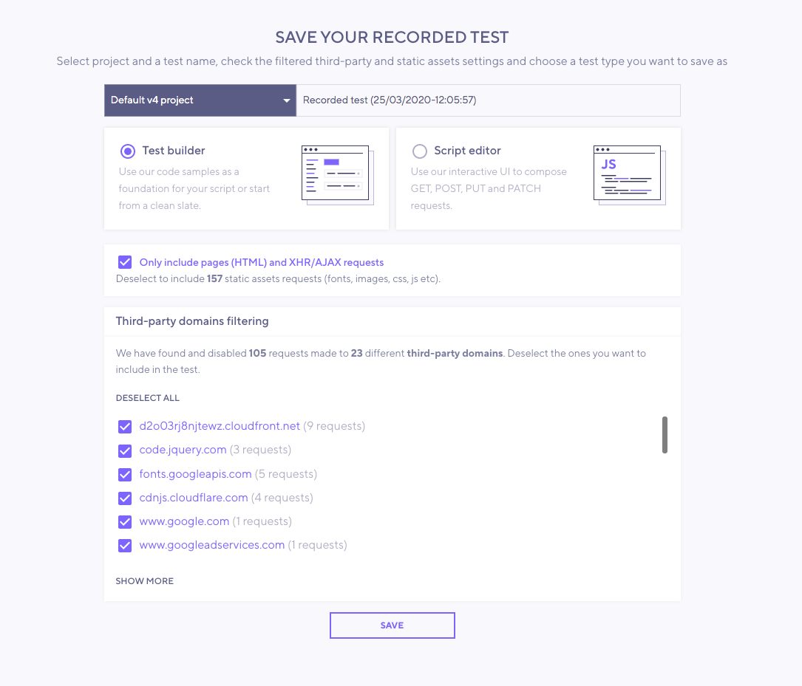

The browser recorder allows generating a k6 script based on a web session. It is available as extensions for [Chrome](https://chrome.google.com/webstore/detail/k6-browser-recorder/phjdhndljphphehjpgbmpocddnnmdbda?hl=en) and [Firefox](https://addons.mozilla.org/en-US/firefox/addon/k6-browser-recorder/).

### k6 Cloud integration

The browser recorder functionality is powered by the [k6 Cloud](/cloud). When the user finalizes the recording of the session, the extension will upload the auto-generated k6 test into the k6 Cloud account.

> #### Note
>
> It is important to know you **do not need an active paid subscription** to use the browser recorder. 
> 
> Any user can copy the script from the [k6 Cloud editor](/cloud/creating-and-running-a-test/script-editor) to edit and run the test locally using the `k6 run` command. 
> 
> _This integration has allowed us to benefit from the capabilities of the k6 Cloud web app. In the future, we plan to make the extensions operational without having a k6 Cloud account_.

### How it works

The browser recorder allows you to generate the bulk of your test scripts simply by browsing like a user would on your site or web app. The script created gives you a foundation which you can further edit, as required.

The recorder will capture everything – every single HTTP(s) request being loaded into the browser as you click – including ads, images, documents, etc., so you get a far more accurate read of what’s going on. Just press “record”, start browsing and when complete, the script will automatically upload to your k6 Cloud account.

## Instructions

1 - **Install** the [Chrome](https://chrome.google.com/webstore/detail/k6-browser-recorder/phjdhndljphphehjpgbmpocddnnmdbda?hl=en) or [Firefox](https://addons.mozilla.org/en-US/firefox/addon/k6-browser-recorder/) extension.

2 - **Start a recording**

Open the extension by clicking the k6 logo, and press "Start recording" to begin recording the current browser tab.  It's good to have in consideration the following best practices to record a user session:

**Do**

- Browse like a user would
- Take natural pauses that users would take to consume page content
- Focus on the most common use cases, rather than all the possible use cases
- Take note of pages where forms/logins occur, you will likely need to complete some scripting there

**Do NOT**

- Visit every page in one journey
- Click every possible option
- Navigate as fast as you can
- Navigate away your actual site or application

3 - **Stop the recording**

When done, press "Stop recording", you'll be taken to the app to review the recorded test script

4 - **Save your test script**

Save the recorded script in any of your projects.

If any **third party requests** are made during the recording, those requests will be filtered out by default because: 

- These third-party requests will skew the percentiles of your performance results.
- You may have no ability to impact the performance of the third-party service
- The load test may violate the terms of service contract that you have with the provider.

If you want to include some of the requests in the _third party list_, simply deselect the ones you want to include, then hit save.

5 - **Edit your script** as necessary.

Depending on the type of testing, you might need to change different aspects of the script.  The most usual changes are:
- Changing the [load options](/using-k6/options). The default is a 12 min ramp-up test.
- Handling [correlation and dynamic data](/examples/correlation-and-dynamic-data).

> #### Things to consider
>
> - The auto-generated script sets [discardResponseBodies](/using-k6/options#discard-response-bodies) to `true`. This configuration will discard all response bodies.
> - The browser extension will not record other tabs or pop up windows. If you need to capture this information, you should try the [HAR converter](/test-authoring/recording-a-session/har-converter).

6 - **Run the test** locally or in the k6 Cloud.

If you want to run a cloud test from the k6 Cloud UI, press `Run` to start the test.

If you want to use the k6 CLI to run a local or cloud test, copy the generated script to your local text editor and execute the `k6 run` or `k6 cloud` command to start the test. 

For learning more about running k6, check out the [Running k6 guide](/getting-started/running-k6).
