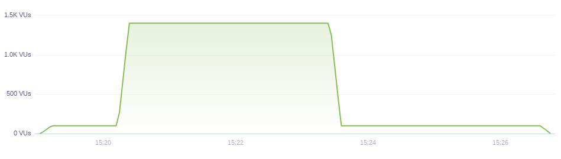

Stress testing is one of many different types of load testing.

While [load testing](/test-types/load-testing) is primarily concerned with assessing the systems performance,
the purpose of stress testing is to assess the availability and stability of the system under heavy load.

> ## What is stress testing?
>
> Stress Testing is a type of Load testing used to determine the limits of the system.
> The purpose of this test is to verify the stability and reliability of the system under **extreme conditions**.

To execute a proper stress test, one needs to push the system over its normal operations, to its limits, and _beyond the breaking point_.

You typically want to run a Stress Test to:

1. determine how your system will behave under extreme conditions
2. determine what is the maximum capacity of your system in terms of users or RPS.
3. determine the breaking point of your system and its failure mode
4. determine if your system will recover without manual intervention after the stress test is over

When stress testing, you're going to configure the test to include more concurrent users than:

1. your application typically sees
2. you think it will be able to handle.

It's important to note that a stress test does not mean you're going to overwhelm the system
immediately — that's a spike test, we're going to cover it in a minute.

A stress test should be configured in many gradual steps, each step increasing the concurrent load of the system.

A classic example of a need for stress testing is "Black Friday" or "Cyber Monday" - two days each
year that generates multiple times the normal traffic for many internet businesses.

A stress test can be only a couple of steps, or it can be many, as you see in the example below.
No matter how many steps you include, just remember this type of test is about finding out what
happens when pushing the performance limits of your system — so don’t worry about being too aggressive.

With this said, you probably don't want to run this test against your production environment.
We recommend running this type of test in a UAT or staging environment.

## Stress Testing in k6

You can easily create a stress test in k6 by properly configuring the `options` object.
Remember, the point of this test is to gradually push your system beyond its breaking point.
It's probably the easiest to start with an example.

<div class="code-group" data-props='{"labels": ["sample-stress-test.js"], "lineNumbers": [true]}'>

```javascript
import http from 'k6/http';
import { sleep } from 'k6';

export let options = {
  stages: [
    { duration: '2m', target: 100 }, // below normal load
    { duration: '5m', target: 100 },
    { duration: '2m', target: 200 }, // normal load
    { duration: '5m', target: 200 },
    { duration: '2m', target: 300 }, // around the breaking point
    { duration: '5m', target: 300 },
    { duration: '2m', target: 400 }, // beyond the breaking point
    { duration: '5m', target: 400 },
    { duration: '10m', target: 0 }, // scale down. Recovery stage.
  ],
};

export default function() {
  const BASE_URL = 'https://test-api.k6.io'; // make sure this is not production

  let responses = http.batch([
    [
      'GET',
      `${BASE_URL}/public/crocodiles/1/`,
      null,
      { tags: { name: 'PublicCrocs' } },
    ],
    [
      'GET',
      `${BASE_URL}/public/crocodiles/2/`,
      null,
      { tags: { name: 'PublicCrocs' } },
    ],
    [
      'GET',
      `${BASE_URL}/public/crocodiles/3/`,
      null,
      { tags: { name: 'PublicCrocs' } },
    ],
    [
      'GET',
      `${BASE_URL}/public/crocodiles/4/`,
      null,
      { tags: { name: 'PublicCrocs' } },
    ],
  ]);

  sleep(1);
}
```

</div>

The VU chart of a Stress Test should look similar to this:


This configuration increases the load by 100 users every 2 minutes and stays at this level for
5 minutes. We have also included a recovery stage at the end, where the system is gradually
decreasing the load to 0.

If your infrastructure is configured to auto-scale, this test will help you to determine:

1. How quickly the auto-scaling mechanisms react to increased load
2. Are there any failures during the scaling events

The point of the recovery stage is to determine if the system can serve requests once the load
decreases to a normal level. If you are testing auto-scaling, you may want to scale down in steps
as well to determine if the down-scaling is working.

# Spike testing

Spike test is a variation of a Stress Test, but it does not gradually increase the load,
instead it spikes to extreme load over a very short window of time.
While a stress test allows the SUT (System Under Test) to gradually scale up its
infrastructure, a spike test does not.

> ## What is Spike testing
>
> Spike testing is a type of stress testing that immediately overwhelms the system with an extreme surge of load.

You want to execute a spike test to:

1. Determine how your system will perform under a sudden surge of traffic
2. Determine if your system will recover once the traffic has subsided.

A classic need for a spike testing is if you've bought advertising on a big television event,
such as the Super Bowl or a popular singing competition.

You’re expecting a large number of people to see your advertisement and immediately visit your website,
which can end with disastrous results if you haven't tested for this scenario and made
performance optimizations in advance.

Another typical example is a "HackerNews hug of death" - someone links to your website on one
of the popular internet forums such as HackerNews or Reddit which makes thousands of people visit
your system at the same time.

Success or failure of a spike test depends on your expectations. Systems generally react in 4 different ways:

1. Excellent: system performance is not degraded during the surge of traffic.
   Response time is similar during low traffic and high traffic.
2. Good: Response time is slower, but the system does not produce any errors.
   All requests are handled.
3. Poor: System produces errors during the surge of traffic, but recovers to normal after the
   traffic subsides.
4. Bad: System crashes, and does not recover after the traffic has subsided.

## Spike testing in k6

Here's an example script configuration for a spike test.

<div class="code-group" data-props='{"labels": ["sample-spike-test.js"], "lineNumbers": [true]}'>

```javascript
import http from 'k6/http';
import { sleep } from 'k6';

export let options = {
  stages: [
    { duration: '10s', target: 100 }, // below normal load
    { duration: '1m', target: 100 },
    { duration: '10s', target: 1400 }, // spike to 1400 users
    { duration: '3m', target: 1400 }, // stay at 1400 for 3 minutes
    { duration: '10s', target: 100 }, // scale down. Recovery stage.
    { duration: '3m', target: 100 },
    { duration: '10s', target: 0 },
  ],
};
export default function() {
  const BASE_URL = 'https://test-api.k6.io'; // make sure this is not production

  let responses = http.batch([
    [
      'GET',
      `${BASE_URL}/public/crocodiles/1/`,
      null,
      { tags: { name: 'PublicCrocs' } },
    ],
    [
      'GET',
      `${BASE_URL}/public/crocodiles/2/`,
      null,
      { tags: { name: 'PublicCrocs' } },
    ],
    [
      'GET',
      `${BASE_URL}/public/crocodiles/3/`,
      null,
      { tags: { name: 'PublicCrocs' } },
    ],
    [
      'GET',
      `${BASE_URL}/public/crocodiles/4/`,
      null,
      { tags: { name: 'PublicCrocs' } },
    ],
  ]);

  sleep(1);
}
```

</div>

The VU chart of a Spike Test should look similar to this:


Note, the test starts with a period of 1 minute of low load, a quick spike to very high load, followed by a recovery period of low load.

Remember that the point of this test is to suddenly overwhelm the system. Don't be afraid to increase the number of VUs beyond your worst-case prediction.
Depending on your needs, you may want to extend the recovery stage to 10+ minutes to see when the system finally recovers.

<div class="doc-blockquote" data-props='{"mod": "warning"}'>

> ### ⚠️ Don't execute these tests in your production environment
>
> A successful Stress/Spike test will overwhelm your system and may make it unavailable.
> Double check your URLs to make sure you are not testing the production system.

</div>

## Conclusions

Stress and Spike testing help to prepare you for the extreme conditions your system will
inevitably encounter in production.

Preparing for inevitable is a sign of maturity for a technical organization. Stress testing not
only makes your system more reliable but also decreases the stress level of your Ops and Dev teams.

Once your system has is stress-proof, you may want to run a Soak Test to see if other reliability
issues don't surface over an extended period.
