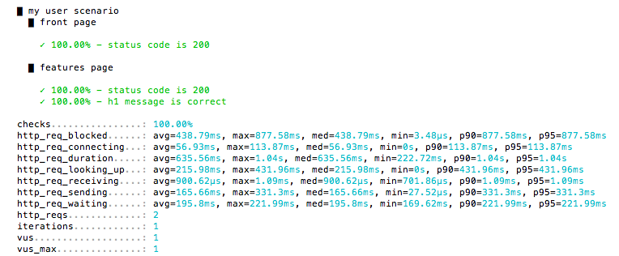

Run code inside a group. Groups are used to organize results in a test.

| Parameter | Type     | Description                                            |
|-----------|----------|--------------------------------------------------------|
| name      | string   | Name of the group.                                     |
| fn        | function | Group body - code to be executed in the group context. |

### Returns

| Type | Description               |
|------|---------------------------|
| any  | The return value of _fn_. |


### Example

<div class="code-group" data-props='{"labels": []}'>

```js
import { group, check } from "k6";
import http from "k6/http";

export default function() {
  group("my user scenario", function() {
    group("front page", function() {
      let res = http.get("https://k6.io");
      check(res, {
        "status code is 200": (res) => res.status == 200,
      });
    });
    group("features page", function() {
      let res = http.get("https://k6.io/features");
      check(res, {
        "status code is 200": (res) => res.status == 200,
        "h1 message is correct": (res) => res.html("h1").text().startsWith("Simple yet realistic load testing"),
      });
    });
  });
};
```

</div>

The above code will produce output like shown on the screenshot below,
with check results presented separately depending on which group they were executed in:

