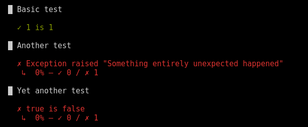

To declare a test you call the `test(name, function)` function. Provide the required name and implementation function. 
Names should be unique within the script, otherwise, your test cases are going to be grouped. 
It's passed an execution object as its first argument.

Note: The first argument of the implementation function should be named `t`.


Behind the scenes, the `test()` function creates a k6 [group](/javascript-api/k6/group-name-fn). 


| Parameter      | Type   | Description                                                                          |
| -------------- | ------ | ------------------------------------------------------------------------------------ |
| name  | string    | Test name |
| function  | function    | The function body to be executed |


### Returns

| Type    | Description                     |
| ------- | ------------------------------- |
| bool    | Returns true when all checks within the test() body were successful, and no unhandled exceptions were raised, otherwise false. |

### Example

<CodeGroup labels={[]}>

```javascript
import { test } from 'https://jslib.k6.io/functional/0.0.2/index.js';
import http from 'k6/http';

export default function testSuite() {

  let success1 = test('Basic test', (t) => {
    t.expect(1).toEqual(1)
  })

  console.log(success1); // true

  let success2 = test('Another test', (t) => {
    throw("Something entirely unexpected happened");
  });

  console.log(success2); // false

  let success3 = test('Yet another test', (t) => {
    t.expect(true).toEqual(false);
  });

  console.log(success3); // false

}
```

</CodeGroup>

Execution of this script should print the following output.




