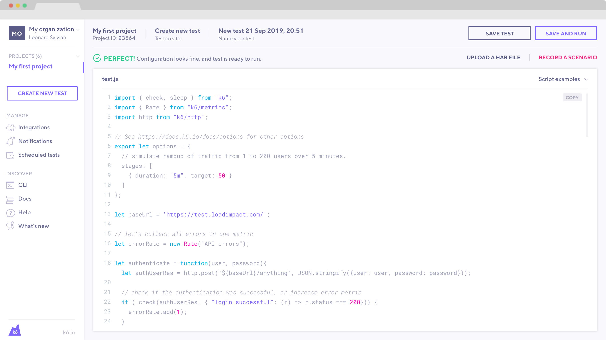

The in-app script is designed to allow you to quickly write and mock up test scripts right within the web app. We believe most users will quickly graduate to using k6 as a CLI and their IDE of choice locally. However, organizational security rules vary from organization to organization and some may not be able to install a program without review from their security team. The script editor allows you to utilize just about all features of k6 right within the web app.

Use the script editor as a stepping stone, if needed, before you move to running [cloud tests from the CLI](/cloud/creating-and-running-a-test/cloud-tests-from-the-cli).

<Blockquote mod="warning">

#### Limitations of the in-app editor

The in-app editor has access to all built-in k6 modules and remote modules available via
the web. If you need to import a custom library or file for parameterization, you
must trigger your test using the CLI.

</Blockquote>

## Usage

Usage of the script editor is straight forward and you can use it like any other editor. Note some of the built in functionality to aide you in scripting

- Built in examples
  - Clicking on any example from the drop down will launch a side by side window for you to use as guidance to adapt your script.
- Validation/error checking
  - If you have a syntactical error, we will alert you of that/prevent you from running the script. If you have such an error you will see `There are validation errors, please fix them in order to run the test` above the example drop down.
- Code Folding
  - We allow you to fold/collapse blocks of code for easier reading. You can fold by using the down arrow next to the line numbers.
- Variable highlighting
  - Selecting any variable will result in other references to that variable being highlighted in your script
