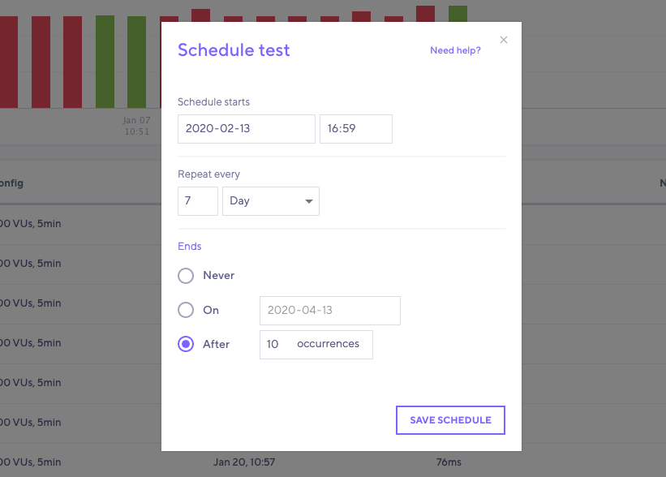

## Background

It's not always feasible to be able to trigger a test to run when you need it.  The scheduling option in k6 Cloud allows you to configure a test to execute at a particular time, and on a regular interval, if needed.

Some reasons include, but are not limited to:
- You need to test a production system and want to do it during hours with minimal usage
- You want to build a performance trend to monitor for regressions (but aren't ready to integrate it as a step in a CI Pipeline

## Scheduling

You have the ability to schedule any tests that currently exists in your k6 Cloud account that has been executed on our cloud service (you can not schedule a locally run test through the web UI). You may also schedule tests that you create within the web UI after saving your configuration.

You can schedule any of your tests from the page with the performance trending graph as shown below. This is helpful if you have triggered a cloud test from the command line and want to automatically run it regularly (without using a CI tool)

## Scheduling options

In both cases, after clicking "Schedule" you are presented with the following options. You are able to run a test now or at a later date.  You can also set the execution to repeat on an Hourly, Daily, Weekly, or Monthly interval. You can also control how long the test will run for, either after a set number of occurrences, or after a certain date.  There is some very granular control here, so do explore the option.

Finally - we do recommend setting up [notifications](/cloud/integrations/notifications) and [thresholds](/using-k6/thresholds) to complete an automated loop. Schedule your test to run and get notified if the test has passed or failed.
