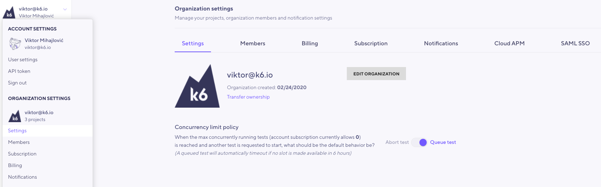
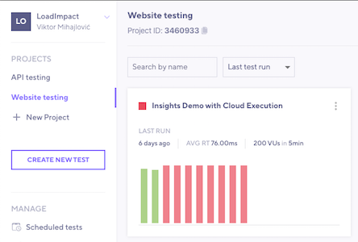

Sometimes, you might need to debug your test scripts.
Other times, you might run into some design limitations of the cloud platform.

## Prefer to debug locally {#debug-locally}

Debugging helps ensure your code produces the expected results.
While the [script editor](/cloud/creating-and-running-a-test/script-editor) can catch syntax errors, it has limited debugging abilities. 
Instead, you can run k6 locally to execute your test scripts on a small scale:

```sh
k6 run test.js
```

Debugging locally has multiple benefits:

* A cloud test counts against any subscription limits you may have.
* Execution is slower when streaming or executing in the cloud. We want debugging to be a fast iterative process.

If you've configured Virtual Users or duration in your script, you can add the flags `-i 1 -u 1` to instruct k6 to execute 1 iteration with 1 Virtual User,
making the debugging sometimes easier.

```sh
k6 run test.js -i 1 -u 1
```

For debugging, k6 also provides a few builtin options:

- [`--http-debug`](/using-k6/k6-options/reference#http-debug) prints all the requests and responses to the console. Read more [HTTP debugging](/using-k6/http-debugging).

  <CodeGroup labels={[""]}>

  ```bash
  k6 run test.js --http-debug="full"
  ```

  </CodeGroup>

- `Console logging methods` can print any message to the console. In the cloud, the console logs are shown on the [Logs Tab](/cloud/analyzing-results/logs).

  <CodeGroup labels={[""]}>

  ```javascript
  import http from 'k6/http';

  const res = http.get('http://httpbin.test.k6.io/json');
  console.log(JSON.stringify(res));
  ```

  </CodeGroup>

  Note that you can also use the [`--console-output`](/using-k6/k6-options/reference#console-output) option to redirect console logs to an output file.

    <CodeGroup labels={[""]}>

  ```bash
  k6 run --console-output "loadtest.log" script.js
  ```

  </CodeGroup>

## How to open a firewall for the k6 Cloud services {#open-firewall}

`k6 cloud` tests use k6's cloud infrastructure.
These are dynamically allocated from our cloud providers and k6 does not know the source IP until the test is running.

To open your firewall to k6 cloud traffic, you have multiple options.

### Open up your firewall to the whole range of AWS IP addresses

In this case, you would open the firewall to the load zones where you want to run your load test from.
Refer to [the list of cloud IPs](/cloud/cloud-reference/ips) for specifics.

### Identify traffic with unique headers, query params, or data

If your test requests generates unique data, you can open your firewall to this traffic.
This solution requires that your firewall can scan application payload data and apply rules based on what it finds.
Here are some examples:

#### Custom HTTP headers

You can add custom HTTP headers to any request in your script. You'll need to add the header to every single request.

<CodeGroup labels={["Custom headers"]}>

```javascript
import http from 'k6/http';

export default function () {
  const url = 'http://test.k6.io/login';
  const payload = JSON.stringify({ email: 'aaa', password: 'bbb' });
  const params = {
    headers: { 'Content-Type': 'application/json', 'Myheader': 'TOKEN_STRING' },
  };
  http.post(url, payload, params);
}
```

</CodeGroup>

#### Custom user-agent headers

If your simulated users don't need to be a certain user agent,
you can also use the `userAgent` option to set the "User-Agent" header for all subsequent requests.
That header could then contain your token value and you would not have to modify every single HTTP request in your script.

In this example, the user agent is set to `MyK6UserAgentString/1.0`

<CodeGroup labels={["User agent option"]}>

```javascript
// Set a custom User Agent globally in your test options.
export const options = {
  userAgent: 'MyK6UserAgentString/1.0',
};
```

</CodeGroup>

#### Custom query parameters

You might also use query parameters, if they don't interfere with the functionality of your application:

<CodeGroup labels={["Query parameters"]}>

```javascript
import http from 'k6/http';

// Add query parameters to your requests with a unique piece of data
export default function () {
  http.get('http://test.k6.io/?firewall_token=TOKEN_STRING');
}
```

</CodeGroup>

### Unique host name

Another option would be to request content from a certain hostname that is not in the DNS.
For this solution, you would need to configure your application to respond to requests for that hostname.
This is how you do it on the k6 cloud's side:

<CodeGroup labels={["Query parameters"]}>

```javascript
import http from 'k6/http';

// In your options, map your a unique/unused/secret hostname to the IP of the server.
export const options = {
  hosts: {
    'https://very_difficult.to.guess.hostname.com': '1.2.3.4',
  },
};
// Make your requests to that hostname
export default function () {
  http.get('https://very_difficult.to.guess.hostname.com/');
}
```

</CodeGroup>

This last solution requires that your firewall terminates SSL traffic.
Otherwise it won't see the Host header in unencrypted form.
You could also use unencrypted HTTP, but get a bit less security.

## Max concurrency reached error message {#max-concurreny}

In the context of the k6 Cloud, concurrency is the ability to execute more than one test run simultaneously. Your k6 Cloud subscription defines the maximum number of concurrent test runs. If you need to increase this limit, please contact our support team.

Additionally, you can change the concurrency limit policy that defines how k6 Cloud acts when the organization reaches the limit and a new test run is triggered.
Two options are available:

- `Abort test`: the new test run is automatically aborted. This is the default option. 
- `Queue test`: the new test run is queued for execution and starts once a slot opens.
  A queued test times out if no slot is available in 6 hours.

Note that to change the concurrency limit policy, you must be the organization owner.
You can change the policy navigating by selecting your profile, then  **Organization settings > Settings**.



### Data uploads with k6 Cloud

The [test builder](/test-authoring/test-builder) and [script editor](/cloud/creating-and-running-a-test/script-editor) in the k6 Cloud do not allow to upload a data file in your test.

If you want to execute a cloud test uploads a data file, you have to [run the cloud tests from the CLI](/cloud/creating-and-running-a-test/cloud-tests-from-the-cli) and follow the steps described on the [data uploads example](/examples/data-uploads).

## Invited to an org but can't run tests {#wrong-org}

> I was invited to an organization with a subscription. However, When I try to run tests, I get an error that my subscription doesn't have enough Virtual Users/exceeds the duration/uses too many load zones. Our subscription allows for the test I want to run. What is wrong and how do I fix this?

If you encounter a similar situation, the problem is likely that you are trying to run the test from a different organization with another subscription.

This situation often happens because when you register your account.
k6 Cloud automatically creates a "personal" default organization for you.
In this case, you might have two organizations: your "personal" organization and the organization that invited you. 

By default, tests run from your "personal" organization.

**To change organizations from the web interface:**
1. Select the profile at the top of the main nav.
1. Select the organization and select a project.



**To change tests from the k6 CLI**, you need to set the `projectID` in the test script. 
To do this:
1. Copy the project ID from the top left corner of the project dashboard.
1. Set the `projectID` as a [cloud execution option](/cloud/creating-and-running-a-test/cloud-tests-from-the-cli#cloud-execution-options).

<CodeGroup labels={["Example:"]}>

```javascript
export const options = {
  ext: {
    loadimpact: {
      projectID: 123456,
    },
  },
};
```

</CodeGroup>

Read more about managing [Organizations](/cloud/project-and-team-management/organizations) and [Projects](/cloud/project-and-team-management/projects).
