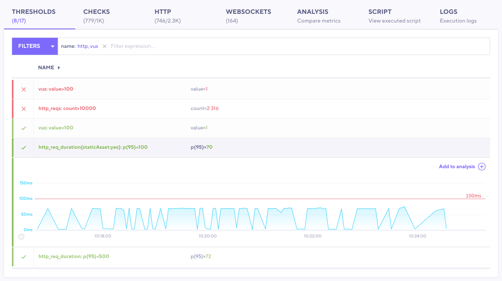

With thresholds, you can codify SLOs, and set pass/fail criteria for your test.
After your test finishes, the **Thresholds** tab  can give you valuable insight into how your system under test performed.

> **ⓘ If a threshold fails, k6 marks the test as `Failed` in the UI.**

To visual inspect and analyze thresholds, use the **Threshold** tab.
First, in the tab itself, note the number of the thresholds that passed against the total number of thresholds.
You can use this number to quickly see whether something needs your attention.

Then, you can explore the data from individual thresholds.

## Explore thresholds in k6 Cloud

You can use this tab to do the following:

- To **find failing thresholds**, use the search bar. You can filter by name, or by whether the threshold passed or failed.

  In this example, we've filtered the list of thresholds to show only thresholds with names that include either `http` or `vus`.
  Out of the thresholds that satisfies the filter criteria, two are failing, `vus: value>100` and `http_reqs:count>10000`.
  Note the &#10003; or &#10005; on the left side of each row.
- To see visualizes for the metric, select the threshold.
  A graph appears, which you can use to inspect where performance degraded.

  In our example below, the expanded thresholds calculated value is below the threshold of 100 ms.

To compare the threshold with other data about the test:
1. Select the threshold.
2. Select **Add to analysis**.
3. Then use the **Analysis** tab to find correlations between threshold data and other values from the test.

## See Also

For more information on defining `Thresholds` in your test, refer to the [Thresholds documentation](/using-k6/thresholds).
