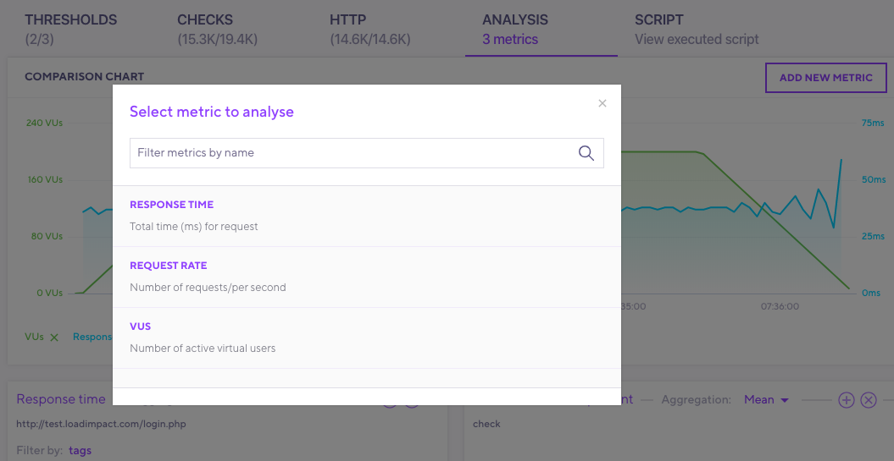
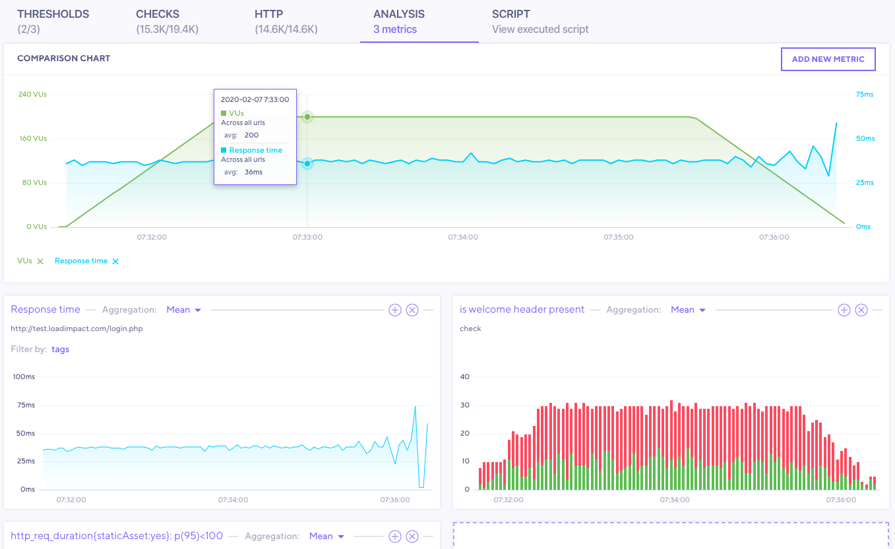

In the previous pages, this documentation gave instructions about how to add a certain aspect of your test results to the **Analysis** tab.

With the **Analysis** tab, you can organize all the interesting data points from your test in a single view.
- The default view shows the VUs, Response time, request rate, and failed requests.
- On top of these defaults, you can data from other tabs.

## Cloud Results: Analysis Tab

In the example, we've added some metrics from the previous sections.
The number shows how many metrics have been added.

Other things you can do on this tab:

- Inspect a data points by hovering over them on the chart.
- View metrics you added from previous tabs.
  - Change how the page aggregates these metrics.
- Filter by tags.
- Add small charts to the larger chart by clicking on the "+" in the top right corner of the small charts
- Add additional metrics to the small chart area by clicking `ADD NEW METRIC` in the small chart area

