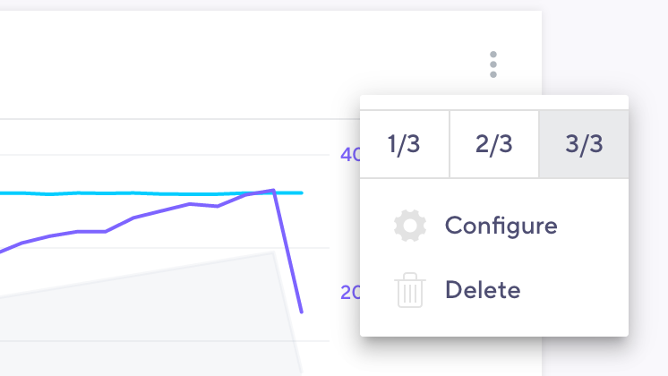
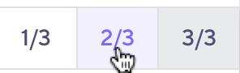
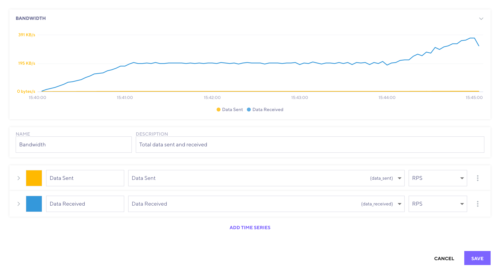
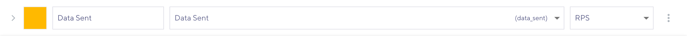
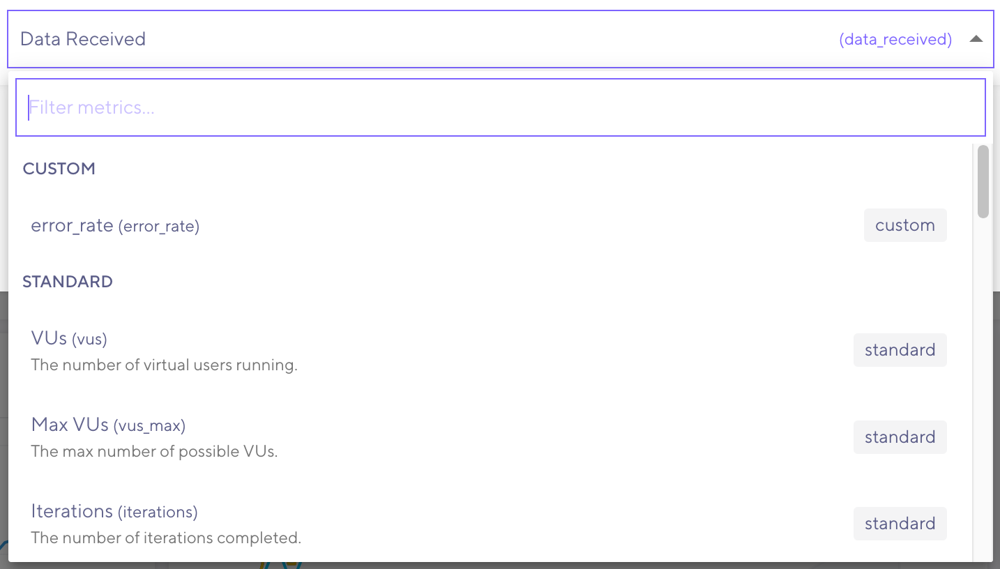
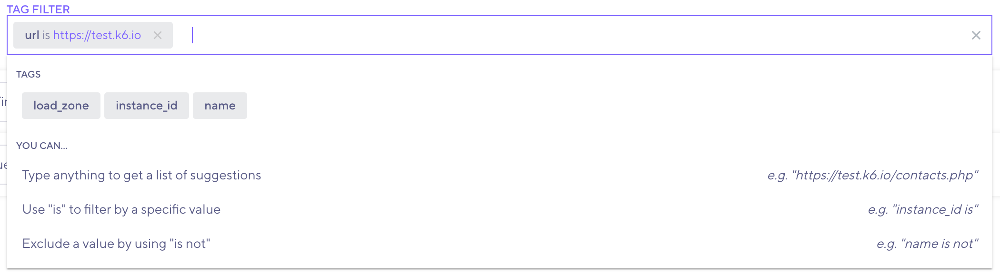
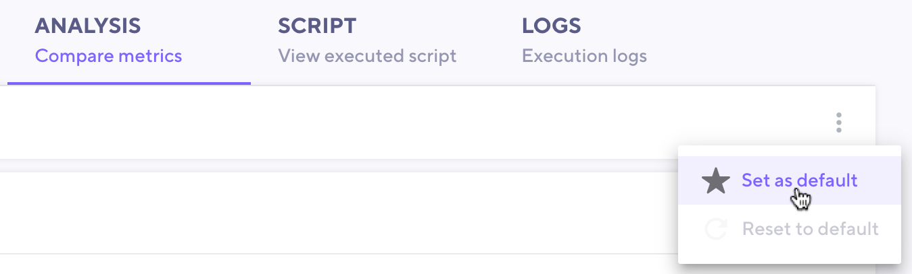
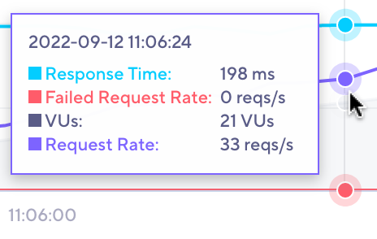
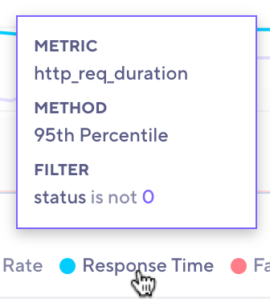

In the previous pages, this documentation showed how to add a certain value from your test results to the **Analysis** tab.
In this tab, you can organize the interesting data points of your test in a single view.

The first time you open a test run for a test, k6 generates a default layout that contains:

- An overview chart with the most common metrics that you'll want to keep track of
- One chart for each custom metric

The exact metrics that k6 adds to the overview chart vary depending on the protocols that your test uses.
For instance, if your test made HTTP requests, the chart will include the Response Time, Request Rate, and Failure Rate metrics.

You can customize the default layout to suit your needs.

## Add new charts

To add a new chart to the analysis, select **Add new chart**.
This opens the [configuration dialog](#configure-chart-data).
Once satisfied with your chart, **Save** and the new chart will be added to your analysis.

## Configure charts

You can configure charts from the menu of each panel.
This menu has a number of options.



### Change chart width

Charts come with different widths:
- 1 column
- 2 columns
- 3 columns

A wider chart draws more attention and gives you more details at a glance.
You can use this to highlight the metrics that are most important to you.

To change the size, pick a width from the menu:



<Blockquote mod="note">

The layout is responsive, so the actual number of columns may vary.
Depending on the screen size, charts that are configured to be 1 or 2 columns wide may be just as wide as those that are 3 columns wide.

</Blockquote>

### Configure chart data 

Only you know what to look for when analyzing the results of your test.
You can customize each chart to include multiple time series at different levels of details.

 

The top of the dialog shows a preview of your chart, so you can see how the final result looks.

Charts have a title and an optional description.
They also contain one or more time series. 



To help distinguish time series,
you can assign each one a color and name.

To select which metric to display data for, use the metrics dropdown.
Different metrics might have different sets of aggregations.

 

### Advanced settings

To expand the time-series row, select the arrow on the left.
This brings up some advanced options.

A line chart is not the best way to visualize all data.
To change the plot type, use the Plot Type dropdown.
The available types are:


- Line. The data as a line.
- Area. Similar to a line plot, but with a filled background.
- Column. The data as vertical bars.

### Tag filter

Sometimes you're interested in some specific detail of your test.
You can use tag filters to narrow down results.



You can create a tag filter either by selecting a tag in the dropdown and selecting the desired value, or by typing.

As you type, k6 presents a list of results matching both tag names and values.
To narrow the results down to a specific tag, use our query syntax:

```
<tag name> is <tag value>
```

These are the possible operators:

| Operator | Description                                                                 | Example                |
|----------|-----------------------------------------------------------------------------|------------------------|
| `is`     | Aggregate data where the tag matches the given value.                       | `url is https://k6.io` |
| `is not` | Aggregate all data except where the tag matches the given value.            | `protocol is not http` |

<Blockquote mod="note">

It is possible to write tag filters that never produce a result.

For instance, the `protocol` tag will always match the protocol of the `url` tag. But it is possible to write a filter
that checks for different values of these tags, e.g. `protocol is http` and `url is https://test.k6.io`. Since the
protocols of the two values don't match, no data will be returned.

Our recommendation is to keep your filters as simple as possible and filter only the values you need to.

</Blockquote>

## Guidelines for adding metrics to analysis

As you add metrics to the analysis tab, consider these tips:

- Ensure that VUs and Request rates follow the same trend.
- Add and compare interesting requests from the HTTP Websocket and gRPC tabs to compare with other metrics.
- Add the load generator CPU and Memory consumption metrics to ensure they are not saturated (metrics are only available for tests run in the cloud).
- Add thresholds that have failed.
- Add checks that have failures.
- Add metrics for endpoints that you have specific SLAs/SLOs on.

This list is just a starting point. In your test analysis, you can identify deeper issues.

## Re-use a layout for other runs

Any changes you make to the layout will be saved for that test run, so if you leave the page and come back, you will always see the same layout.
If you want to reuse the layout for all test runs, you will have to set it as default for the test.

To do this:
1. Open the menu using the menu button right under the tab bar.
1. Select **Set as default**.



If you have made local changes to a test run and want to revert to the default layout, head to the same menu and select **Reset to default**.

## Analyze your results

Once you've set up your charts, you can start analyzing your data.

To compare data points between different time series, hover over the chart.



Hovering over a time series in the legend gives you a detailed view of the query used to fetch the data.
 


<Blockquote mod="note">

Since test scripts may change between runs and the metrics reported by k6 might vary (for example, if one run dropped iterations and another did not) there may
not be any data to display. In this case, the time series will be greyed out in the legend, and its tooltip will say `No data available`.

</Blockquote>

