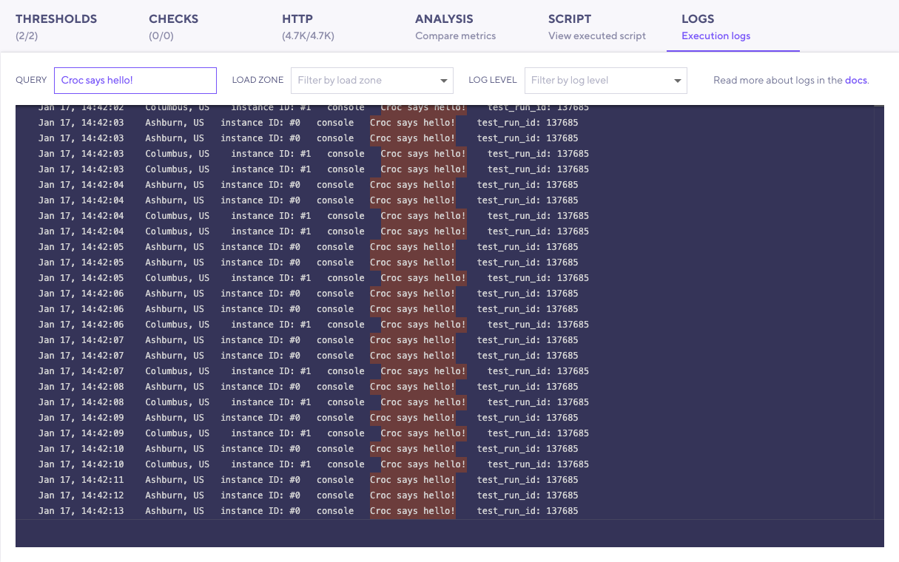

Logging messages can help debug load tests.
With the **Log** tab, you can explore logs in k6 Cloud results. 

## Logging

The k6 API supports the following console-logging methods:

- `console.log()`
- `console.info()`
- `console.debug()`
- `console.warn()`
- `console.error()`

> **Note**: `console.debug()` will log output only when you run k6 with the `-v/--verbose` flag.

Logs can help you troubleshoot your test execution.
But they *should not* replace the functionality of other k6 APIs.

For example, it is **often an anti-pattern** to use `logs` to:

- Track the status of a condition. Instead, use [Checks](/javascript-api/k6/check) to assert these conditions.
- Track a variable value during the test execution. Instead, use the [Trend](/javascript-api/k6-metrics/trend) metric.

> **Tip: Debug locally first**
>
> When your script is ready, execute the test on the k6 Cloud with the `k6 cloud` command.

## Explore logs in k6 cloud results.

With the **Logs** Tab, you can view, filter, and query log messages in the Cloud Results page.

Beyond reading log messages, you can also use the log panel to find contextual information, such as:

- The log date in the local time zone
- The load zone. The geographic zone where the load generator is.
- The instance ID. The numerical ID of the load generator taking part in the test.

Refer to [how the k6 Cloud injects environment variables](/cloud/creating-and-running-a-test/cloud-tests-from-the-cli#environment-variables) for further information about the load zone and instance ID.

### Filter by log level and load zone

Each JavaScript log statement has a severity level:

- **Info**: `console.log` and `console.info`.
- **Debug**: `console.debug`.
- **Warning**: `console.warning`.
- **Error**: `console.error`.

To filter messages by severity, use the **Log level** dropdown.

The load-zone filter displays only when your test runs in more than one load zone.

### Querying logs

After a test run finishes, you can start querying the logs.
The query will output messages that contain the string you've specified in the input.

## Logging limitations

Logs help you find script issues and debug execution anomalies.
However, you *should not* rely on logging to interpret or analyze the performance of your system.

For this reason, the cloud logs have some limitations:

- The logs are deleted three days after the test execution.
- The number of log lines is limited to 10 messages per second per server. If this limit is exceeded, k6 shows a warning with the number of discarded log lines.

## Cloud logs on the CLI

k6 aims to have a consistent experience when running local and cloud tests.

When running cloud tests using the CLI (`k6 cloud`), k6 will print cloud logs on standard output, like it would with your local tests.

To silence logs from printing on the terminal, add the `--show-logs=false` flag.

