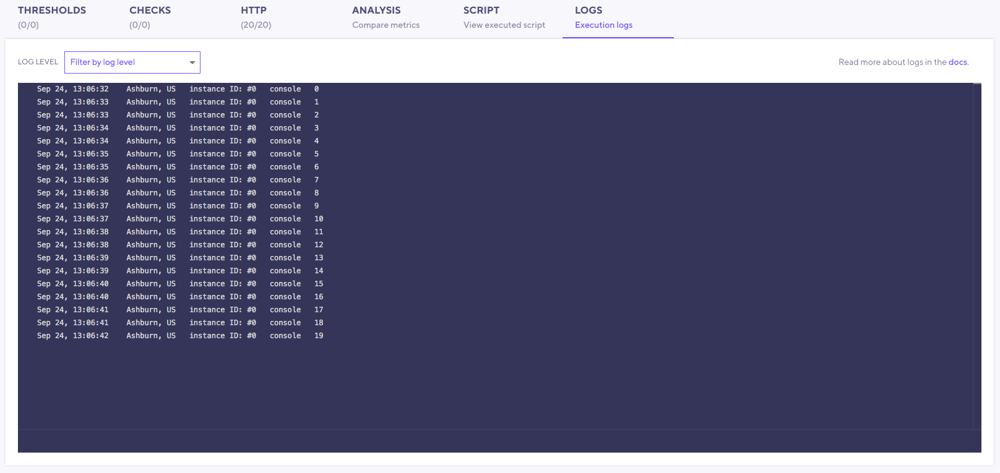
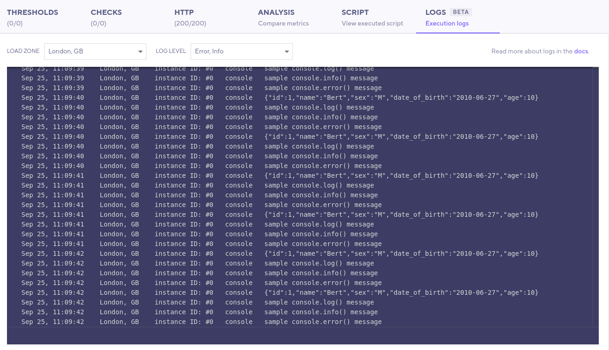
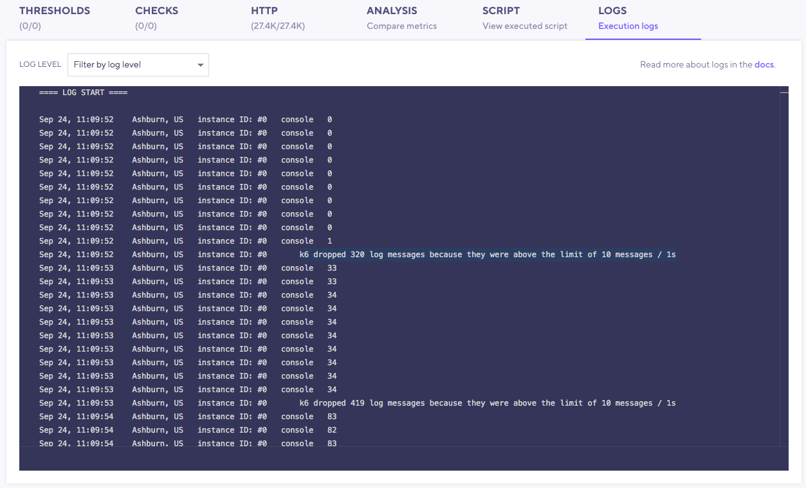
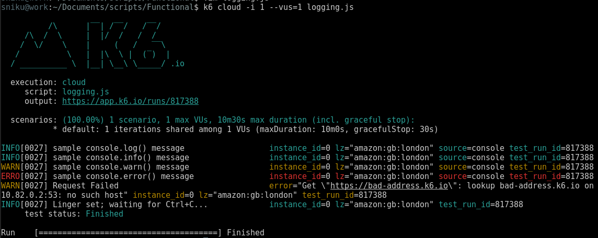

## Logging

> This feature is available since k6 `0.28.0`.

When developing a load test, it's often useful to print messages for debugging purposes.

The k6 API supports the following console logging methods:

- `console.log()`
- `console.info()`
- `console.debug()`
- `console.warn()`
- `console.error()`

Logs can aid you in troubleshooting your test execution. But they should NOT replace the functionality of other k6 APIs.

For example, it is often an **anti-pattern** to use `logs` to:

- Track the status of a condition. Instead, use [Checks](/javascript-api/k6/check-val-sets-tags) to assert these conditions.
- Track a variable value during the test execution. Instead, use the [Trend](/javascript-api/k6-metrics/trend) metric.

> **Tip**
>
> To develop and debug your load tests, we recommend, in most cases, running your tests locally - using the **`k6 run`** command.
>
> When your script is ready, execute the test on the k6 Cloud with the `k6 cloud` command.

## Logs Tab

The Logs Tab allows you to view and filter log messages in the Cloud Results page.

In addition to the log messages, the log panel shows context information such as:

- Log date in the local time zone
- Load zone: the geographic zone where the load generator server is located
- Instance ID: numerical ID of the load generator server taking part in the test

See [how the k6 Cloud injects environment variables](/cloud/creating-and-running-a-test/cloud-tests-from-the-cli#environment-variables) for further information about the load zone and instance ID.

### Filter by log level and load zone

Each JavaScript log statement has a severity level:

- **Info**: `console.log` and `console.info`.
- **Debug**: `console.debug`.
- **Warning**: `console.warning`.
- **Error**: `console.error`.

You can filter messages by severity level and load zone. The load zone filter is only present when your test has been executed in two or more load zones.

## Logging limitations

Logs are intended to help you in finding script issues and debugging execution anomalies. You should NOT rely on logging to interpret or analyze the performance of your system.

For this reason, the cloud logs have some limitations:

- The logs are deleted 3 days after the test execution.
- The number of log lines is limited to 10 messages per second per server. If this limit is crossed, a warning messages appears showing the number of discarded log lines.

## Cloud logs on the CLI

k6 aims to have a consistent experience when running local and cloud tests.

When running cloud tests using the CLI (`k6 cloud`), k6 will print cloud logs on the standard output as it does with your local tests.

If you don't want the cloud logs to be printed on the terminal, add the `--show-logs=false` argument.

Next, [Test Comparison](/cloud/analyzing-results/test-comparison)
