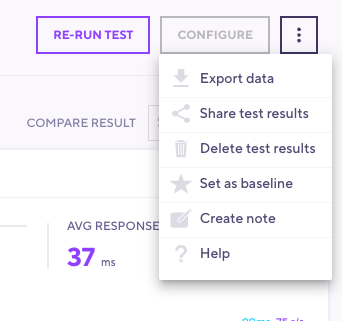
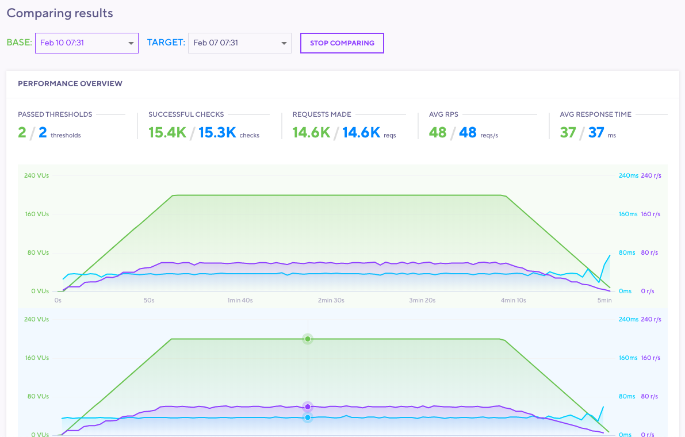
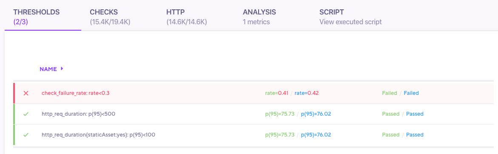
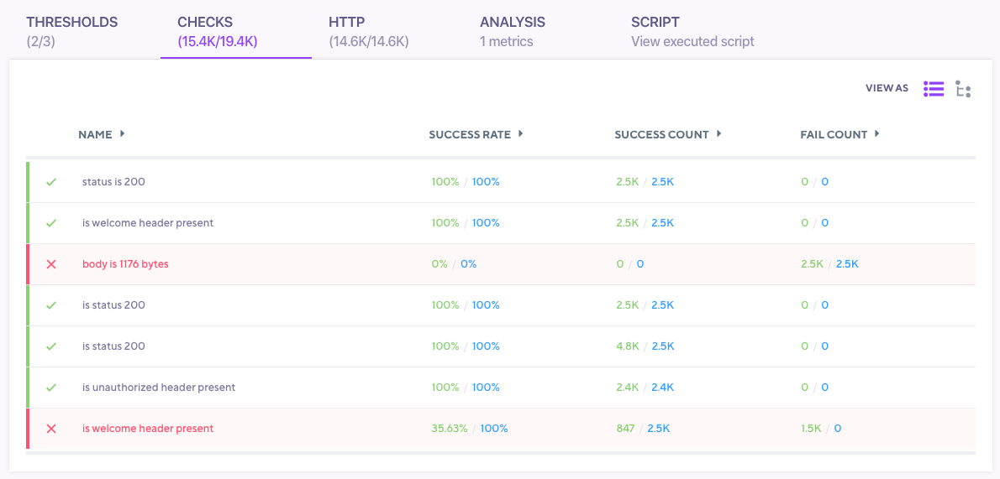
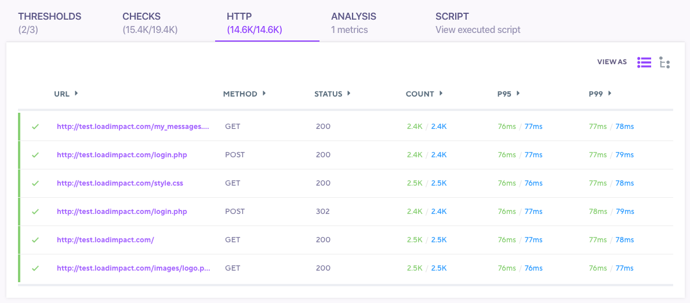

> ### Test Comparison is for comparing runs of the same Test Script
>
> When using test comparison, you may only compare tests from the same series of test runs.  You are not able to compare two different test scripts.

The test comparison feature built-in to k6 Cloud Results that allows you to compare the results of two different test runs of the same test script. You can compare high-level metrics, individual checks and URL endpoints. You may wish to compare against a previous test run to look for a measurable difference in some change you made. Or you may be comparing against a known baseline.

## Setting a baseline test

Comparing results against a known [baseline](#phase-2---baseline-testing-scaling-your-tests-and-complex-cases) is a core part of the General Methodology for [automating performance testing](/testing-guides/automated-performance-testing). Baseline tests are important as they allow you to compare against a control to look for differences. Baseline tests should produce enough load to contain meaningful data and ideal results.  In other words, a heavy [stress test](/test-types/stress-testing) isn't a good baseline. Think much smaller.

In order to set your baseline, open up the results for the test run you wish to be your baseline. Click on the three dots in the top right corner -> set as Baseline test run. Baseline tests are exempt from data retention policies.

## Selecting test runs to compare

To compare two test runs, open up one of the test runs. Then select the test run you want to compare it to using the select drop down on the right side of the test result page, just above the Performance Overview section.

## Test Comparison Mode

After you select a test you will be brought into comparison mode. While in this mode you will see two charts in the Performance Overview section and are able to change the base and target test you are comparing. This lets you quickly change between different test runs and visually see if there are any obvious performance differences.

## Thresholds Tab Test Comparison

In the thresholds tab, additional data is added to the table for the base and target test run These columns will show the current vs compared test run's Threshold `value` for each Threshold and the `pass/fail` status. Clicking on any threshold will display a separate threshold chart for each test run.

## Checks Tab Test Comparison

In the checks tab, additional data is added to the table for the base and target test run. These column will show the difference in `Success Rate`, `Success Count` and `Fail Count` between the current and compared test runs. clicking on any Check will display a separate checks charts for each test run.

## HTTP Tab Test comparison

In the HTTP Tab, additional data is added to the table for the base and target test run. Here you can compare `Count`, `p95`, and `p99` metrics for individual HTTP requests.

Clicking on a row will also show two separate charts, one for each test run. You can also change aggregation of the data to add additional metrics, such as timing breakdown for each HTTP request.

Next, [Sharing Results](/cloud/analyzing-results/test-results-menu#share-test-results)

<!---
## Analysis tab comparison

When you use the "Add this graph to analysis tab" action in the other tabs, two charts will be added to the analysis panel, one for each test run. Same goes if you add a metric via the "Add metric to visualize" button, you'll get two charts.

> <b>Only metrics from current test run can be added to comparison chart</b> 
> At this point metrics from the compared test run can't be added to the comparison chart.

--->
