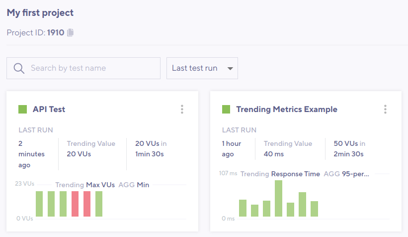
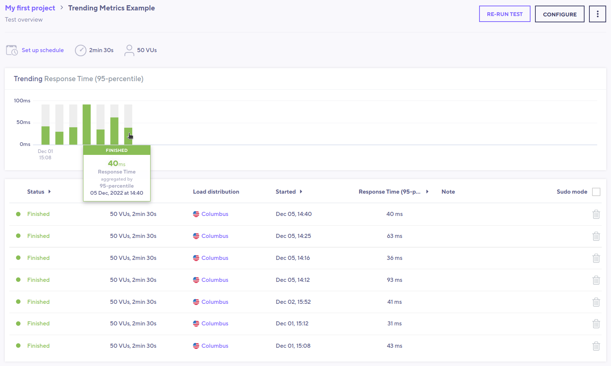
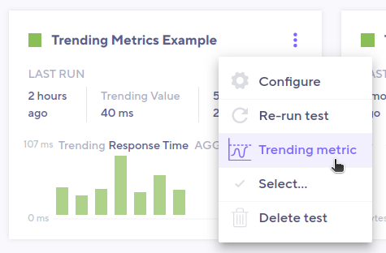
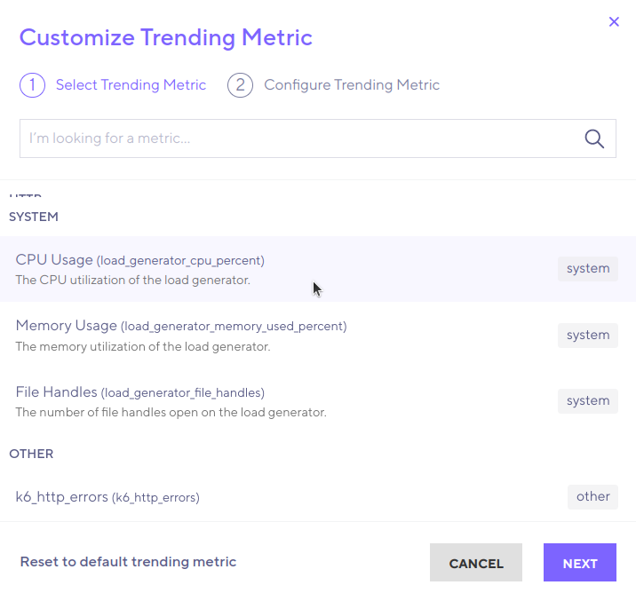
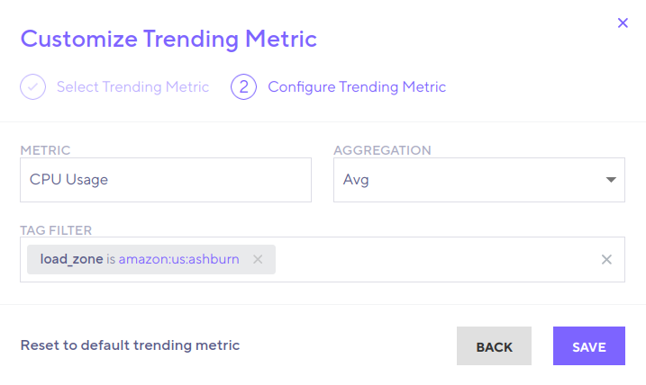
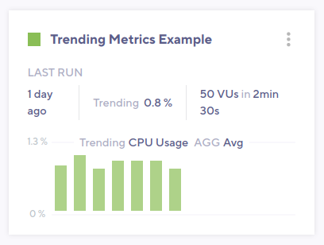

To find regressions, you can compare data from multiple test runs.
k6 Cloud provides three graphical ways to compare tests over time:

- Between a recent run and a baseline
- Between two selected runs
- Across all runs for a certain script

<Blockquote mod="warning">

**Test comparison works only on runs from the same test script**

You can't compare two different test scripts.

</Blockquote>

## Use a test as a baseline

Comparing results against a known *baseline* is a core part of the general methodology for [automated performance testing](/testing-guides/automated-performance-testing).
Baseline tests are important for comparing against a control and finding differences.

Baseline tests should produce enough load to contain meaningful data and ideal results.
In other words, a heavy [stress test](/test-types/stress-testing) isn't a good baseline.
Think much smaller.

To set your baseline, follow these steps:

1. Open the results for the test run you wish to be your baseline.
2. Select the three dots in the top right corner, then **set as Baseline**.

Baseline tests are exempt from [data-retention policies](/cloud/your-plan/about-data-retention/).

## Select test runs to compare

To compare two test runs, follow these steps:

1. Open up a test run.
2. In the top right, select **Compare result**.
3. Select the test run you want to compare the test to.

## Test comparison mode

When you compare tests, the layout of the performance-overview section changes to *comparison mode*.
Comparison mode has controls for changing base and target tests,
and the overview chart now renders time series for the two compared test runs.

Solid lines represent the base run, and dashed lines represent the comparison.
To make a certain time series more visible, select the appropriate element in the interactive legend.

### Compare scenarios

If a test has multiple scenarios, k6 presents a performance overview for each one.
If the test script uses multiple protocols, k6 categorizes the overview data by protocol.

### Compare thresholds

To compare thresholds, select the **Thresholds** tab.
You can add additional data to the table for the base and target test runs.

You can compare the following threshold data from the current and previous runs:
- The `value` of the threshold
- `pass/fail` statuses
- Previous and current test-run values for each threshold and its `pass/fail` status.

To display a separate threshold chart for each test run, select a threshold.

### Compare checks

To compare checks, use the **Checks** tab.
Here, k6 provides extra data on the table for the base and target test runs.

You can compare the following metrics from the current and previous runs:
- `Success Rate`
- `Success Count`
- `Fail Count` 

To display separate check charts for each test run, select a check.

### Compare HTTP requests

To compare HTTP requests, use the **HTTP** tab.
Here, k6 provides extra data on the table for the base and target test runs.

You can compare the following data from the current and previous runs:
- Metrics such as:
  - `request count`
  - `avg`
  - `p95 response time`
- Other data for individual HTTP requests.

To show separate charts, select the rows for each test run that you want to compare.
You can add extra charts, such as timing breakdowns for each HTTP request.

## Compare all runs for a test

To compare runs for a test across time, use the *performance-trending chart*.
The chart displayes test run metrics and uses colors to signal the status of a specific run.

To view the performance-trending chart for multiple tests belonging to a same project, open the Project page:

Additionally, in order to view the performance-trending chart for an individual test, open the test's page:

This last version of the chart shows more data points over time. For more information on an individual run, hover over any bar in the chart.

The data displayed in the performance-trending chart is `p95` of the HTTP response time (`http_req_time`) for responses with a status code (so, for example, requests that timed out are not considered).

We call this combination of metric plus aggregation function the _trending metric_ of the chart. k6 produces a single value for each test run using the trending metric, and then plots each value the chart.
It is possible to customize the trending metric on a per-test basis, which allows displaying different information in the test's performance-trending chart.

### Customizing the trending metric 

To customize the trending metric used for a test, navigate to the Project page, and then click on the three dots at the top-right corner of the test's performance-trending chart. Then, select the "Trending metric" option:

This will bring up the "Customize Trending Metric" window:

From here, you can select the metric to use in the performance-trending chart. You'll notice that both standard (created by all k6 test runs) and custom (user-defined) metrics are listed.
For this example, we will select "CPU Usage", and then advance to the next step:

In this section, you can select:
- The aggregation function to apply to the metric (in this case, "Average" is selected).
- A set of tags & tag values used to filter the metric's values (in this case, selecting values only from instances in the `amazon:us:ashburn` load zone).

Note that you can reset the configuration to use the default trending metric by clicking on `Reset to default trending metric`. This is only possible after you have made modifications to the default configuration.

Once the desired parameters have been selected, press "Save" to apply the changes. k6 will calculate the required values and then plot them in the performance-trending chart.
For the example steps describe previously, the result will look like this:

