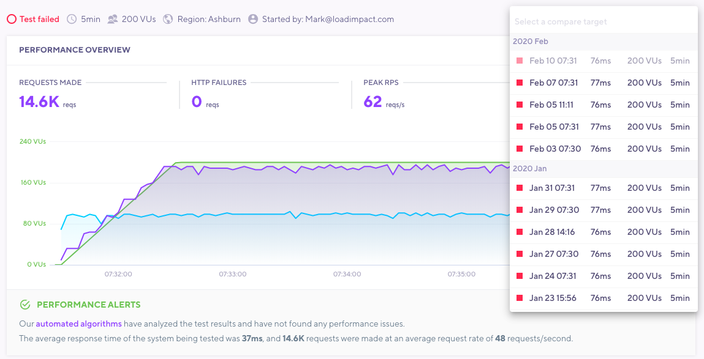
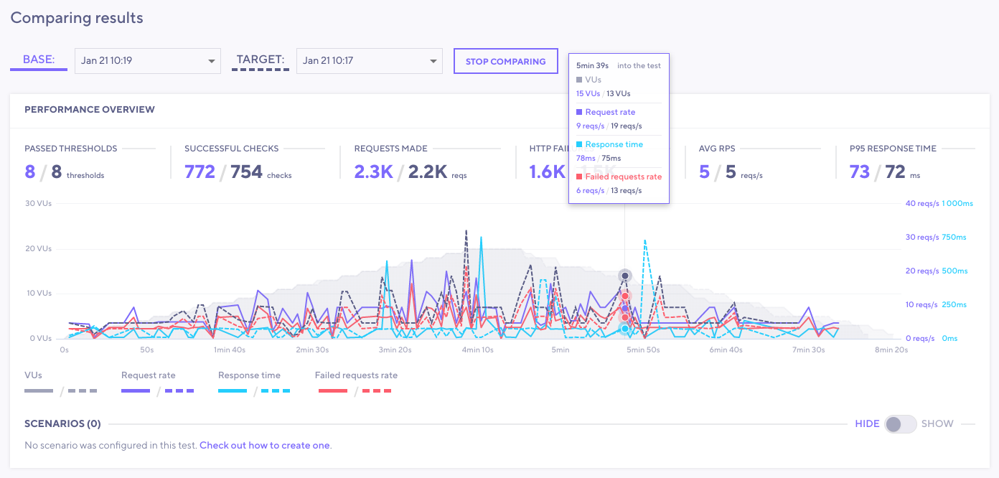
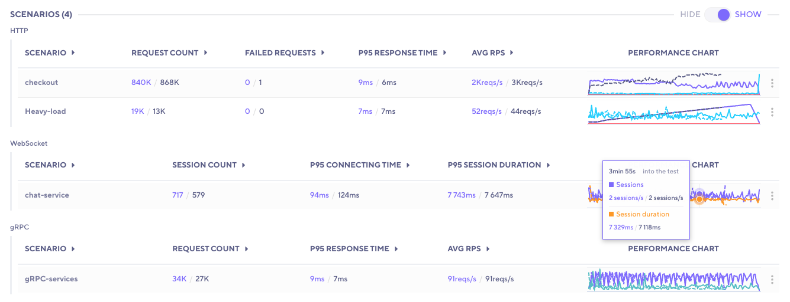
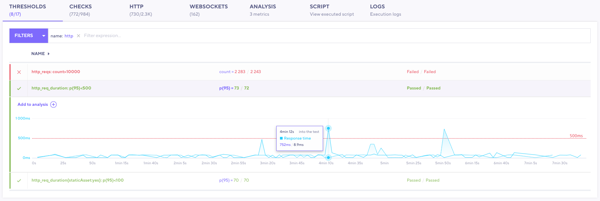
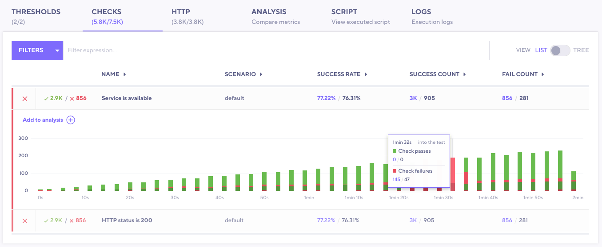

As you continue to test, tracking how results change is key to finding regressions.
k6 Cloud provides three graphical ways to compare tests over time:

- Between a recent run and a baseline
- Between two selected runs
- Across all runs for a certain script

<Blockquote mod="warning">

#### Test comparison works only on runs from the same test script

You can compare tests only from the same series of test runs.
You can't compare two different test scripts.

</Blockquote>

## Set a baseline test

Comparing results against a known *baseline* is a core part of the general methodology for [automated performance testing](/testing-guides/automated-performance-testing).
Baseline tests are important for comparing against a control and finding differences.

Baseline tests should produce enough load to contain meaningful data and ideal results.
In other words, a heavy [stress test](/test-types/stress-testing) isn't a good baseline.
Think much smaller.

To set your baseline, follow these steps:

1. Open the results for the test run you wish to be your baseline.
2. Select the three dots in the top right corner, then **set as Baseline**.

Baseline tests are exempt from [data-retention policies](/billing-user-menu/about-data-retention/).

## Select test runs to compare

To compare two test runs, follow these steps:

1. Open up a test run.
2. In the top right, select the **Compare result** dropdown.
3. Select the test run you want to compare the test to.

## Test comparison mode

When you compare tests, k6 brings you to *comparison mode*.
In comparison mode, the layout of the Performance Overview section changes quite a bit.

Controls for changing base and target test runs appear, and the overview chart now renders time series for the two compared test runs.
Solid lines represent the base run, and dashed lines represent the comparison.

To make a certain time series more visible, select the appropriate element in the interactive legend.

### Scenario comparison

If the test script configures multiple scenarios, k6 presents a performance overview for each scenario. If the test script uses multiple protocols, k6 categorizes the overview data by protocol.

### Compare thresholds

To compare thresholds, select the **Thresholds** tab.

You can add additional data to the table for the base and target test runs.
For the current and previous runs, you can compare:
- The `value` of the threshold
- `pass/fail` statuses
- Previous and current test-run values for each threshold and their `pass/fail` statuses.

To display a separate threshold chart for each test run, select a threshold.

### Compare checks

To compare checks, use the **Checks** tab.
Here, k6 provides extra data on the table for the base and target test runs.

For the current and previous runs, you can compare:
- `Success Rate`
- `Success Count`
- `Fail Count` 

To display separate check charts for each test run, select a check.

### Compare HTTP requests

To compare HTTP requests, use the **HTTP** tab.
Here additional data is added to the table for the base and target test run.
For previous and current test runs, you can compare:
- Metrics such as:
  - `request count`
  - `avg`
  - `p95 response time`
- Other data for individual HTTP requests.

To show separate charts, select the rows for each test run that you want to compare.

You can also change how the data aggregates by adding additional charts, such as timing breakdowns for each HTTP request.

## Compare a series of tests

To compare multiple tests across time, use the *performance-trending chart*.
The chart shows test times and uses color to signal the status of a specific test.

To view the performance trending graph, use the dashboard, or select the name of any given test.
In both cases, k6 plots the `p95` response time metric for all HTTP requests from the test run.

### Dashboard Performance Trending

Directly from the dashboard, you can see all your tests and the status of the test runs.
This view gives you a high-level view of how performance trends over time.

In this example, note that the test `Demo with Cloud Execution` is currently running and that its previous runs had quite a few failures.
The script, `api.js`, is passing and trending down, which is a good sign.

## Test Performance Trending

For a performance-trending graph of a specific test run, select the test.
This graph shows more data points over time.

For more information, hover over any bar in the graph.
This test has stable response times between test runs but fails its [thresholds](/using-k6/thresholds).

