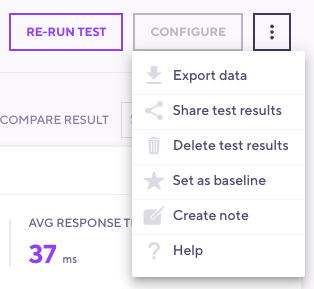

The Test Results menu allows you to take some more actions on your specific test.

## Generate PDF summary

The PDF report is an executive summary of the test result's most relevant metrics and performance data. For more information, please refer to our [documentation on Result Export](/cloud/analyzing-results/result-export#generate-pdf-report).

## Export data

Starts a data export. For more information on the structure of the export, please refer to the [documentation](/cloud/analyzing-results/result-export#export-as-csv).

## Share test results

Generates a URL that you can use to share test results.

<Blockquote mod="warning">

#### Test Result Sharing URL

The generated URL does not require a user to be authenticated to view. If you want to share sensitive results, consider adding users as [Project Members](/cloud/project-and-team-management/project-members) instead.

**Note**: The URL is not generated until after you choose the option to share.

</Blockquote>

## Delete test results

Deletes the current test result.

<Blockquote mod="warning">

#### Test deletion is not reversible

</Blockquote>

## Set as baseline

Sets the current test run as your baseline test. You are able to specify one test run per test as baseline. This allows you to compare performance over a longer period of time.

## Create Note

The `Create Note` option launches a modal window with a text box. You can use this to enter notes regarding the test, changes made, or anything that may be worth noting about your test.

