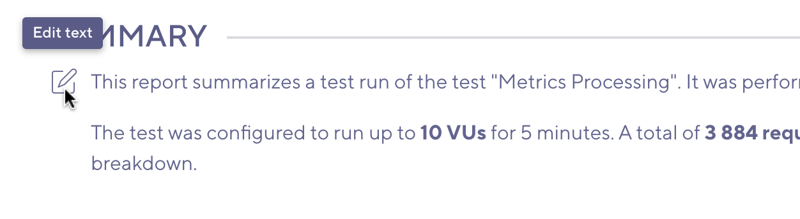
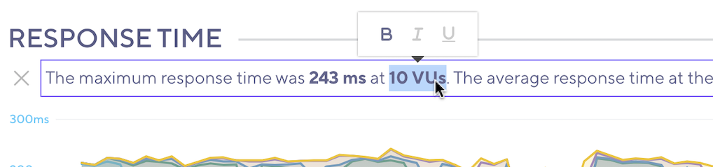

After a test finishes, you can export the test-result data in various formats:

- [PDF report](#generate-pdf-report): to share the performance results with managers and executives.
- [CSV format](#export-as-csv): to analyze the test result metrics deeper on your own.

For other methods to analyze your test results, check out the k6 Cloud integrations with [APM tools](/cloud/integrations/cloud-apm) and the [Grafana Data Source Plugin](/cloud/integrations/grafana-app).

## Generate a PDF Report

> ⭐️ The PDF report is available on annual Pro and Enterprise plans.

The PDF report is an executive summary of the test results' most relevant metrics and performance data.
To get an idea of the report looks, you can download an example [here](https://f.hubspotusercontent10.net/hubfs/1681264/Executive%20Summary%20-%20Scenarios.pdf).

### Open the editor

To generate a PDF summary, do the following:

1. Navigate to the test result you want to generate a summary of.
2. Use the three-dots icon to open [test results menu](/cloud/analyzing-results/test-results-menu) in the top right.
3. Select the `Generate PDF summary` option.

This takes you to an editor where you can customize and download the summary.

### Add or remove metrics

To limit the data included in the report, use the **Add/Remove Metrics** dropdown at the top of the page.
The editor comes with a variety of predefined metrics that can be included.

### Summarize the Results

You have a few ways to edit and format the PDF.

#### Edit text

Each section of the summary has text from a predefined template.
To edit this text:
1. Select the edit icon or the text itself.
1. Write your new text.
1. Select outside the text field.

When you are satisfied with your changes, select outside the text editor.
If you want to cancel and revert your changes, select the cancel icon next to the editor, or use the ESC key on your keyboard.

#### Formatting

To apply formatting to your text, select the text you want to format and choose the appropriate formatting from the popup.

You can also use the following keyboard shortcuts to apply format text:

| Shortcut            | Format                                                    |
| ------------------- | --------------------------------------------------------- |
| Ctrl / &#x2318; + B | **Bold**                                                  |
| Ctrl / &#x2318; + I | _Italic_                                                  |
| Ctrl / &#x2318; + U | Underline |

### Generating the PDF

Once you've finished editing the summary, select the `Generate PDF` button in the top right of the editor. This opens a progress dialog.
After a few moments, the browser will prompt you to download the PDF summary report.

> **Do not refresh or navigate away from the page while the PDF is being generated.**
> How much time it takes to generate depends on the amount of data that needs to be included.
> If your test has much data, such as many load zones, it may take longer.

## Export as CSV

To export the test result as CSV, follow these steps:
1. Select the test result.
1. Select the three-dots icon in the top right, and select `Export Data`.

The data will be exported as a ZIP file that contains a number of CSV files.

Each metric is exported to a separate file.
The export also contains a `metrics.csv` file with the list of exported metrics.

A typical k6 HTTP test will have the following files:

| File name                                        |             Metric               |           Columns                |
| ------------------------------------------------ | -------------------------------- | -------------------------------- | 
| `metrics.csv`                                    | Index of exported metrics         | `metric`,`type`,`origin`         |
| `metric_checks.csv`                              | [checks](/using-k6/metrics/) | `time`,`metric`,`scenario`,`group`,`check`,`load_zone`,`tags`,`nz_count`,`count`|
| `metric_data_received.csv`                       | [data_received](/using-k6/metrics/) | `time`,`metric`,`scenario`,`group`,`load_zone`,`tags`,`count`         |
| `metric_data_sent.csv`                           | [data_sent](/using-k6/metrics/) | `time`,`metric`,`scenario`,`group`,`load_zone`,`tags`,`count`         |
| `metric_group_duration.csv`                      | [group_duration](/using-k6/tags-and-groups/) | `time`,`metric`,`scenario`,`group`,`load_zone`,`tags`,`count`,`min`,`mean`,`median`,`p95`,`p99`,`max`,`stdev`|
| `metric_http_reqs.csv`                           | [http_reqs](/using-k6/metrics/#http-specific-built-in-metrics) | `time`,`metric`,`group`,`scenario`,`name`,`method`,`status`,`expected_response`,`load_zone`,`tags`,`count` |
| `metric_http_req_duration.csv`                   | [http_req_duration](/using-k6/metrics/#http-specific-built-in-metrics) |  `time`,`metric`,`group`,`scenario`,`name`,`method`,`status`,`expected_response`,`load_zone`,`tags`,`count`,`min`,`mean`,`median`,`p95`,`p99`,`max`,`stdev` |
| `metric_iteration_duration.csv`                  | [iteration_duration](/using-k6/metrics/) | `time`,`metric`,`scenario`,`group`,`load_zone`,`tags`,`count`,`min`,`mean`,`median`,`p95`,`p99`,`max`,`stdev` |
| `metric_iterations.csv`                          | [iterations](/using-k6/metrics/)         | `time`,`metric`,`scenario`,`group`,`load_zone`,`tags`,`count` |
| `metric_load_generator_ cpu_percent.csv`         | [load_generator_cpu_percent](/using-k6/metrics/)         | `time`,`metric`,`scenario`,`group`,`load_zone`,`tags`,`count`,`min`,`mean`,`max`,`last` |
| `metric_load_generator_ file_handles.csv`        | [load_generator_file_handles](/using-k6/metrics/) | `time`,`metric`,`scenario`,`group`,`load_zone`,`tags`,`count`,`min`,`mean`,`max`,`last` |
| `metric_load_generator_ memory_used_percent.csv` | [load_generator_memory_used_percent](/using-k6/metrics/) | `time`,`metric`,`scenario`,`group`,`load_zone`,`tags`,`count`,`min`,`mean`,`max`,`last` |
| `metric_vus.csv`                                 | [vus](/using-k6/metrics/) | `time`,`metric`,`scenario`,`group`,`load_zone`,`tags`,`count`,`min`,`mean`,`max`,`last` |
| `metric_vus_max.csv`                             | [vus_max](/using-k6/metrics/) | `time`,`metric`,`scenario`,`group`,`load_zone`,`tags`,`count`,`min`,`mean`,`max`,`last` |
| `metric_myCustomCounter.csv`                     | User-defined `myCustomCounter` [Counter](/javascript-api/k6-metrics/counter/) | `time`,`metric`,`scenario`,`group`,`load_zone`,`tags`,`count` |
| `metric_myCustomGauge.csv`                       | User-defined `myCustomGauge` [Gauge](/javascript-api/k6-metrics/gauge/) | `time`,`metric`,`scenario`,`group`,`load_zone`,`tags`,`count`,`min`,`mean`,`max`,`last` |
| `metric_myCustomRate.csv`                        | User-defined `myCustomRate` [Rate](/javascript-api/k6-metrics/rate/) | `time`,`metric`,`scenario`,`group`,`load_zone`,`tags`,`nz_count`,`count` |
| `metric_myCustomTrend.csv`                       | User-defined `myCustomTrend` [Trend](/javascript-api/k6-metrics/trend/) | `time`,`metric`,`scenario`,`group`,`load_zone`,`tags`,`count`,`min`,`mean`,`median`,`p95`,`p99`,`max`,`stdev` |

The following table is a reference for the columns in the CSV data, with examples, data types, and descriptions.

| Column          | Example                          | Type (unit)      | Description                                                                                                                               |
| --------------- | -------------------------------- | -------------- | ----------------------------------------------------------------------------------------------------------------------------------------- |
| `time`          | 2019-03-25 11:12:48.927949+00:00 | datetime (UTC) | The ISO-8601 timestamp when this data point was captured (when the HTTP request was made).                                                |
| `metric`        | http_req_duration                | string         | The metric name that this data point represents.                                                                                          |
| `group`         | "my group"                       | string         | The group name [`group()`](/using-k6/tags-and-groups) from where this request was made.                                                 |
| `scenario`      | default                          | string         | The name of the scenario that this metric was collected in.                                                                           |
| `url`           | `http://test.k6.io/style.css`      | string         | The URL requested.                                                                                                                        |
| `method`        | GET                              | string         | The HTTP method of the request that this data point represents.                                                                           |
| `status`        | 200                              | number         | The HTTP response status code of the request that this data point represents.                                                             |
| `count`         | 1.0                              | number         | Number of samples that this data point represents (if > 1 `response_time` is an aggregate value).                                         |
| `load_zone`     | amazon:us:ashburn                | string         | The load zone where the request(s) was made from.                                                                                         |
| `tags`          | {"staticAsset":"true"}           | string         | JSON formatted list of `{"name": "value"}` tags as specified for the request in the script.                                                      |
| `min`           | 1.008016                         | number (ms)    | The minimum response time for samples collected within the time bucket. |
| `mean`          | 3.008016                         | number (ms)    | The mean response time for samples collected within the time bucket. |
| `median`        | 5.468016                         | number (ms)    | The median response time for samples collected within the time bucket. |
| `p95`           | 10.10816                         | number (ms)    | The 95th percentile response time for samples collected within the time bucket. |
| `p99`           | 14.08016                         | number (ms)    | The 99th percentile response time for samples collected within the time bucket. |
| `max`           | 15.08016                         | number (ms)    | The maximum response time for samples collected within the time bucket. |
| `stdev`         | 0.075112                         | number (ms)    | The standard deviation time for samples collected within the time bucket. |

