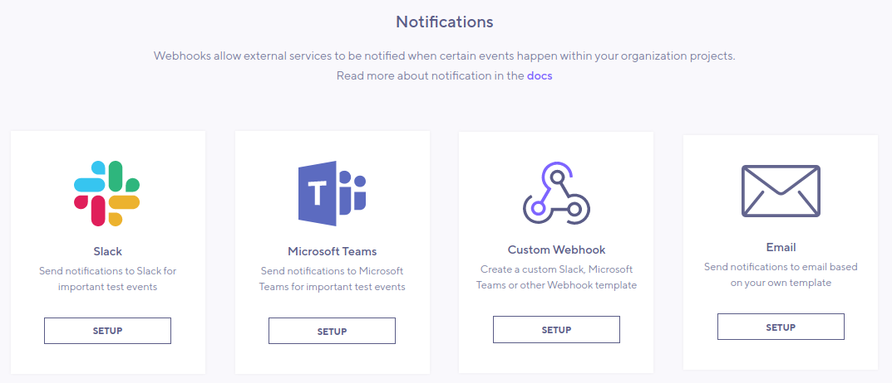
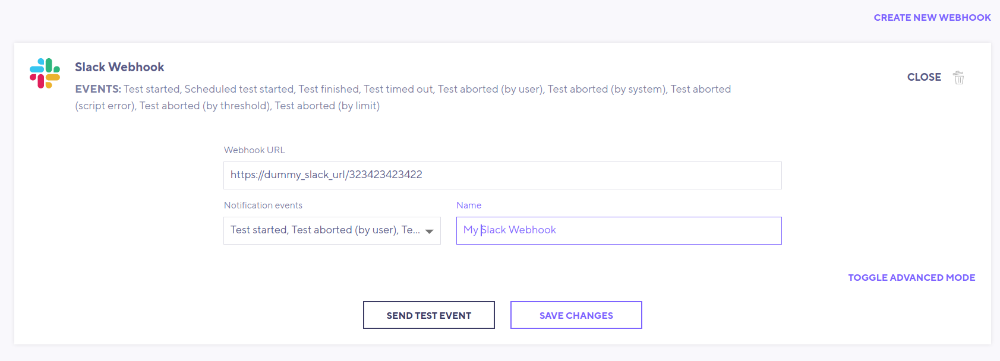
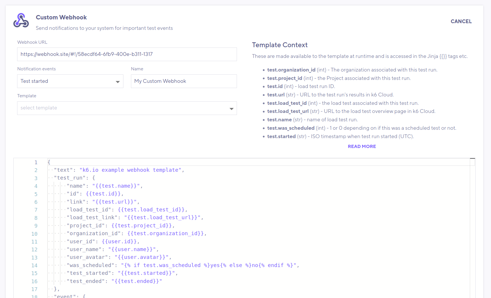
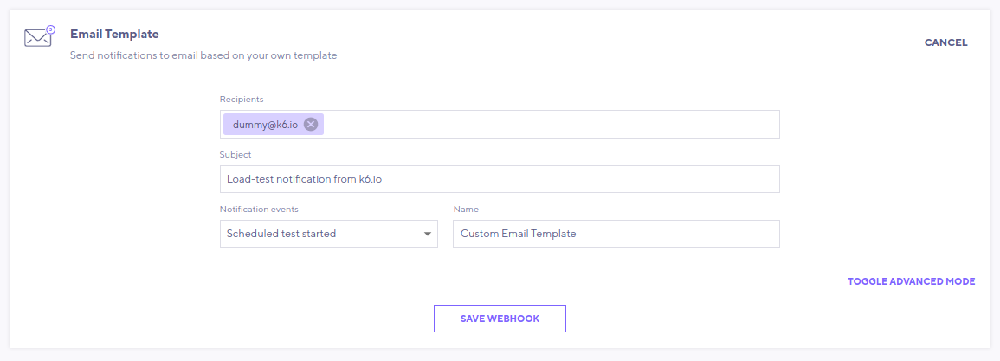

Notifications allow third-party services to be notified via
[Webhook](https://en.wikipedia.org/wiki/Webhook) or [Email](https://en.wikipedia.org/wiki/Email) 
when various test-related
events of your choice happen in your organizations/projects. Commonly monitored
events are if a test is aborted unexpectedly or if it fails a
[check](/using-k6/checks) or [threshold](/using-k6/thresholds).

You will likely want to use notifications when you schedule your performance
tests and/or configure them into your Continuous Integration (CI) pipeline.

> **Note:** Notifications are configured per organization by the organization's
> owner or an admin member.

k6 supports four different integration options: _Slack_, _Microsoft Teams_ and
your own _Custom Webhook_ or _Custom Email_. Each option can also be customized freely 
if our default is not exactly what you need.



## Adding a Slack notification

[Slack](https://slack.com/) is a proprietary business communication platform.

1. From Slack, add a Custom Integration and select _Incoming WebHook_ app.
2. Select or create a channel and copy Slack's generated WebHook URL.
3. From the k6 web app, select `Notifications` from the left menu bar. From
   there, select to setup _Slack_.
4. Add Slack's WebHook URL into the `Webhook URL` input field.
5. From the `Notification event` dropdown, pick the events you want to be notified by, or all of them.
   You can find descriptions of the available events [below](#supported-notification-events).
6. Optionally, give your notification a name (in case you want more than one Slack integration)
7. Press `Save`. If you now go back to `Configure` the notification you just created, you'll see a
   `Send test event` button. Use that to send a dummy message and to make sure it works.



> By pressing the _toggle advanced mode_ button you can view and customize exactly what will be
> sent to Slack. Read more about it in the [Custom webhook](#adding-a-custom-webhook) section below.

---

## Adding a Microsoft Teams notification

[Microsoft Teams](https://docs.microsoft.com/en-us/microsoftteams/) is a hub for team
collaboration in office 365.

1. Figure out the webhook URL for your Microsoft Team setup.
2. From the k6 web app, select `Notifications` from the left menu bar. From there,
   select to setup _Microsoft Teams_.
3. Add The Teams URL into the `Webhook URL` input field.
4. From the `Notification event` dropdown, pick the events you want to be notified by, or all of them.
   You can find descriptions of the available events [below](#supported-notification-events).
5. Optionally, give your notification a name (in case you want more than one Teams integration)
6. Press `Save`. If you now go back to `Configure` the notification you just created, you'll see a
   `Send test event` button. Use that to send a dummy message and make sure it works.


> By pressing the _toggle advanced mode_ button you can view and customize
> exactly what will be sent to Microsoft Teams. Read more about it in the
> [Custom webhook](#adding-a-custom-webhook) section below.

---

## Adding a Custom Webhook

While k6 offers defaults for Slack and Microsoft Teams, you can send to any
third-party service with a webhook integration. The JSON payload can be
customized directly in the k6 app.

1. Get the webhook URL of your service of choice. If you are experimenting it
   may be an idea to first try with some free online service that provides temporary
   URLs for webhook debugging, like [webhook.site](https://webhook.site/).
2. From the k6 web app, select `Notifications` from the left menu bar. From there,
   select to setup a _Custom Webhook_.
3. Add your URL in the `Webhook URL` input field.
4. From the `Notification event` dropdown, pick the events you want to be notified by, or all of them.
   You can find descriptions of the available events [below](#supported-notification-events).
5. Optionally, give your notification a name to separate different hooks.
6. Optionally, select a `Template` to start from. The _Generic Template_ showcases all the possible
   values k6 can send. The _Slack/Microsoft Teams_ templates are the same ones you can customize by clicking
   `Toggle advanced mode` within each integration.
7. Modify the JSON payload as needed. Note the `Template Context` pane on the right - this lists most available
   properties k6 cloud returns. The full list of template variables is [found below](#template-context-variables).
8. Press `Save` and fix any eventual errors reported.
9. Once Saving completes correctly, go back to `Configure` the notification you
   just created and click the `Send test event` button. This sends a dummy
   message to your URL. All the context fields in your template will be filled
   with mock values to make sure it works.
10. Fix any errors reported by sending the test event. Make sure to also
    double-check so that you get the expected value-type for every field on the
    receiving end (if there was a typo in the variable-name some may just be
    left empty without giving an explicit error).



## Adding a Custom Email notification

Instead of using webhooks you can have k6.io send you an email.

1. Decide which email or emails to receive the notification.
2. From the k6 web app, select `Notifications` from the left menu bar. From there,
   select to setup _Email_.
3. In the `Recipients` field select your organization's member emails from a dropdown or 
   alternatively enter the email address or addresses that should receive the
   notification. Separate multiple emails by commas or spaces.
4. Enter `Email Subject`. This is useful if you want to filter
   and organize notifications in your email program.
5. From the `Notification event` dropdown, pick the events you want to be notified by, or all of them.
   You can find descriptions of the available events [below](#supported-notification-events).
6. Optionally, give your notification a name to separate different notifications.
7. Optionally, select a `Template` to start from. The default _Email notification_ is a simple
   HTML-enhanced email template with human-readable test results. You can edit this to your liking.
8. Press `Save` and fix any eventual errors reported.
9. Once Saving completes correctly, go back to `Configure` the notification you
   just created and click the `Send test event` button. This sends a dummy
   message to your email address/addresses. All the context fields in your template will be filled
   with mock values to make sure it works.
10. Fix any errors reported by sending the test event. Make sure to also
   double-check so that you get the expected value-type for every field on the
   receiving end (if there was a typo in the variable-name some may just be
   left empty without giving an explicit error).



## Supported Notification events

You can receive notifications for two main situations - when a test-run
_starts_ and when it _ends_. You can then further limit the conditions under which
a notification is sent.

### Events when a test starts

| Event name             | Identifier               | Description                    |
| ---------------------- | ------------------------ | ------------------------------ |
| Test started           | `test.started.manual`    | Only tests started manually    |
| Scheduled test started | `test.started.scheduled` | Only tests that were scheduled |

### Events when a test ends

| Event name                  | Identifier                           | Description                                                                                   |
| --------------------------- | ------------------------------------ | --------------------------------------------------------------------------------------------- |
| Test finished               | `test.finished.finished`             | All tests that ends with a `Finished` run-status                                              |
| Test finished successfully  | `test.finished.success`              | Only tests that _pass_ their [checks](/using-k6/checks) or [thresholds](/using-k6/thresholds) |
| Test failed                 | `test.finished.failed`               | Only tests that _fail_ their checks or thresholds                                             |
| Test timed out              | `test.finished.timed_out`            | Only tests that _timed out_ in some way due to an upstream issue                              |
| Test aborted (by user)      | `test.finished.aborted_user`         | Only tests that were _aborted_ manually by a user                                             |
| Test aborted (by system)    | `test.finished.aborted_system`       | Only tests that were _aborted_ due to some upstream system problem                            |
| Test aborted (script error) | `test.finished.aborted_script_error` | Only tests that were _aborted_ due to a test-script error                                     |
| Test aborted (by threshold) | `test.finished.aborted_threshold`    | Only tests that were _aborted_ by crossing a test threshold                                   |
| Test aborted (by limit)     | `test.finished.aborted_limit`        | Only tests that were _aborted_ due to hitting an execution or network limit                   |

You can safely pick multiple options and will still at most get two notifications per
test-run, one when it starts and one when it ends. The event-identifier will be passed along
to specify which condition triggered the notification.

<!--  These are not in frontend, superfluous and commented out for now:
|  -    | `test.started.all` | All tests started, no matter how |
|  -    | `test.finished.all` | All tests that ends, no matter how |
-->

## Templating syntax

The notification templates use the
[Jinja2](https://jinja.palletsprojects.com/en/2.11.x/) templating language.
Jinja uses `{{ }}` to mark places in the template that will be replaced by
actual values when the notification is created.

For example, let's say we want to include the running test's name and
identifier in our context. From the `Template Context` list we see that these
variables are accessed as `test.name` and `test.id`. Here's what we need to add
to the template:

```json
{
  ...
    "name": "{{ test.name }}",
    "test_run_id": {{ test.id }},
  ...
}
```

Jinja also supports simple if/else conditionals. These are written on the form

```json
if_true_resultif_untrue_result
```

Here is an example (from the generic template) of setting a color based on the
result of the test-run:

```json
{
    ...
    "color": "redgreen",
    ...
}
```

Jinja also allows for for-loops.

```json
{% for value in iterable}
    ...

```

This example loops over the list of `errors` (if any):

```json
"errors": [
      
        {
          "code": {{error.code}},
          "error_created": "{{error.created}}",
          "error_detail": "{{error.detail}}"
        }{{"," if not loop.last}}
      
  ]
```

The `loop.last` is a special Jinja feature used here in order to not add a
comma after the very last item (a comma at the end would not be valid JSON).

> It's important to remember that after the Jinja-parsing/replacing, the result _must be a valid JSON structure_.
> So in the examples above, note how we can leave the `test.id` as-is (since
> it's an int), but because the `test.name` is a string it must be enclosed
> in quotes `" ... "`. In the same way, the for-loop output must be created inside `[ ... ]` to
> have the result be a proper JSON array.

---

## Template Context variables

These are variables available for use in your notification templates. A short
list of these are available in the app, here is the full list. They will
usually be accessed with Jinja's `{{ }}` tags. Note the type of each value
and especially remember to put double-quotes around strings so the result
after template-replacement is still valid JSON.

### \`test\`

This holds test-run data for the test-run that triggered the event.

| Variable               | Type  | Description                                                           |
| ---------------------- | ----- | --------------------------------------------------------------------- |
| `test.organization_id` | `int` | The organization associated with this test-run                        |
| `test.project_id`      | `int` | The project associated with this test-run                             |
| `test.id`              | `int` | The test-run ID                                                       |
| `test.url`             | `str` | A link to the test-run result data in the K6 cloud app                |
| `test.load_test_id`    | `int` | The test associated with this test-run                                |
| `test.load_test_url`   | `str` | A link to the test's page in the k6 cloud app                         |
| `test.name`            | `str` | The name of this test                                                 |
| `test.was_scheduled`   | `int` | 1 or 0 depending on if this was a scheduled test or not               |
| `test.started`         | `str` | ISO time stamp for when test-run started (GMT)                        |
| `test.ended`           | `str` | ISO time stamp for when test-run ended (GMT)                          |
| `test.status`          | `int` | The [run-status code](/cloud/cloud-faq/test-status-codes) of the test |
| `test.status_text`     | `str` | Run-status as human-readable text ("Finished", "Timed out" etc)       |
| `test.result`          | `int` | Is `0` if passed, `1` if failed                                       |
| `test.result_text`     | `str` | Result as text ("Passed"/"Failed")                                    |

### \`user\`

Information about the user associated with this test-run.

| Variable      | Type  | Description                                                                           |
| ------------- | ----- | ------------------------------------------------------------------------------------- |
| `user.id`     | `int` | The user starting this test-run                                                       |
| `user.name`   | `str` | The full name of the user (first and last name, if available)                         |
| `user.avatar` | `str` | A [gravatar](https://en.gravatar.com/) link, needed for example for Slack integration |

### \`event\`

This holds details about the event itself.

| Variable     | Type  | Description                                                                                                                               |
| ------------ | ----- | ----------------------------------------------------------------------------------------------------------------------------------------- |
| `event.id`   | `str` | Unique hash for this event                                                                                                                |
| `event.type` | `str` | This is the event trigger type that fired, like "test.finished.all". If no `event` was specified, this will be the string `<any>`         |
| `event.text` | `str` | This is a more readable description of the event type, like "Test finished running". If `event.type` is `<any>`, this will be `"Unknown"` |

### \`errors\`

This is an array of error objects attached to this test run (if any).

| Variable | Type    | Description      |
| -------- | ------- | ---------------- |
| `errors` | `array` | Holds all errors |

If looping over this array (let's call the loop variable `error`), each item in
the list has the following properties:

| Variable        | Type  | Description                                                       |
| --------------- | ----- | ----------------------------------------------------------------- |
| `error.code`    | `int` | An internal error code only useful when reporting a problem to us |
| `error.created` | `str` | ISO string with the time the error was triggered                  |
| `error.detail`  | `str` | A short description of the error                                  |

## Notification message format

When an event is triggered, k6cloud sends a HTTP POST request to the configured
URL.

Headers sent with all requests:

| Header            | Description                          |
| ----------------- | ------------------------------------ |
| `X-k6cloud-ID`    | Unique ID for this request           |
| `X-k6cloud-Event` | Name of the event, like "test.ended" |
| `User-Agent`      | Always "K6CloudWebHook"              |

Header Example:

<CodeGroup labels={["Example Headers"]}>

```json
X-k6cloud-ID: 19c5d426-3b4d-43c3-8277-37ad7d457430
X-k6cloud-Event: test.started
User-Agent: K6CloudWebHook
```

</CodeGroup>

The body of the request is a JSON structure created by populating the chosen
notification template with values relevant to the event.
