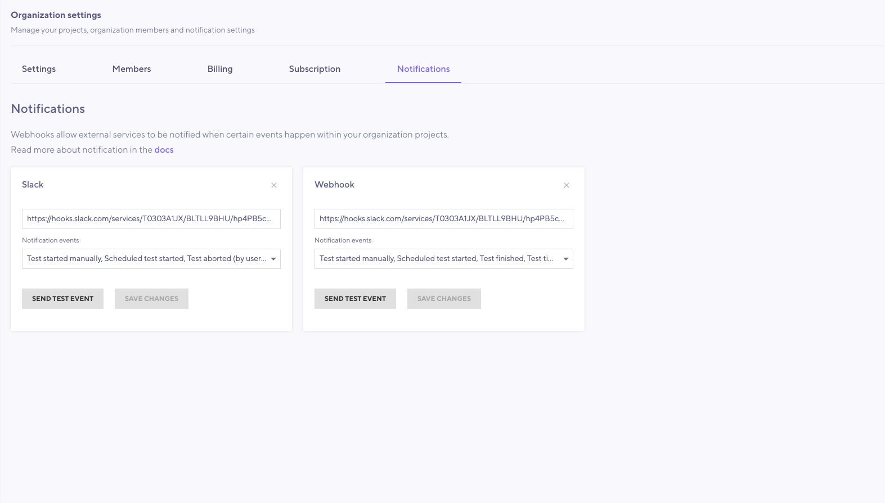
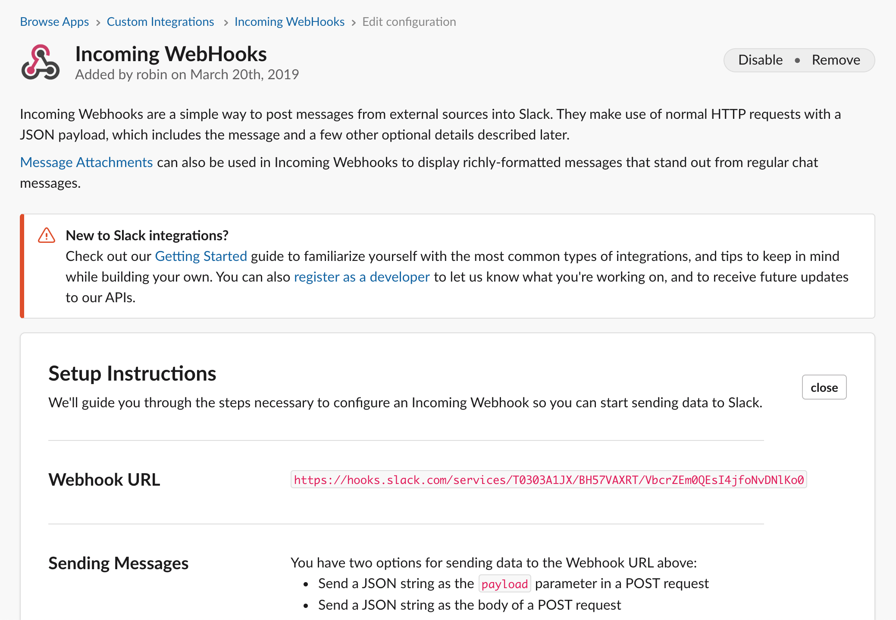

Notifications allow you to subscribe to events happening in your organizations/projects. You can receive notifications to be aware when:

- A test has started.
  - With option to notify on "manual" or "scheduled" tests.
- A test has completed
  - With option to notify based on specific result statuses, eg. only on test failure (like a [threshold](/using-k6/thresholds) failing).

You will likely want to use notifications when you schedule your performance tests and/or configure them into your Continuous Integration pipeline.

k6 supports two different notification options:

- Slack
- WebHook

**Note:** Notifications are configured per organization by the organization owner or an admin member.



## Slack

Slack is a messaging app for teams. Follow these instructions to configure Slack notifications:

1. From Slack, add a Custom Integration and select Incoming WebHook app.
2. Select or create a channel and copy the generated WebHook URL.
3. From the k6 web app, select "Integrations" from the left menubar, and from there select "Setup" for Slack.
4. Add Slack WebHook URL into the URL input field and click Save Changes or Test Hook.



---

## WebHooks

When an event is triggered, we'll send a HTTP POST request to the configured URL with a JSON payload containing event specific data. The format is explained in the following section.

---

## Notification events

Headers sent with all requests

| Header             | Description                                                           |
| ------------------ | --------------------------------------------------------------------- |
| X-LoadImpact-ID    | Unique ID for this request                                            |
| X-LoadImpact-Event | Name of the event                                                     |
| User-Agent         | User agent for webhook requests always start with `LoadImpactWebHook` |

<div class="code-group" data-props='{"labels": ["Example Headers"]}'>

```
Example headers:
X-LoadImpact-ID: 19c5d426-3b4d-43c3-8277-37ad7d457430
X-LoadImpact-Event: test.started
User-Agent: LoadImpactWebHook
```

</div>

## Load test run started event

Sent when a load test is starting.

Example JSON body:

<div class="code-group" data-props='{"labels": ["Example JSON body"]}'>

```json
{
  "status": 2,
  "status_text": "Running",
  "user_id": 1,
  "name": "Load test",
  "organization_id": 1,
  "load_test_id": 1,
  "load_test_run_id": 1,
  "project_id": 1,
  "event": "test.started"
}
```

</div>

## Load test run finished event

Sent when a load test finishes, aborts or fails

Example JSON body:

<div class="code-group" data-props='{"labels": ["Example JSON body"]}'>

```json
{
  "status": 3,
  "status_text": "Finished",
  "user_id": 1,
  "name": "Load test",
  "organization_id": 1,
  "load_test_id": 1,
  "load_test_run_id": 1,
  "project_id": 1,
  "event": "test.finished"
}
```

</div>

## Status Codes

| Status	 | Description
|------- | ------------
| -2	 | Created
| -1	 | Validated
| 0	 | Queued
| 1	 | Initializing
| 2	 | Running
| 3	 | Finished
| 4	 | Timed out
| 5	 | Aborted by user
| 6	 | Aborted by system
| 7	 | Aborted by script error
| 8	 | Aborted by threshold
| 9	 | Aborted by limit

---

## Test notification channel event

Test event that can be triggered from the UI to test webhook

Example JSON body:
```json
{
"event": "test.notification_channel"
}
```
