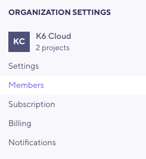
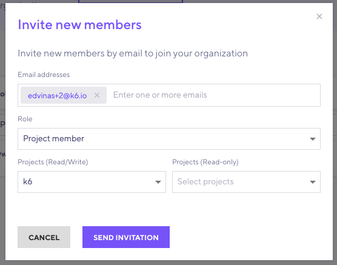
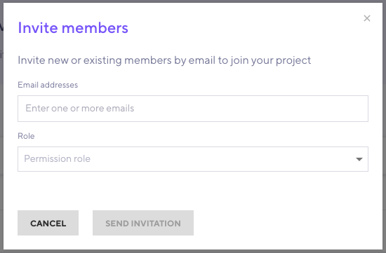

Members are individuals in your organization.
You can assign members roles and grant varying levels of access.

## Roles

k6 supports the following roles:

- [Owner](#owner)
- [Admin](#admin)
- [Project member](#project-member): Read/Write or Read-Only.

### Owner

The organization owner has unrestricted access to the organization data, settings, and all its projects and member roles.
The owner can pass ownership to another member with the **Transfer ownership** link in the organization settings.

### Admin

Admin users can see and edit all projects under the organization, manage members, and change most organization settings.
Admins can assign and remove other admins but not change the owner.
However, they *cannot* change name, subscriptions, and billing information.

### Project member

You can choose the access level to grant to your selected projects: either Read/Write or Read-Only.

<h4 id="readwrite">Read/Write</h4>

Allows a project member to create, edit, run and schedule tests in a particular project.

<h4 id="read-only">Read-Only</h4>

Allows a project member to only _view_ tests and test runs in a particular project.
They cannot modify them in any way.

> ⚠️ &nbsp; If you only have access to run tests in a specific project, don't forget to specify its projectID when running a cloud test from the k6 CLI. Read more [here](/cloud/project-and-team-management/projects/#running-cli-tests-in-a-specific-project).

## Managing members

There's two places in the k6 Cloud app where you can manage members:
- [Members settings](/cloud/project-and-team-management/members/#members-settings) under the **Organization settings**
- Through [Project settings](/cloud/project-and-team-management/members/#project-settings).

### Members settings

To locate **Members settings**, head to **Organization Settings** and find **Members**.

Under the **Members settings**, you can invite new members to projects under your organization, change access levels, or delete members.

To invite new members, select the **Invite new members**.

In this modal, you can invite new team members:
1. Enter one or multiple email addresses (supports a comma-separated list).
1. Select the organization role: [Admin](#admin) or [Project member](#project-member).
1. For Project members, select the project and the project role as either [Read/Write](#readwrite) or [Read-Only](#read-only).

### Project settings

To locate this view, select the **Project settings** link located in the project dashboard.

In the **Project settings** view, you can invite new members, change access levels or delete currently existing members from your selected project.

To invite new members, select the **Invite new members** button.

In this modal, you can:
- Select existing organization members.
- Enter one or multiple email addresses (use commas to separate emails).
- Select the member role in the selected project, either [Read/Write](#readwrite) or [Read-Only](#read-only).
