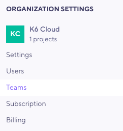
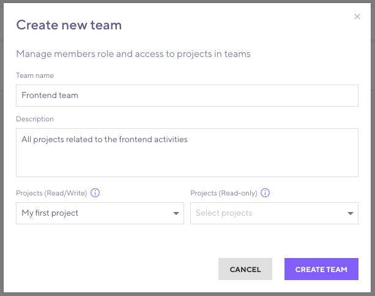

---

title: 'Teams'
excerpt: 'Guide on setting up Teams in k6 Cloud'
---

> ⭐️ Teams are available on Enterprise plans.

## A level between organizations and projects

A _Team_ is an optional organizational level that sits between [Organizations](/cloud/project-and-team-management/organizations) and [Projects](/cloud/project-and-team-management/projects). 

With Teams, you can group the Projects of your Organizations into categories. 
All Team members gain access to the Projects under that Team. The Team can provide varying [Membership](/cloud/project-and-team-management/members) levels to each Project.

Teams help you administrate k6 Organizations with a large number of members and projects.
For example, a "Backend" Team could grant read-write access to all backend-related k6-cloud Projects,
and a "Payment" Team might deal only with Projects for testing payment-related services.
In this case, an Organization admin could add or remove members from these Teams (rather than doing so for each project).

You can mix **Team** membership with **Project** membership.
If the access-level differs, k6 uses the higher membership.
If you leave the Team, your regular Project membership does not change.

<Blockquote mod="note" title="You still must specify the projectID in cloud scripts.">

That team that the project belongs to is never referenced in k6 scripts.
Refer to [Projects](/cloud/project-and-team-management/projects) for examples.

</Blockquote>

## Necessary organization structure and permissions

To add Teams and Team members, you need the following:
- An Organization with [Projects](/cloud/project-and-team-management/projects) and some [Organization Members](/cloud/project-and-team-management).
- **Organization admin** or **Organization read/write** privileges 

## Managing teams

Using the [k6 cloud browser app](https://app.k6.io), you should be able to access _Teams_ view from the left side bar.

### Creating a team

To create a new team:
1. Select the **Create new team** button.
2. Give the team an organization-unique **name**, and assign at least one **project**. You can also add an optional **description**.

Selected **projects** can provide different accesses:

- **Read/Write** access allows Team members to view, create, and edit test runs in the Project. They cannot delete or rename the Project itself.
- **Read-only** access allows Team members to look at test data but not modify or create new test-runs.

### Inviting a team member

Once the Team has been created, select it in your list of Teams and press **Invite members**.
You can invite only existing members of your Organization.
When adding one or more member, consider what Team-level access they should have. Every batch of members you invite will join with the same Team-level role.

- All Team members gain access to all Projects linked to that Team (according to the Project accesses you set up for the Team)
- **Team admins** can modify the Team itself (change name and description) and also invite or remove members from the Team.
- **Team members** are read-only and can't modify the Team itself. They can use the Team only to access its Projects.

<Blockquote mod="attention" title="">

Don't confuse the _Team_ access level with the _Project_ access level granted by the Team!
Most members just need **read only** Team access.

</Blockquote>

### Managing team members

Once members are added, they appear in the list.
Organization admins and Team admins can add or remove members from it.

