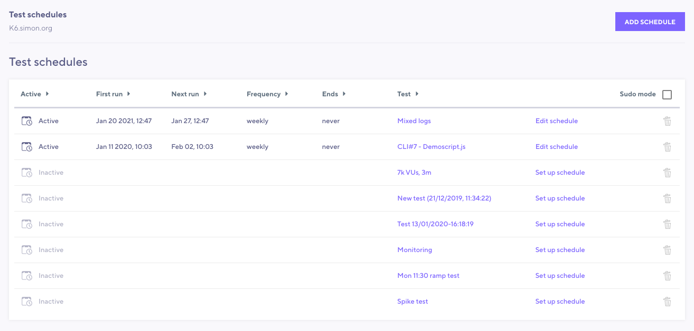
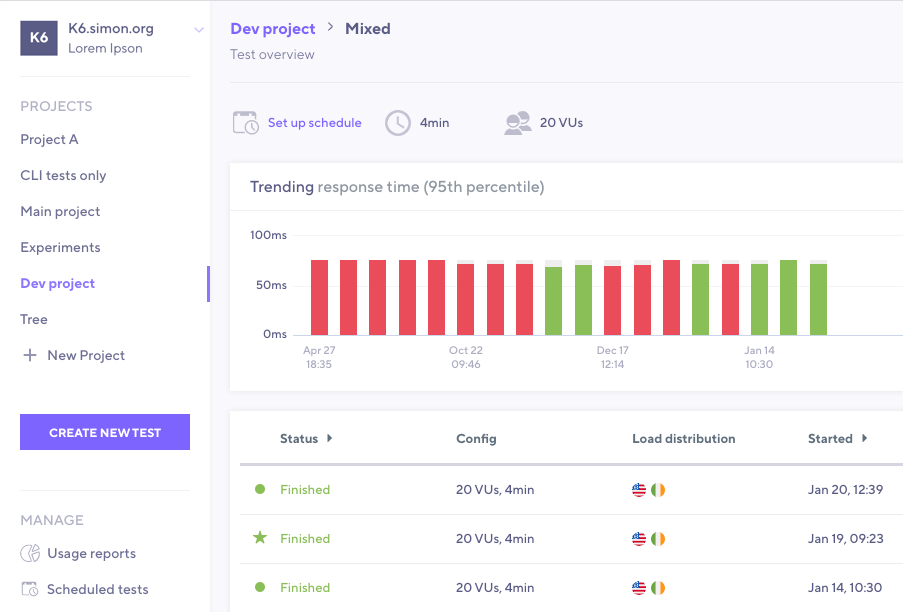

It's not always feasible to trigger a test run when you need it. The scheduling option in k6 Cloud allows you to configure a test to execute at a particular time, and on a regular interval.

Some reasons for using scheduled tests include, but are not limited to:

- You need to test a production system and want to do it during hours with minimal usage
- You want to build a performance trend to monitor for regressions (but you're not ready to integrate it as a step in your CI pipeline)

## Scheduling

You have the ability to schedule any tests that currently exist in your k6 Cloud account that have been executed on our cloud service (you can not schedule a locally run test through the web UI). You can also schedule tests that you create within the web UI after saving your configuration.

Schedules can be set up from two different places:

### 1. Schedules overview page

Located in the left menu under **Manage section** you will find the **Scheduled tests** option.

On this page you can quickly find and edit all test schedules that have been created in your organization. 
You can create a new schedule for any of your projects and cloud tests directly from this page.

Select **Add schedule** on the top right, then follow the steps:

1. Select a project and test.
2. Set a _start date and time_.
3. Should the test repeat to run multiple times?
4. When you are done with the configuration, save the schedule by clicking **Save schedule**. 
   If all went well, you should be seeing your newly created test schedule in the list of schedules.

### 2. Test overview page
To get to a test overview page, select the name of any of your cloud tests.

Here you will find an icon that resembles a calender, next to it a link with the text **Set up schedule**. 
Select **Set up schedule** and you will be presented with the steps to configure your schedule.

<!-- Scheduling is a great tool for re-running  -->

> ⭐ **Pro Tip**
> [trigger a cloud test from the CLI](/cloud/creating-and-running-a-test/cloud-tests-from-the-cli), then set up a schedule from the cloud app to re-run the test on a regular interval.

## Scheduling options

In both cases, you are presented with the following options:

- Ability to run a test **now** or at a **later date**.
- Set the execution to repeat on an **Hourly**, **Daily**, **Weekly**, or **Monthly interval**.
- Control how many times the test will run for, _a set number of occurrences_, _stop after a certain date_. The granularity for controlling this is high, so do explore the options.

Finally: we recommend setting up [notifications](/cloud/manage/notifications) and [thresholds](/using-k6/thresholds) to complete an automated loop. Schedule your test to run and get notified if the test has passed or failed.
