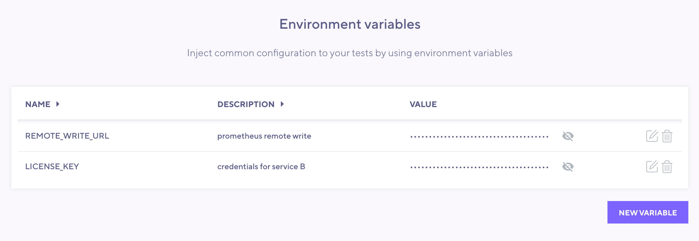
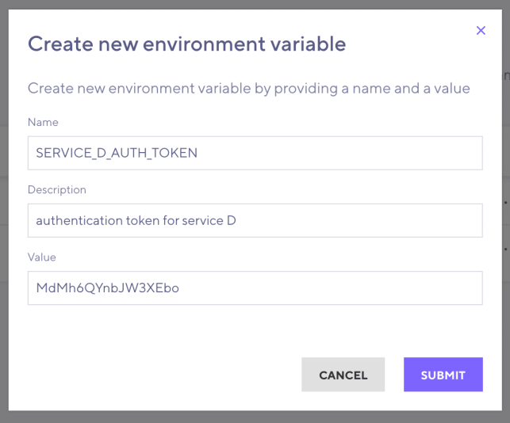

Environment Variables are key-value pairs that you configure at the organization level.
k6 encrypts all values before storing them in our database, and they remain encrypted until needed for a test run.
If you reference a variable in a test script, k6 inserts the value of the variable on the server that runs the test.

You can use Environment Variables to store sensitive (and non-sensitive) information that you want to reference in your test-scripts. Managing environment variables in one central place brings the following benefits:
- Reduced data exposure
- An easier way to re-use and change values across different test scripts.

> Changes to an Environment Variable don't apply to test runs that have already started.

## Manage environment variables

Only owners and admins can create, modify, and delete environment variables.
If you have appropriate permission, you can manage environment variables with these steps:
1. Head to **Organization Settings**.
2. Select your profile icon, then **Manage > Environment variables**.



### Rules for environment variable names

The following restrictions apply to environment variable names:
- Names can contain only alphanumeric characters (`[a-z]`, `[A-Z]`, `[0-9]`) and underscores (`_`). Spaces are not allowed.
- Names must not start with the `K6_CLOUD` prefix.
- Names must not start with a number.
- Names are **case insensitive**.
- Names must be unique.

### Declare a new environment variable

1. Give your Environment Variable a `name`, then enter the respective Value.
2. Optionally, add a brief description.
3. Select **Submit**.



## Access environment variables

If you create an Environment Variable on k6 Cloud, you can reference it in your k6 script through the __ENV variable, as you would with other [k6 Environment Variables](/using-k6/environment-variables/)

```javascript
import http from 'k6/http';
import { sleep } from 'k6';

export default function () {
  const params = {
    headers: { Authorization: __ENV.AUTH_TOKEN },
  };
  const res = http.get(__ENV.SERVICE_URL, params);
  sleep(1);
}
```

<Blockquote mod="warning">
The current environment variables implementation doesn't prevent printing values to the log (or restrict exposing a variable any other way). You should avoid printing sensitive data to the log intentionally.
</Blockquote>

## Order of precedence

When starting tests with `k6 cloud`, environment variables set via CLI flag `--env` and environment variables set in the cloud are combined and used together to run the test. If an environment variable is both set via CLI and declared in the cloud, the value set via the CLI will be applied instead of the value set in the cloud.

<Blockquote mod="warning">
Environment variables set via CLI flag will still be stored in the archive as plain data.
</Blockquote>
