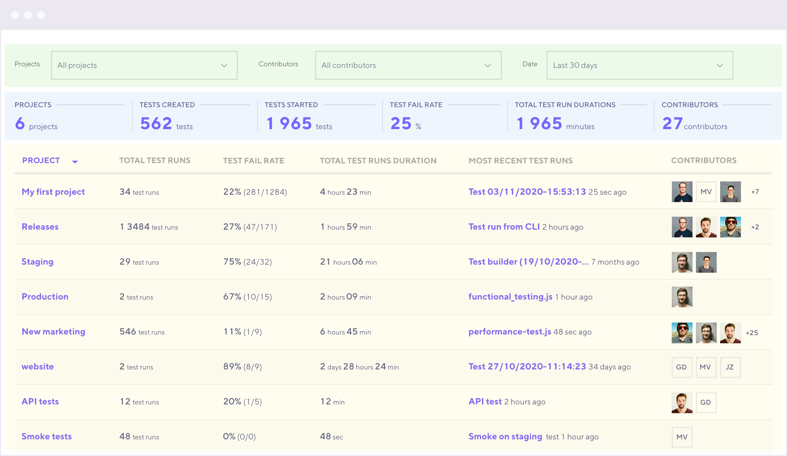

The *Usage report* helps you keep track of everything happening in your team’s project and follow the activity of your performance testing projects.

> ⭐️ Usage reports are available on annual Pro and Enterprise plans.

To view the Usage report, go to  **Manage > Usage reports** section.

## Usage report breakdown

The Usage report has statistics for organization and project statistics.

<dl>
<dt>Section highlighted in green</dt>
<dd>
The filtering section, where you narrow down the result by fields, projects, contributors, and time interval.
</dd>
<dt>Section highlighted in blue</dt>
<dd>
Overview statistics for your organization.
</dd>
<dt>Section highlighted in yellow</dt>
<dd>
 Statistics for each individual project.
</dd>
</dl>

| Column                       | Description                                                                           |
| ---------------------------- | ------------------------------------------------------------------------------------- |
| **Project**                  | The project that the stats are collected from.                      |
| **Total test runs**          | Total count of test runs started.                                                     |
| **Test fail rate**           | The rate of failed tests in the project.  <small>[What is a failed test?](#tests-that-count-as-failed) </small> |
| **Total test runs duration** | Cumulative sum of time spent running tests.                                           |
| **Most recent test run**     | Link to the most recent test run in the project.                                      |
| **Contributors**             | All members that have started tests in the project                                    |

## Tests that count as failed

Tests that meet any of the following criteria contribute to the `Test fail rate`:

- The test was aborted by any of the following statuses: Aborted system, Aborted limit, Aborted user, Aborted threshold or Aborted script error
- The test ran to completion but had failed thresholds (specified by the user).
- The test timed out.

