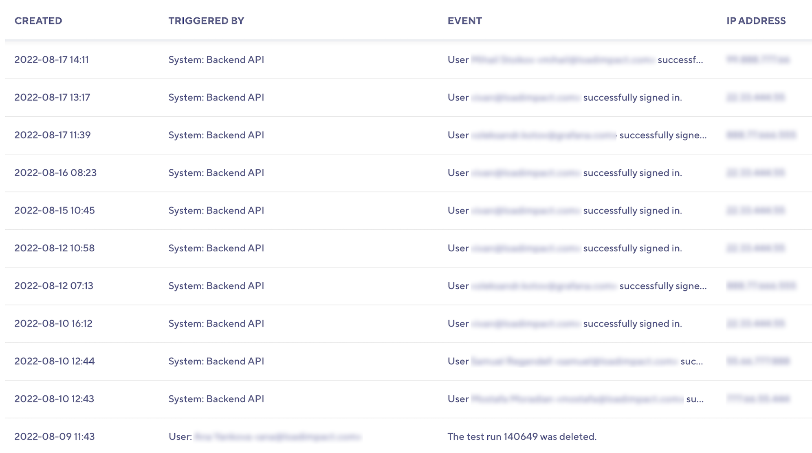

The *Audit Trail* can provide valuable insights into the activity within your organization.

> ⭐️ Audit Trail is available on annual Pro and Enterprise plans.

To view the Audit Trail, go to  **Manage > Audit Trail**.

## A log of system events and activities

An audit trail provides a chronological list of system events and user activities. 
Organization owners can use audit trails to keep an eye on the operations that their users perform and to trace events.

## Reconstructing Events

With the audit trail, you can piece together how a series of events perhaps led to an event.
Use cases include investigating the following:
- How a test was deleted
- How a member lost access to a project,
- How a subscription or billing settings were altered.

## Threat Detection

If you've noticed suspicious activity,
you can use audit logs to rule out the possibility that something or someone gained unauthorized access to your organization.
You can scan the audit trail for abnormalities and even check whether the IP addresses correlate to what you have 
registered for your users.

| Column                        | Description                                   |
| ----------------------------- | --------------------------------------------- |
| **Created**                   | Date and time the event took place            |
| **Triggered by**              | Source of the event                           |
| **Event**                     | Brief summary of the event                    |
| **IP Address**                | The users IP address                          |
