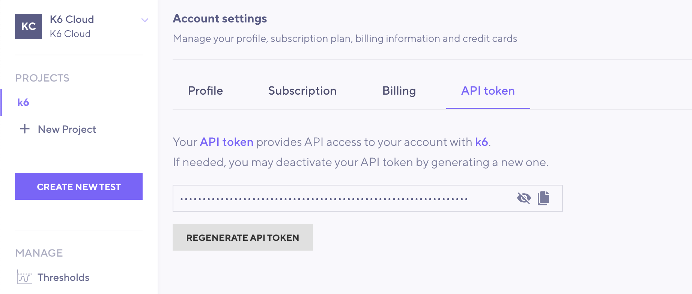
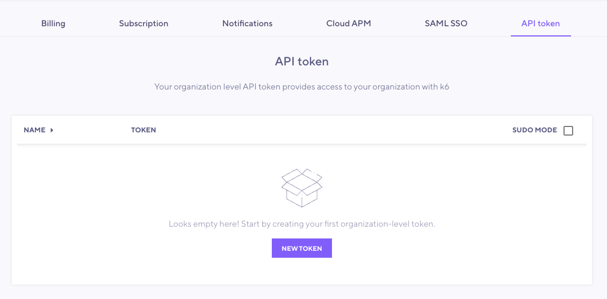

To run [Cloud tests from the CLI](/cloud/creating-and-running-a-test/cloud-tests-from-the-cli/), you need to authenticate your account.
Authentication is required both for tests that run on k6 Cloud and for results that stream to k6 Cloud.
To authenticate accounts, k6 provides an API token, which you can pass on the CLI or through the REST API.

You can generate two types of API tokens for k6 Cloud, depending on how you want to authenticate:
- [Account-level API tokens](#account-api-token) grant access through your account with k6
- [Organization-level API tokens](#organization-api-token) grant organization-wide access for actions not tied to a user.

To generate API tokens, follow these steps.

## Account API token

An account-level API token provides API access to your account with k6.
To generate the token:
1. Select your profile in the top-right icon.
2. Under **Account settings**, select **API token**.
  
  On this page, you can copy, see, and regenerate the token.



## Organization API token

> #### Access to organization settings
>
> Only [organization admins](/cloud/project-and-team-management/members/#admin) can access organization settings.

An organization API token provides organization-wide API access to k6.
You can use it to run tests without linking the run to a specific user, e.g. when running tests from a CI platform.
To generate a token, follow these steps:

1. Select your profile in the top-right icon.
2. Under **Organization settings**, select **API token**.
3. Select **New token**.

   On this page, you can create, see, and regenerate the tokens.

   By default, organizations can create a maximum of 5 tokens.

Note that you must specify the project where the test runs will be created when using an organization API token.

[How to set the `Project ID`](https://k6.io/docs/cloud/creating-and-running-a-test/cloud-tests-from-the-cli/#running-tests-under-a-different-project-than-your-default-one).



## Authenticate with email and password

To forego using a token, you can authenticate with your k6 Cloud email and password credentials.

To do so, enter the following command into your terminal:

<CodeGroup labels={["Authenticate with email/password"]}>

```bash
k6 login cloud
```

</CodeGroup>

This command logs in to your account, fetches or creates your k6 Cloud API authentication token, and saves it to a [k6 configuration file](#using-config-file).

## Authenticating with API token

If you're a Google/GitHub Single Sign-On (SSO) user, or if you have a use case where using your k6 Cloud account credentials is not appropriate, you can choose to enter your k6 Cloud API authentication token directly.

To authenticate with an API token in the CLI, enter the following command:

<CodeGroup labels={["Using API token"]}>

```bash
k6 login cloud --token YOUR_API_AUTH_TOKEN
```

</CodeGroup>

## API Token as an environment variable

You can also authenticate with your k6 Cloud API authentication token via environment variables.
Make sure you have set the `K6_CLOUD_TOKEN` as your k6 Cloud API authentication token, and k6 will pick it up when running.

## Authentication with a config file

You can also directly add your k6 Cloud API authentication token to a configuration file:

<CodeGroup labels={["Linux", "MacOS", "Windows"]} lineNumbers={[true, true, true]}>

```bash
${HOME}/.config/loadimpact/k6/config.json
```

```
${HOME}/Library/Application Support/loadimpact/k6/config.json
```

```bash
C:\Users\&lt;User&gt;\AppData\Roaming\loadimpact\k6\config.json
```

</CodeGroup>

Or, set the config path with the `-c/--config PATH/TO/CONFIG_FILE` CLI flag.

After your token has been added to the config file, it should look something like this (removing any other config options from the file):

<CodeGroup labels={["API token in JSON"]}>

```json
{
    "collectors": {
        "cloud": {
            "token": "YOUR_API_AUTH_TOKEN"
        }
    }
}
```

</CodeGroup>

## Recommended authentication methods for different cases

### Single Sign-On Users

If you use SSO to authenticate through Google and GitHub, here's the recommended approach:

- **Recommended method**  
  Use `k6 login cloud` and log in with either:
    - Your account email and password
    - Your API token
- **How to authenticate**.
  - Create a password using [Forgot Password](https://app.k6.io/account/forgot).
  - [Authenticate with an API token](#authenticating-with-api-token).

### Docker Users

If you're running k6 in a Docker container, here's the recommended approach:

- **Recommended method**.  
  Use the `-c/--config PATH/TO/CONFIG_FILE` CLI flag.

- **Reason for recommendation**.  
  This ensures that the k6 config file where the k6 Cloud API authentication information is stored is persisted via a Docker volume to the host machine.

- **How-to authenticate**. 

  ```bash
  docker run --rm -i -v /path/on-host:/path/in-container/ grafana/k6 \
  login cloud -c /path/in-container/config.json
  ```

### Integrating with CI


If you want to integrate k6 into your CI pipeline, here's the recommended approach:

- **Recommended method**.  
  Two options:
  - Use [organization level API token](#organization-api-token), and passing the token through an environment variable.
  - Use an [account-level API token](#account-api-token) with a user created specifically to run CI tests.
- **Reason for recommendation**.  
  With this method, you can authenticate without exposing your username and password within your CI configuration files or as variables.
- **How-to authenticate.**  
  In this case, the recommended way to pass the token is through an environment variable:

  ```bash
  K6_CLOUD_TOKEN=$TOKEN k6 cloud script.js
  ```

- **Read more**.
  - [Environment Variables](/using-k6/environment-variables/)
  - [Automated performance testing guide](/automated-performance-testing/).

