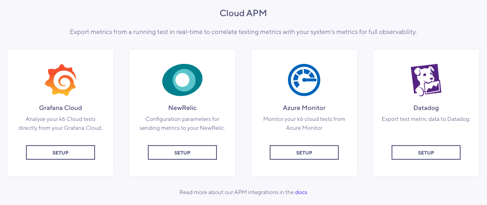
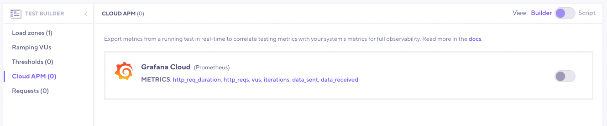

k6 Cloud supports exporting metrics to APM platforms, enabling users to export metrics from a running test to their preferred [APM](https://en.wikipedia.org/wiki/Application_performance_management) platform(s) in near real-time.

> ⭐️ APM integrations are available on Pro and Enterprise plans, as well as on the annual Team plan and Trial.

## Supported APM Providers

As you'll see in each platform's respective section, the `provider` is a key passed to the APM configuration object and its value should match the providers listed below. Also, each platform has a separate set of configuration parameters. Therefore you need to visit your platform's page:

| Provider       | Platform pages                                                                    | Supported Regions                                                                        |
| -------------- | -------------------------------------------------------------------------------- | ---------------------------------------------------------------------------------------- |
| `datadog`      | [DataDog](/cloud/integrations/cloud-apm/datadog)                                 | [DataDog supported regions](/cloud/integrations/cloud-apm/datadog#supported-regions)     |
| `azuremonitor` | [Azure Monitor](/cloud/integrations/cloud-apm/azure-monitor)                     | [Azure supported regions](/cloud/integrations/cloud-apm/azure-monitor#supported-regions) |
| `prometheus`   | [Grafana Cloud](/cloud/integrations/cloud-apm/grafana-cloud)<br/>[New Relic](/cloud/integrations/cloud-apm/new-relic) | Not applicable                                                                           |

This list will be expanded in the future. Please [contact us](https://k6.io/contact) if you would like to see a particular integration.

## Configuration

To increase flexibility, the APM export functionality is configured on the test-run level. You can set up your provider via K6 Cloud app or by specifying required parameters in `options.ext.loadimpact.apm` in your script (See [extension options](/using-k6/options#extension-options) for more information).

### Configuration via K6 Cloud app

Locate the page in the left menu under the **Manage** section.


On this page you will be able to select your platform and enter the configuration parameters. You can find more detailed information about each provider's configuration on it's respective [platform page](/cloud/integrations/cloud-apm/#supported-apm-providers).



After you have set up your provider you will be able to enable it via [Test builder](/test-authoring/test-builder).



### Configuration via script

Common configuration parameters for all providers are as follows:

```javascript
export let options = {
  ext: {
    loadimpact: {
      apm: [
        {
          provider: "<first provider>",
          // provider-specific configurations
          metrics: ["http_req_sending", "my_rate", "my_gauge", ...],
          includeDefaultMetrics: true,
          includeTestRunId: true
        },
        {
          provider: "<second provider>",
          // provider-specific configurations
          metrics: ["http_req_sending", "my_rate", "my_gauge", ...],
          includeDefaultMetrics: true,
          includeTestRunId: true
        },
      ]
    },
  },
};
```

Here's what each key means:

- `provider` is the name of the APM platform.
- `// provider-specific configurations` is the respective configuration parameters for your APM provider, which are listed in their respective platform pages.
- `metrics` is the array of custom metrics you want to export from your test run (optional).
- `includeDefaultMetrics` should be set if you want built-in metrics to be included in your export. Otherwise only the keys in `metrics` will be exported. This is enabled by default, which means the `metrics` key is populated with built-in metrics. Passing custom metrics to the `metrics` key and having `includeDefaultMetrics` key enabled makes the configuration object to combine built-in and custom metrics.
- `includeTestRunId` should be set if you want to have the test run ID as a tag/label in your metrics export. Because it increases the number of metrics recorded by each APM provider, hence increased costs, it is disabled (`false`) by default.

As you see in the configuration object above, there is an array containing two different objects under the `apm` key. This means that you can send metrics to multiple APM providers, provided that you have them enabled in your subscription. Please [contact us](https://k6.io/contact) if you want multiple providers to be able to your test run at the same time.

## Built-in Metrics

The following built-in metrics are enabled by default, and are exported to the APM platform of your choice. They can also be disabled by setting the `includeDefaultMetrics` key to `false`. If you disable default metrics, you will need to specify an array of metrics using the `metrics` key.

- data_sent
- data_received
- http_req_duration
- http_reqs
- iterations
- vus

## Requirements

For the metric export to function properly, you have to fulfill the following:

- If you use custom metrics in your script, remember to add them to the `metrics` array, otherwise, those metrics won't be automatically exported.
- If you want to export built-in metrics that are not listed above, you can include them in the `metrics` array.
- If the APM configuration has errors, (e.g. invalid provider, wrong credentials, etc) the configuration will be ignored, and the test will be executed without the APM functionality.
- If you provide invalid metrics to the `metrics` field, the test will continue, but the metrics export(s) will not include the invalid metric.
- The metrics defined in `metrics` are case-sensitive.
- Each APM provider gives you the ability to filter metrics based on `test_run_id`, but we don't export `test_run_id` as an extra tag by default. If you want to export it, you should set `includeTestRunId` to `true`.

## Limitations

1. APM data export is supported for tests that are up to 1 hour long (3600 seconds plus 30 seconds of `gracefulStop`). Longer tests are currently not supported.
2. The data exported in near real-time may appear incorrect until the test is finished and the 2nd pass export has completed. The Prometheus Remote Write integration doesn't have a 2nd pass export.
3. Duplicate APM configuration parameters of the same provider is not allowed. For example, you cannot export metrics to two Prometheus Remote Write servers at the same time. This also applies to the other providers.
