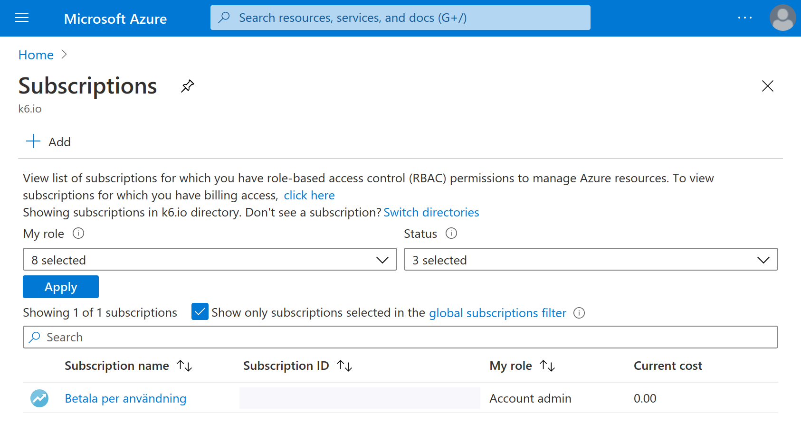
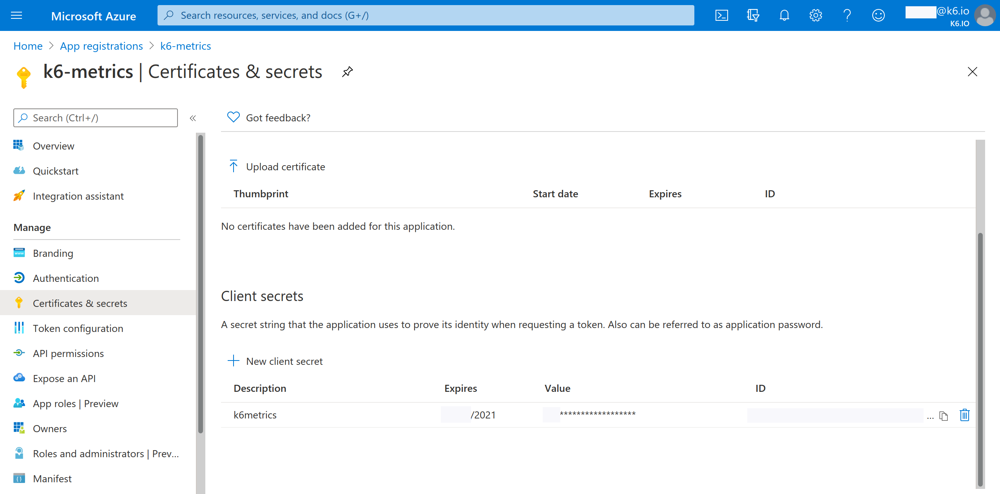
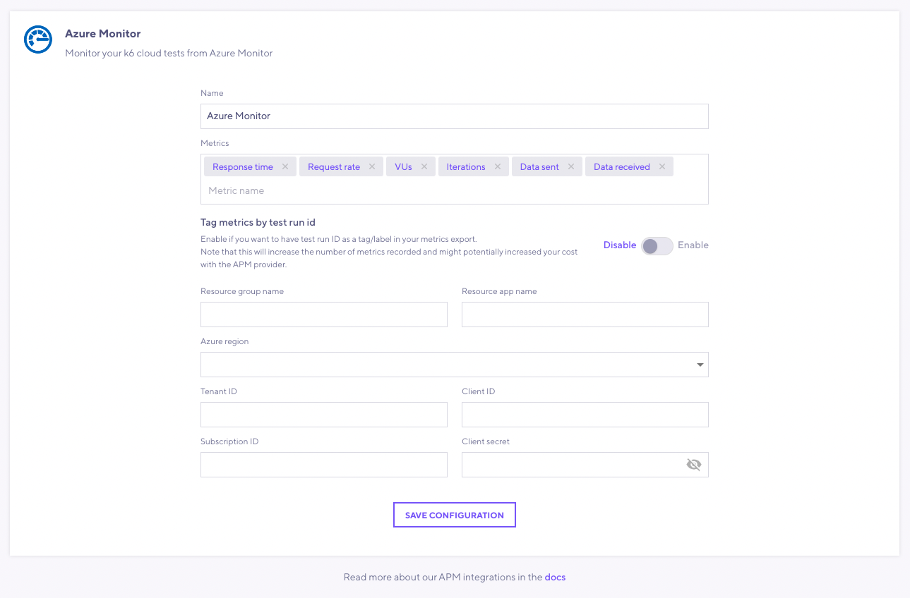
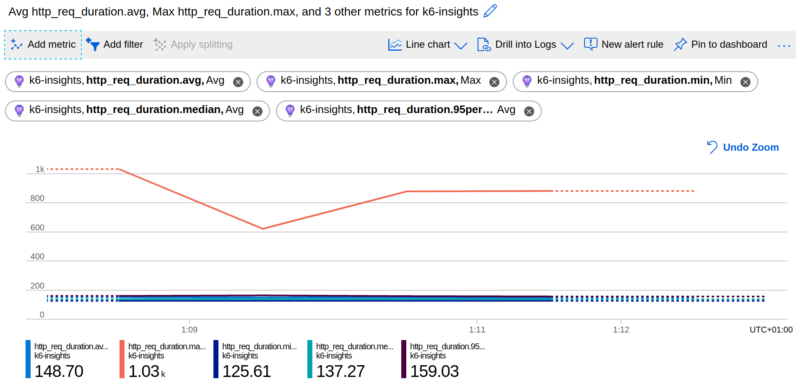

You can export test result metrics from the k6 Cloud to [Azure Monitor](https://azure.microsoft.com/en-us/services/monitor/), using Azure Monitor to store and analyze all your data from your Azure and other environments.

> ⭐️  &nbsp;[Cloud APM](/cloud/integrations/cloud-apm/) integrations are available on Pro and Enterprise plans, as well as the annual Team plan and Trial.

## Azure Monitor Setup

To set up the Azure Monitor integration on the k6 Cloud, you need the following settings:

| Name                    | Description           |
| ----------------------- | ---------------------------------------------- |
| tenantId              | The `tenantId` provided by service principal. The directory (tenant) ID can be extracted from Azure's app registrations.     |
| clientId              | The `clientId` provided by service principal. The application (client) ID can be extracted from Azure's app registrations.     |
| clientSecret          | The `clientSecret` provided by service principal. The client secret can be extracted from the certificates & secrets section of Azure's app registrations.  |
| subscriptionId        | The `subscriptionId` can be viewed in the subscriptions section of Azure portal.                     |
| resourceGroupName     | The `resourceGroupName` can be viewed in the resource groups section of Azure portal. It should match the `subscriptionId`.     |
| insightsAppName       | The `insightsAppName` can be viewed in the application insights section of Azure portal. It should match the `resourceGroupName`. |
| azureRegion           | The `azureRegion` you've created your Azure configurations. See the list of [supported regions](#supported-regions). Default is `eastus`.   |


<br/>
You can follow these instructions to get the required Azure Monitor settings:

1. Make sure you have an active subscription on Azure. Copy the subscription ID for `subscriptionId` setting.

    

2. Create a resource group under your active subscription. Copy the name for the `resourceGroupName` setting.

    

3. Create a service principal by adding a new app to Azure app registrations. Copy the name for the `tenantId` setting. 

    

4. Create a client secret in your service principal. Copy the `clientId` and `clientSecret` settings.

    

5. Go to your resource group and assign "Monitoring Metrics Publisher" role to the user and the service principal.

    

6. Create a log analytics workspace. The region is now created. Copy the region name for the `azureRegion` setting.

    

8. Create an app under application insights with your log analytics workspace. The region should match the log analytics workspace. Copy the app name for the `insightsAppName` setting.

    

## k6 Cloud test configuration

You have to enable the Azure Monitor integration for each test that you want to export its k6 metrics when running the test.

Currently, there are two options to set up the Cloud APM settings in the test:

- [Using the test builder](#configuration-using-the-test-builder)
- [Scripting the k6 test](#configuration-in-the-k6-script)  

### Configuration using the test builder

First, you have to enable the Azure Monitor integration into your organization. Click the `Cloud APM` option on the left sidebar menu under the `Manage` section, and select `Azure Monitor` from the list.



In this form, set the parameters that you copied in the previous steps.  For more information on the other input fields, see [configuration parameters](#configuration-parameters).

Save the Azure Monitor configuration for the current organization. 

Now, you can use the [test builder](/test-authoring/test-builder) to enable the integration for a new or existing test on the organization.


### Configuration in the k6 script

If you script your k6 tests, you can also configure the Cloud APM settings using the `apm` option in the k6 script. 

The parameters to export the k6 metrics to Azure Monitor are as follows:

```javascript
export let options = {
  ext: {
    loadimpact: {
      apm: [
        {
          provider: "azuremonitor",

          tenantId: "<Directory (tenant) ID>",
          clientId: "<Application (client) ID>",
          clientSecret: "<Client secret>",
          subscriptionId: "<Subscription ID>",
          resourceGroupName: "<Resource Group Name>",
          insightsAppName: "<Application Insights Name>",
          // optional
          azureRegion: "<Region>",

          // optional
          metrics: ["http_req_sending", "my_rate", "my_gauge", ...],
          includeDefaultMetrics: true,
          includeTestRunId: false
        },
      ]
    },
  },
};
```

### Configuration Parameters

| Name                    | Description                                                                                                                                                                                |
| ----------------------- | ------------------------------------------------------------------------------------------------------------------------------------------------------------------------------------------ |
| provider<sup>(required)</sup>            | For this integration, the value must be `azuremonitor`.
| remoteWriteURL<sup>(required)</sup>       | URL of the Prometheus remote write endpoint.  <br/> The `prometheus_server` query param must be included. The license key can optionally be included using the `X-License-Key` query param. |
| tenantId<sup>(required)</sup>              | The `tenantId` provided by service principal. The directory (tenant) ID can be extracted from Azure's app registrations.     |
| clientId<sup>(required)</sup>              | The `clientId` provided by service principal. The application (client) ID can be extracted from Azure's app registrations.     |
| clientSecret<sup>(required)</sup>          | The `clientSecret` provided by service principal. The client secret can be extracted from the certificates & secrets section of Azure's app registrations.  |
| subscriptionId<sup>(required)</sup>        | The `subscriptionId` can be viewed in the subscriptions section of Azure portal.                     |
| resourceGroupName<sup>(required)</sup>     | The `resourceGroupName` can be viewed in the resource groups section of Azure portal. It should match the `subscriptionId`.          |
| insightsAppName<sup>(required)</sup>       | The `insightsAppName` can be viewed in the application insights section of Azure portal. It should match the `resourceGroupName`.     |
| azureRegion           | The `azureRegion` you've created your Azure configurations. See the list of [supported regions](#supported-regions). Default is `eastus`.   |
| includeDefaultMetrics | Whether it exports the [default APM metrics](/cloud/integrations/cloud-apm/#default-apm-metrics): `data_sent`, `data_received`, `http_req_duration`, `http_reqs`, `iterations`, and `vus`. Default is `true`. |
| metrics               | List of built-in and custom metrics to export.                            |
| includeTestRunId      | Whether all the exported metrics include a `test_run_id` tag whose value is the k6 Cloud test run id. Default is `false`. <br/> Be aware that enabling this setting might increase the cost of your APM provider. |
| resampleRate          | The rate by which the metrics are resampled and sent to the APM provider in seconds. Default is 3 and acceptable values are integers between 1 and 10. |

### Supported Regions

The supported Azure Monitor regions are:

| Geographic Region    | Supported Azure Region(s)                                                                                                                        |
| -------------------- | ------------------------------------------------------------------------------------------------------------------------------------------------ |
| **Africa**           | `southafricanorth`, `southafricawest`                                                                                                         |
| **America**          | `brazilsouth`, `canadacentral`, `canadaeast`, `centralus`, `eastus` (default), `eastus2`, `northcentralus`, `southcentralus`, `westcentralus`, `westus`, `westus2`                                                                                                          |
| **Asia** | `centralindia`, `eastasia`, `japaneast`, `japanwest`, `koreacentral`, `koreasouth`, `southeastasia`, `southlindia`, `uaecentral`, `uaenorth`, `westindia` |
| **Australia**    | `australiacentral`, `australiacentral2`, `australiaeast`, `australiasoutheast` |
| **Europe**           | `francecentral`, `francesouth`, `northeurope`, `uksouth`, `ukwest`, `westeurope` |


## Run the cloud test

Once you have set up the Azure Monitor settings in the test, you can run a cloud test as usual. The k6 Cloud will continuously export the test results metrics to Azure Monitor during the test execution with a 3~4 minutes delay.

You can now view the k6 metrics on Azure Monitor. Just choose application insights name as scope, k6 as metrics namespace and your metrics (and their associated aggregation methods) will be shown in metric dropdown. If you didn't see the results, try to narrow down the time range to last 30 minutes or less.

  


## See also

- [Cloud APM](/cloud/integrations/cloud-apm/)
