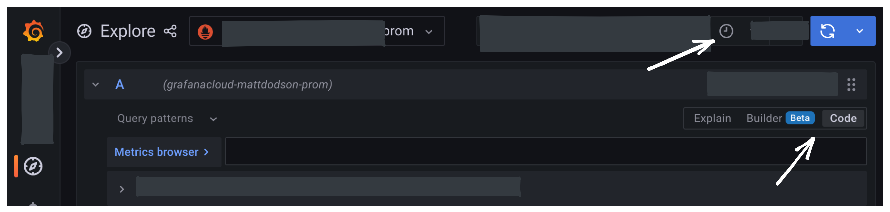

With this integration, you can export test result metrics from the k6 Cloud to a Prometheus instance hosted by [Grafana Cloud](https://grafana.com/products/cloud/).
After that, you can use Grafana to query, visualize, and correlate k6 metrics with all your other metrics.

> ⭐️  &nbsp;[Cloud APM](/cloud/integrations/cloud-apm/) integrations are available on Pro and Enterprise plans, as well as the annual Team plan and Trial.

## Before you start

If you don't have a Grafana Cloud account, [sign up](https://grafana.com/products/cloud/).
The free plan includes 10,000 Prometheus series.

### Necessary values from Grafana Cloud

To export k6 Cloud results to Grafana cloud, you need the following data from your Grafana Cloud Prometheus instance:

- URL
- Username
- Password

To access this information:

1. Log in to Grafana.com and visit the [Cloud Portal](https://grafana.com/docs/grafana-cloud/what-are/cloud-portal/).
1. Select the **Details** button of your Prometheus service.

  

1. Copy the URL of the Remote Write Endpoint and the Username / Instance ID.
1. For the password, create and copy an API key of the `MetricsPublisher` role.

  

Now, you can set the URL, username, and password in k6 Cloud to authorize exporting k6 Cloud metrics to your Prometheus instance.

## Export k6 Cloud results to Grafana Cloud

Now that you have the necessary values from Grafana Cloud settings, you can configure k6 Cloud tests to export.

Currently, there are two options to set up the Cloud APM settings in the test:

- [Using the test builder](#configuration-using-the-test-builder)
- [Scripting the k6 test](#configuration-in-the-k6-script)

### Configuration with the Test Builder

You have to configure the Grafana Cloud integration for an organization.
From the k6 Cloud app, follow these steps.

1. In the main navigation, go to **Manage > Cloud APM**, and select **Grafana Cloud**.
1. In the form, paste the `URL`, `username`, and `password` that you copied previously.

  

  For details, refer to [configuration parameters](#configuration-parameters).

1. Save the Grafana Cloud configuration for the current organization.

Note that configuring the Grafana Cloud settings for an organization does not enable the integration. You must manually enable each test using the [test builder](/test-authoring/test-builder).

1. Create a new test with the Test Builder, or select a test that was previously created with the Test Builder.
1. To enable the integration for the test, select the **Cloud APM** option on the Test&ndash;Builder sidebar.

  

### Configuration in the k6 script

If you script your k6 tests, you can configure the Cloud APM settings using the `apm` option in the k6 script.

The parameters to export k6 metrics to a Grafana Cloud Prometheus instance are as follows:

```javascript
export const options = {
  ext: {
    loadimpact: {
      apm: [
        {
          provider: 'prometheus',
          remoteWriteURL: '<Remote Write URL>',
          credentials: {
            username: '<Prometheus Username / Instance ID>',
            password: '<Grafana Cloud API key of type MetricsPublisher>',
          },
          // optional parameters
          metrics: [
            'vus',
            'http_req_duration',
            'my_rate_metric',
            'my_gauge_metric',
            // create a metric by counting HTTP responses with status 500
            {
              sourceMetric: 'http_reqs{status="500"}',
              targetMetric: 'k6_http_server_errors_count',
            },
          ],
          // for advanced metric configuration see example belod
          includeDefaultMetrics: true,
          includeTestRunId: false,
        },
      ],
    },
  },
};
```

### Configuration parameters

| Name                                | Description                                                                                                                                                                                                                              |
|-------------------------------------|------------------------------------------------------------------------------------------------------------------------------------------------------------------------------------------------------------------------------------------|
| provider<sup>(required)</sup>       | For this integration, the value must be `prometheus`.                                                                                                                                                                                    |
| remoteWriteURL<sup>(required)</sup> | URL of the Prometheus remote write endpoint. <br/> For example: `https://prometheus-us-central1.grafana.net/api/prom/push`.                                                                                                              |
| credentials<sup>(required)</sup>    | The credentials to authenticate with the Grafana Cloud Prometheus instance. The required parameters are: <br/> - username: the Prometheus username or instance ID. <br/> - password: a Grafana Cloud API key of type `MetricsPublisher`. |
| includeDefaultMetrics               | If `true`, add [default APM metrics](/cloud/integrations/cloud-apm/#default-apm-metrics) to export: `data_sent`, `data_received`, `http_req_duration`, `http_reqs`, `iterations`, and `vus`. Default is `true`.                          |
| metrics                             | List of metrics to export. <br/> A subsequent section details how to specify metrics.                                                                                                                                                   |
| includeTestRunId                    | Whether all the exported metrics include a `test_run_id` tag whose value is the k6 Cloud test run id. Default is `false`. <br/> Be aware that enabling this setting might increase the cost of your APM provider.                        |
| resampleRate                        | Sampling period for metrics in seconds. Default is 3 and supported values are integers between 1 and 60.                                                                                                                                 |

#### Metric configuration

Each entry in the `metrics` parameter can be an object with the following keys:

| Name                              | Description                                                                                                                                                                                                                                                                                       |
|-----------------------------------|---------------------------------------------------------------------------------------------------------------------------------------------------------------------------------------------------------------------------------------------------------------------------------------------------|
| sourceMetric<sup>(required)</sup> | Name of k6 builtin or custom metric to export, optionally with tag filters. <br/> Tag filtering follows [Prometheus selector syntax](https://prometheus.io/docs/prometheus/latest/querying/basics/#time-series-selectors),<br/> Example: `http_reqs{name="http://example.com",status!="500"}` |
| targetMetric                      | Name of resulting metric in Grafana/Prometheus. Default is the name of the source metric with the prefix `k6.` <br/> Example: `k6.http_reqs`                                                                                                                                                  |
| keepTags                          | List of tags to preserve when exporting time series.                                                                                                                                                                                                                                              |

<Blockquote mod="warning"
title="keepTags can have a high cost">

Most cloud platforms (including Grafana) charge clients based on the number of time series stored.

When exporting a metric, every combination of kept-tag values becomes a distinct time series in Prometheus.
While this granularity can help test analysis, it will incur high costs with thousands of time series.

For example, if you add `keepTags: ["name"]` on `http_*` metrics, and your load test calls many dynamic URLs, the number of produced time series can build up very quickly.
Refer to [URL Grouping](/using-k6/http-requests#url-grouping) for how to reduce the value count for a `name` tag.

k6 recommends exporting only tags that are necessary and don't have many distinct values.

_Read more_: [Time series dimensions](https://grafana.com/docs/grafana/latest/basics/timeseries-dimensions/) in Grafana documentation.

</Blockquote>


#### Metric configuration detailed example
```javascript
export const options = {
  ext: {
    loadimpact: {
      apm: [
        {
          // ...
          includeDefaultMetrics: false,
          includeTestRunId: true,

          metrics: [
            // keep vus metrics for whole test run
            'vus',
            // total byte count for data sent/received by k6
            'data_sent',
            'data_received',

            // export checks metric, keeping 'check' (name of the check) tag
            {
              sourceMetric: 'checks',
              keepTags: ['check'],
            },

            // export HTTP durations from 'default' scenario,
            // keeping only successful response codes (2xx, 3xx), using regex selector syntax
            {
              sourceMetric: 'http_req_duration{scenario="default",status=~"[23][0-9]{2}"}',
              targetMetric: 'k6_http_request_duration', // name of metric as it appears in Grafana
              keepTags: ['name', 'method', 'status'],
            },

            // count HTTP responses with status 500
            {
              sourceMetric: 'http_reqs{status="500"}',
              targetMetric: 'k6_http_server_errors_count',
              keepTags: ['scenario', 'group', 'name', 'method'],
            },
          ],
        },
      ],
    },
  },
};
```

## Run the cloud test

Once you have set up the Grafana Cloud settings in the test, you can run a cloud test as usual.
k6 Cloud continuously export the test-result metrics to the Prometheus endpoint as the test runs.

To find metrics and test the integration:

1. Open the Grafana UI.
2. In the main navigation, select **Explore**.
3. Make sure to apply a time range that includes when you ran the test.
4. With the query builder, you can find your metrics and add them to your dashboard.

  

  > _On some versions of Grafana, you may have to toggle between code and builder._
  > _Make sure you are in a valid time range, too._

You can now start using all Grafana visualization capabilities for the k6 metrics.
And correlate k6 metrics with other system metrics to get better insights into what happens during your tests.

## Read more

- [Grafana Plugin](/cloud/integrations/grafana-plugin/)
- [Cloud APM](/cloud/integrations/cloud-apm/)

