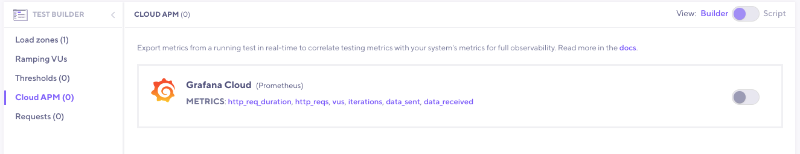

With this integration, you can export test result metrics from the k6 Cloud to a Prometheus instance hosted by [Grafana Cloud](https://grafana.com/products/cloud/), allowing you to use Grafana to query, visualize, and correlate k6 metrics with all your other metrics. 

> ⭐️  &nbsp;[Cloud APM](/cloud/integrations/cloud-apm/) integrations are available on Pro and Enterprise plans, as well as the annual Team plan and Trial.

## Grafana Cloud settings

If you do not have a Grafana Cloud account, you can sign up [here](https://grafana.com/products/cloud/). The free plan includes 10,000 Prometheus series.

To set up the integration on the k6 Cloud, you need the following data from your Grafana Cloud Prometheus instance:

- URL
- Username
- Password

Log in to Grafana.com and visit the [Cloud Portal](https://grafana.com/docs/grafana-cloud/what-are/cloud-portal/). Click on the `Details` button of your Prometheus service.


Copy the URL of the Remote Write Endpoint and the Username / Instance ID. 

For the password, create and copy an API key of `MetricsPublisher` role.


Now, you can set the URL, username, and password on the k6 Cloud to authorize exporting k6 Cloud metrics to your Prometheus instance.

## k6 Cloud configuration

You can configure the Grafana Cloud settings using two options: the [test builder](#configuration-via-test-builder) or [k6 script](#configuration-via-k6-script). 

The settings are configured on the test level; each test needs the Grafana Cloud settings to export the metrics of their test runs.

### Configuration via test builder

First, you have to enable the Grafana Cloud integration into your organization. Click the `Cloud APM` option on the left sidebar menu under the `Manage` section, and select `Grafana Cloud` from the APM list.


In this form, set the URL, username, and password that you copied previously.  For more information on the other input fields, see [configuration parameters](#configuration-parameters).

Save the Grafana Cloud configuration for the current organization. Now, you can use the [test builder](/test-authoring/test-builder) to enable the integration for a new or existing test on the organization.



### Configuration via k6 script

The configuration parameters for sending metrics to Grafana Cloud are as follows:

An example configuration for Grafana Cloud might look like this:

```javascript
export let options = {
  ext: {
    loadimpact: {
      apm: [
        {
          provider: "prometheus",
          remoteWriteURL: "https://prometheus-us-central1.grafana.net/api/prom/push",
          credentials: {
            username: "<Your Metrics instance ID>",
            password: "<Your Grafana.com API Key>"
          },
          metrics: ["http_req_sending", "my_rate", "my_gauge", ...],
          includeDefaultMetrics: true,
          includeTestRunId: false
        },
      ]
    },
  },
};
```

### Configuration parameters

| Name                    | Description                                                                                                                                                                                |
| ----------------------- | ------------------------------------------------------------------------------------------------------------------------------------------------------------------------------------------ |
| `provider`              | Any APM provider name available in the [supported APM provider](/cloud/integrations/cloud-apm#supported-apm-providers)'s table.                                                            |
| `remoteWriteURL`        | The `remoteWriteURL` provided by Grafana Cloud.                                                                                                |
| `credentials`           | The `credentials` provided by Grafana Cloud. The object consists of `username` (metric instance ID) and `password` (Grafana.com API Key) |
| `metrics`               | List of built-in and custom metrics to be exported.                                                                                                                                        |
| `includeDefaultMetrics` | If set, the export will include the default metrics. Default is `true`.                                                                                                                    |
| `includeTestRunId`      | If set, the `test_run_id` will be exported per each metric as an extra tag. Default is `false`.                                                                                            |


## Run the cloud test

  


## See also

- [Grafana Plugin](/cloud/integrations/grafana-plugin/)
- [Cloud APM](/cloud/integrations/cloud-apm/)