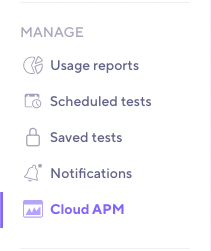

You can set up New Relic integration via [k6 Cloud app](/cloud/integrations/cloud-apm/new-relic#configuration-via-k6-cloud-app) or by specifying [required parameters](/cloud/integrations/cloud-apm/new-relic#configuration-parameters) in `options.ext.loadimpact.apm` in your [script](/cloud/integrations/cloud-apm/new-relic#example-configuration-object).

To get custom metrics from your test runs into New Relic follow the [New Relic Setup](/cloud/integrations/cloud-apm/new-relic#new-relic-setup).

## Configuration via k6 Cloud app

Locate the page in the left menu under the **Manage** section and select **New Relic**.



You will be greeted with the following form. For more information on input fields see [configuration parameters](/cloud/integrations/cloud-apm/new-relic#configuration-parameters).


After you have saved your configuration you will be able to select it in [Test builder](/test-authoring/test-builder).


## Configuration Parameters

The configuration parameters for sending metrics to New Relic are as follows:

| Name                    | Description                                                                                                                                                                                |
| ----------------------- | ------------------------------------------------------------------------------------------------------------------------------------------------------------------------------------------ |
| `provider`              | Any APM provider name available in the [supported APM provider](/cloud/integrations/cloud-apm#supported-apm-providers)'s table.                                                            |
| `remoteWriteURL`        | The `remoteWriteURL` provided by New Relic. The `prometheus_server` parameter should be included in the configuration parameter. The bearer token can be included using the `X-License-Key` parameter. |
| `credentials`           | The `credentials` provided by New Relic. The object consists of `token` property which should be specified with the Bearer token if `X-License-Key` is not specified in `remoteWriteURL` parameter. |
| `metrics`               | List of built-in and custom metrics to be exported.                                                                                                                                        |
| `includeDefaultMetrics` | If set, the export will include the default metrics. Default is `true`.                                                                                                                    |
| `includeTestRunId`      | If set, the `test_run_id` will be exported per each metric as an extra tag. Default is `false`.                                                                                            |

## Example Configuration Object

An example configuration for New Relic might look like this, with `X-License-Key` used as `token` in `credentials` would be:

```javascript
export let options = {
  ext: {
    loadimpact: {
      apm: [
        {
          provider: "prometheus",
          remoteWriteURL: "https://metric-api.newrelic.com/prometheus/v1/write?prometheus_server=<YOUR_DATA_SOURCE_NAME>",
          credentials: {
            token: "<YOUR_LICENSE_KEY>"
          },
          metrics: ["http_req_sending", "my_rate", "my_gauge", ...],
          includeDefaultMetrics: true,
          includeTestRunId: false
        },
      ]
    },
  },
};
```

## New Relic Setup

For sending custom metrics from your test run to New Relic's Prometheus remote write integration, follow the [instructions](https://docs.newrelic.com/docs/integrations/prometheus-integrations/install-configure-remote-write/set-your-prometheus-remote-write-integration/) on their documentation.

The `prometheus_server` parameter should be included in the `remoteWriteURL` configuration parameter. The bearer token can be included either as `credentials.token` (APM configuration parameter) or as part of the `remoteWriteURL` using the `X-License-Key` parameter, as mentioned in their documentation.
