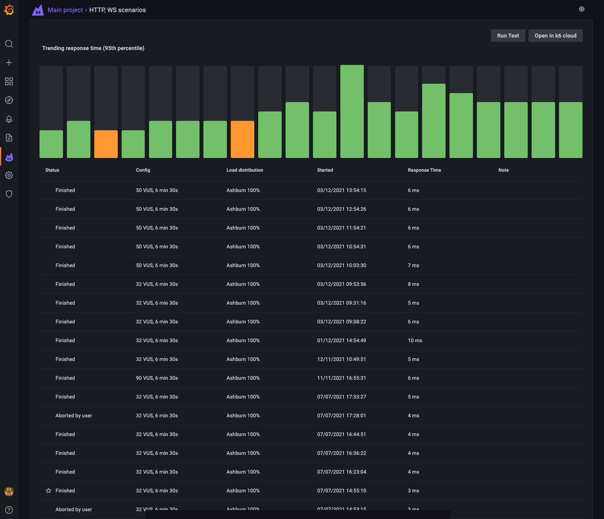

The [k6 Cloud application plugin](https://grafana.com/grafana/plugins/grafana-k6-app/) for [Grafana](https://grafana.com/grafana/) now allows you to:
* manage and visualize cloud tests to make your testing accessible in Grafana
* add k6 visualizations to your existing Grafana dashboards
* correlate testing metrics with other system metrics to detect root causes

## Installing the k6 Cloud app

Installation using Grafana Cloud is done by selecting the 'Install plugin' button on the [k6 Cloud app installation page](https://grafana.com/grafana/plugins/grafana-k6-app/?tab=installation). This will automatically add the plugin to your Grafana instance. For local Grafana instances, follow the [grafana-cli instructions](https://grafana.com/grafana/plugins/grafana-k6-app/?tab=installation).

After the installation, log in to your Grafana instance, and check that the k6 icon appears in the sidebar menu.

You now have to configure the k6 Cloud app data source to use the application. Installed data sources are available from the configuration section in the sidebar menu. Select 'Data sources' and then select the k6 Cloud app data source to go to the configuration page.

The k6 Cloud app needs your API token to connect to your k6 Cloud account. Head over to your [k6 Cloud API token](https://app.k6.io/account/api-token) and copy your API token. Paste the token into the 'API Token' field, select 'Save & test' to check that your token is valid and that you have a connection to the k6 Cloud.

## Navigate cloud tests across various projects

The new k6 Cloud app for Grafana, like the k6 Cloud web app, provides a dashboard including all your tests for a particular project. This view will be familiar for k6 Cloud users. Here, you can select any project and navigate to any test or test runs.

## Re-running cloud tests

The k6 Cloud app for Grafana is not only another visualization interface, but it will also provide additional features to interact with your testing. To begin with, the new application offers the possibility to launch an existing cloud test. Select the `Run test` button to start running the test on the k6 Cloud. You'll be able to visualize the test run immediately on Grafana.

## Enhanced visualizations of k6 results

The k6 results view mirrors its counterpart on the k6 Cloud. In this first version, you'll find an overview of important performance testing metrics and the results of the most relevant k6 reports, such as [HTTP requests](https://k6.io/docs/using-k6/http-requests/), [thresholds](https://k6.io/docs/using-k6/thresholds/), and [checks](https://k6.io/docs/using-k6/checks/).

The k6 Cloud app for Grafana is still in beta. The k6 Cloud will currently support more features than the new app. If you want to visualize your test results on the k6 Cloud, you can select `Open in k6 Cloud` to jump quickly to the same page on the k6 Cloud and explore from there.

## Correlate testing results with other metrics

The k6 Cloud app makes it very easy to add relevant metrics from your test result to a Grafana dashboard. Next to each chart on the test results view, you will find a 'Copy to clipboard' button which lets you simply paste the exact same time series panel into any one of your dashboards! This feature allows you to visualize k6 metrics together with other metrics of your application or systems and bring QA data to any of your existing dashboards.

