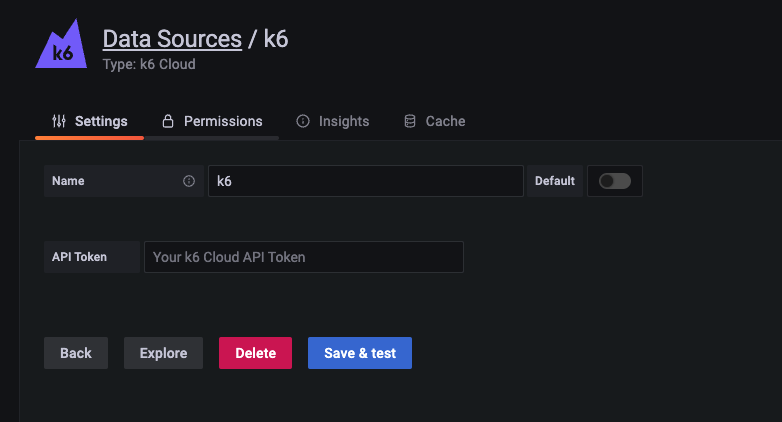

The [k6 Cloud app](https://grafana.com/grafana/plugins/grafana-k6-app/) for [Grafana](https://grafana.com/) simulates the k6 Cloud UI in your dashboard. While Grafana Plugin does not yet support all the features of k6 Cloud we are actively working on reaching feature parity.

Currently supported features:
* manage and visualize your k6 Cloud tests in Grafana.
* add k6 visualizations to your existing Grafana dashboards.
* correlate k6 metrics with other metrics to find root causes quickly.
* create new and update existing tests using the script editor
* use dashboard variables to quickly switch between test runs

## Installing the k6 Cloud plugin

To install the k6 plugin

1. In Grafana Cloud, select the **Install plugin** button on the [k6 Cloud app installation page](https://grafana.com/grafana/plugins/grafana-k6-app/?tab=installation). This automatically adds the plugin to your Grafana stack.

  > For local Grafana instances, follow the [grafana-cli instructions](https://grafana.com/grafana/plugins/grafana-k6-app/?tab=installation).

1. After you install, log in to your Grafana instance, and check that the k6 icon appears in the sidebar menu.

1. To add the k6 Cloud app data source to use the application, select **Data sources** and then **k6 Cloud app data source**.

The k6 Cloud app needs your API token to connect to your k6 Cloud account.

1. Head to your [k6 Cloud API token](https://app.k6.io/account/api-token) and copy your API token.
1. Paste the token into the **API Token** field.
1. Test that your token is valid and connection is up with **Save & test**.

## Navigate cloud tests across various projects

The k6 Cloud app for Grafana, like the k6 Cloud web app, provides a dashboard including all your tests for a particular project.
This view will be familiar for k6 Cloud users.
Here, you can select any project and navigate to any test or test runs.

## Enhanced visualizations of k6 results

The k6 results view mirrors its counterpart on the k6 Cloud.
In this first version, you'll find an overview of important performance testing metrics and the results of the most relevant k6 reports, such as [HTTP requests](https://k6.io/docs/using-k6/http-requests/), [thresholds](https://k6.io/docs/using-k6/thresholds/), and [checks](https://k6.io/docs/using-k6/checks/).

The k6 Cloud app for Grafana is still in beta.
The k6 Cloud currently supports more features than the Grafana app.

If you want to visualize your test results on the k6 Cloud, select **Open in k6 Cloud** to jump quickly to the same page on the k6 Cloud and explore from there.

## Correlate testing results with other metrics

You can copy relevant metrics from your test result to a Grafana dashboard.
This feature allows you to visualize k6 metrics together with other metrics of your application or systems and bring QA data to any of your existing dashboards.
To copy a metric:

1. Next to a chart on the test results view, select  **Copy to clipboard**.
1. Head to a dashboard, and paste same time-series panel in.

## Add dashboard variables to switch between test runs

Dashboard variables are useful when you need to switch between test runs often, without editing panel's query. You can select test run using the dropdown at the top of the dashboard, all your panels which use the variables will update automatically.

To setup open dashboard settings -> variables

1. Add organization variable

2. Add project variable

3. Add test variable

4. Add testrun variable

5. Update panel to use variables

