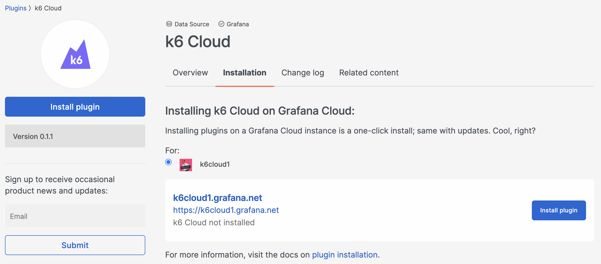
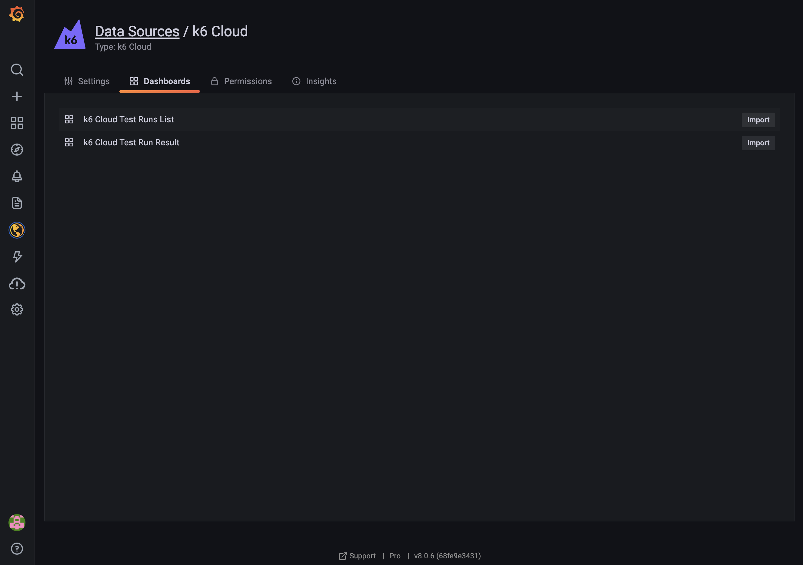
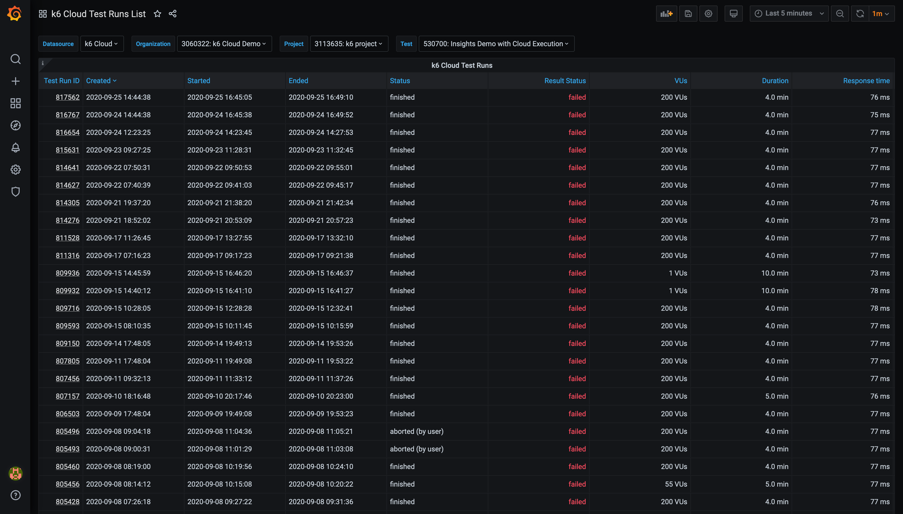

The [k6 Cloud Grafana Data Source Plugin](https://grafana.com/grafana/plugins/grafana-k6cloud-datasource/) allows you to view your test results stored in k6 Cloud in [Grafana](https://grafana.com/grafana/). It recreates dashboards you're already familiar with in k6 Cloud.


The way you install the plugin will vary depending on how you've installed your instance of Grafana. On this page, we'll show you how to install the plugin on a local Grafana instance, Grafana Cloud, and Grafana in a Kubernetes cluster.

## Installing on a local Grafana instance 

First, install the Grafana CLI. [Here are instructions to do that](https://grafana.com/plugins/grafana-k6cloud-datasource/?tab=installation). 

Then, execute the following command:

```bash
grafana-cli plugins install grafana-k6cloud-datasource
```

Restart your Grafana server after installing the plugin.

## Installing on Grafana Cloud

If you do not have a [Grafana Cloud](https://grafana.com/cloud) account, you can sign up for free [here](https://grafana.com/cloud/grafana).

Click on the `Install plugin` button on the [k6 Cloud Data Source page on Grafana.com](https://grafana.com/plugins/grafana-k6cloud-datasource/?tab=installation). 



## Installing on Grafana in Kubernetes

The easiest way to install a plugin on Grafana in a Kubernetes cluster is to use the Helm Package Manager. You can [install Helm here](https://helm.sh/docs/intro/install/).

Create a file called `values.yaml` and copy the following into it:
```yaml
## Pass the plugins you want installed as a list.
##
plugins: 
  - grafana-k6cloud-datasource
```

If you want to configure other settings at this point, you can use [this sample values.yaml file](https://github.com/grafana/helm-charts/blob/main/charts/grafana/values.yaml) as a guide. When you're done, save the file locally.

Add the Grafana Helm Charts repo to Helm:

```bash
helm repo add grafana https://grafana.github.io/helm-charts
```

Now, install Grafana, using the `values.yaml` file that you created earlier:

```bash
helm install -f values.yaml grafana grafana/grafana
```

## Configure the data source 

To access your k6 Cloud test results, you need to configure your [k6 Cloud Token](/cloud/integrations/token) on the k6 Cloud Grafana data source. 

From the Grafana UI, access the `Data sources` page (Settings > Data sources), search for the k6 Cloud Grafana data source, and select it.

Copy your [k6 Cloud Token](https://app.k6.io/account/token) and paste it into the API Token field. Click the `Save & Test` button to verify that your token is valid and that the data source can connect to k6 Cloud.


## Import the k6 Cloud dashboards 

The k6 Cloud data source includes two dashboards. Import both from the Dashboards tab.



## Visualize the k6 Cloud test results 

You can now select a k6 dashboard to find a test across all your k6 projects and visualize the test results in Grafana.

The k6 Cloud Test Runs List dashboard displays all tests executed on k6 Cloud. Choose the appropriate values in the Organization, Project, and Test dropdown menus to find the tests you're looking for.



The k6 Cloud Test Run Result dashboard displays metrics for the selected test. You can get to this dashboard by selecting it in Dashboards > Home within the Grafana UI or by clicking on a test from the k6 Cloud Test Runs List dashboard. You can also select the right test by choosing different options from the Organization, Project, Test, and Test Run dropdown menus.


