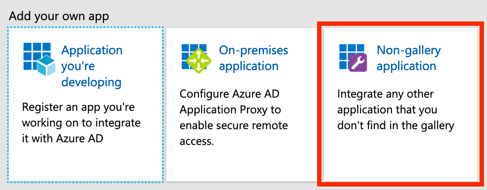

> <b>This feature requires the SAML SSO addon or an Enterprise plan</b> 
> To setup SAML SSO based authentication to k6 Cloud you must have a Team plan or above and the SAML SSO addon, alternatively be on an Enterprise plan. You must also have an Azure AD Premium Subscription.

## Configuration

1. Navigate to [https://portal.azure.com/](https://portal.azure.com/).
  

2. Log in to Azure and go to **"Azure Active Directory"** tab.
  

3. Select the **"Enterprise applications"** service.
  

4. Click on the **"New application"** button.
  

5. Select **"Non-gallery application"**.

    
  

6. Give the application a name, eg. **k6 Cloud**.
  

7. Click **"Add"**.
  

8. When your application has successfully been added, click **"Set up single sign on"** (or the equivalent "Single sign-on" link in the left menu):

    
  

9. Click **"SAML"** to enable it:

    
  

10. Edit **"Basic SAML Configuration"**:

    

    Setting:

    | Property                                   | Value                               |
    | ------------------------------------------ | ----------------------------------- |
    | Identifier (Entity ID)                     | `https://api.k6.io/sso/acs/`        |
    | Reply URL (Assertion Consumer Service URL) | `https://api.k6.io/sso/acs/`        |
    | Logout Url                                 | `https://api.k6.io/account/logout/` |

    Resulting in:

    
  

11. Edit **"User Attributes & Claims"**:

    

    Setting the following user attributes (and clearing the "Namespace" property for each attribute):

    | Attribute                | Value                                                                     |
    | -------------------------| ------------------------------------------------------------------------- |
    | `Unique User Identifier` | `user.userprincipalname`                                                  |
    | `user.email`             | `user.userprincipalname`                                                  |
    | `user.username`          | `user.userprincipalname`                                                  |
    | `user.first_name`        | `user.givenname`                                                          |
    | `user.last_name`         | `user.surname`                                                            |
    | `token`                  | An unique token that you'll be provided with by the k6 Cloud support team. |

    Resulting in:

    
  

12. Copy the "App Federation Metadata Url" and send it to k6 Cloud support for completion of the setup.

    
