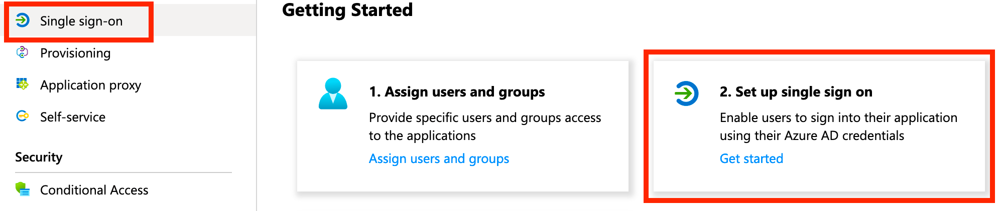
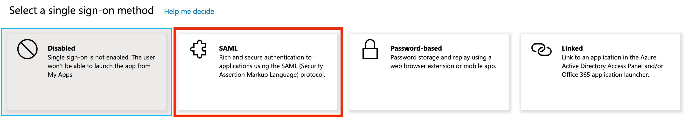

## Background

Federated authentication is a must to virtually all organizations beyond a certain size. Microsoft's Active Directory product has been a long time gold standard for managing an enterprise's users and their access permissions, and Azure Active Directory is its direct cloud counterpart. k6 Cloud intergrates with Azure AD to provide organizations with a compliant way to handle on- and offboarding of team members to the service.

## What is SAML?

Security Assertion Markup Language (SAML) is an open standard for exchanging authentication and authorization data between parties, in particular, between an Identity Provider (eg. Azure AD) and a Service Provider (eg. k6 Cloud). SAML is an XML-based markup language for security assertions (statements that service providers use to make access-control decisions).

Read more over at [Wikipedia](https://en.wikipedia.org/wiki/Security_Assertion_Markup_Language).

## Prerequisites

To setup Azure AD SAML SSO based authentication to k6 Cloud you must have:

1. A [Team plan](/pricing) or above and the SAML SSO addon, alternatively be on an Enterprise plan.
2. An [Azure AD Premium Subscription](https://azure.microsoft.com/en-us/pricing/details/active-directory/).

## Configuration

1. Navigate to [https://portal.azure.com/](https://portal.azure.com/).
  

2. Log in to Azure and go to **"Azure Active Directory"** tab.
  

3. Select the **"Enterprise applications"** service.
  

4. Click on the **"New application"** button.
  

5. Select **"Non-gallery application"**.

    
  

6. Give the application a name, eg. **k6 Cloud**.
  

7. Click **"Add"**.
  

8. When your application has successfully been added, click **"Set up single sign on"** (or the equivalent "Single sign-on" link in the left menu):

    
  

9. Click **"SAML"** to enable it:

    
  

10. Edit **"Basic SAML Configuration"**:

    

    Setting:

    | Property                                   | Value                               |
    | ------------------------------------------ | ----------------------------------- |
    | Identifier (Entity ID)                     | `https://api.k6.io/sso/acs/`        |
    | Reply URL (Assertion Consumer Service URL) | `https://api.k6.io/sso/acs/`        |
    | Logout Url                                 | `https://app.k6.io/account/logout` |

    Resulting in:

    
  

11. Edit **"User Attributes & Claims"**:

    

    Setting the following user attributes (and clearing the "Namespace" property for each attribute):

    | Attribute                | Value                                                                     |
    | -------------------------| ------------------------------------------------------------------------- |
    | `Unique User Identifier` | `user.userprincipalname`                                                  |
    | `user.email`             | `user.userprincipalname`                                                  |
    | `user.username`          | `user.userprincipalname`                                                  |
    | `user.first_name`        | `user.givenname`                                                          |
    | `user.last_name`         | `user.surname`                                                            |
    | `token`                  | An unique token that you'll be provided with by the k6 Cloud support team. |

    Resulting in:

    
  

12. Copy the "App Federation Metadata Url" and send it to k6 Cloud support for completion of the setup.

    
  

13. Before moving to the final step of testing the integration, make sure you've added the appropriate users and groups to the application in Azure AD:

    
  

14. Once you've gotten confirmation from k6 Cloud support that your account is ready we advise you to test the integration by clicking the "Test" button in Azure AD:

    

## Setting up access to projects

With a completed integration between k6 Cloud and Azure AD your team members can Single Sign On to k6 Cloud via the Azure Portal. The next step is to setup project access permissions for team members in k6 Cloud, this doesn't happen automatically as part of account provisioning.

The steps to do this is as follows:

1. Team members need to SSO into k6 Cloud first for account provisioning to happen.
2. See our docs on [adding team members](/cloud/project-and-team-management/team-members#adding-team-members) for more information on how to setup access permissions to projects for team members.

Note: You must not invite team members through the k6 Cloud web app. Rather, as stated in 1) above, _team members must SSO into k6 Cloud for account provisioning to happen_.
