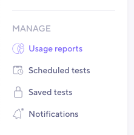

## Background

## Usage reports UI

The usage reports page can be found in the left menu under the **Manage** section.

On this page you will be presented with both organization and project statistics, lets break down what we are looking at.

**Section highlighted in green** 
This is the filtering section, here is where you narrow down the result by fields `projects`, `contributors` and `time interval`.

**Section highlighted in blue** 
This section presents overview statistics for your organization.

**Section highlighted in yellow** 
Here are statistics for each individual project.

| Column                       | Description                                                                                     |
| ---------------------------- | ----------------------------------------------------------------------------------------------- |
| **Project**                  | The project for which the stats to the right are collected from.                                |
| **Total test runs**          | Total count of test runs started.                                                               |
| **Test fail rate**           | The rate of failed tests in the project.  <small>*What does failed test mean?</small> |
| **Total test runs duration** | Cumulative sum of time spent running tests.                                                     |
| **Most recent test run**     | Link to the most recent test run in the project.                                                |
| **Contributors**             | All members that have either created or started tests in the project                            |
> \***How do I know which tests add to the fail rate statistic?**
> - Test was aborted by any of the following statuses (Aborted by system, Aborted by limit, Aborted by threshold, Aborted by timeout)
> - The test ran to completion but there were failing thresholds (specified by the user). [Read how to add thresholds to your tests]().

