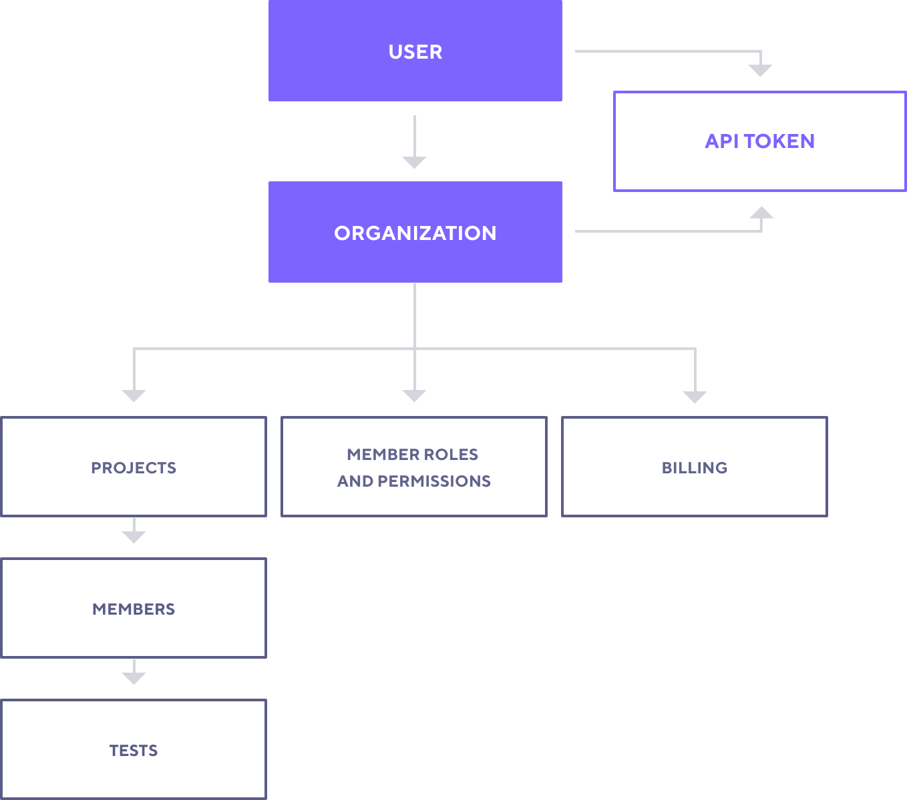

> **Running tests in another Organization**
> 
> If you have been invited to another organization as a Team Member, you must specify a projectID in `ext.loadimpact.projectID` in order to use that organization's subscription to run your test.

## Background

Organizations are a hierarchical tier within k6. Organizations are owned by a single user (the account owner).

## Using Organizations

By default, all users have one Organization within their k6 account, this is automatically created and assigned during account registration. If you purchase a subscription, it is associated with the organization. As an organization owner, you may invite [Project Members](/cloud/project-and-team-management/project-members) as either Admins or Project Members. These users will be able to utilize the subscription and access projects in the organization.

If you have been invited to another user's Organization, you will have access based on the role the owner assigned to you (Admin or Project Member). You may utilize the subscription associated with that Organization.

> #### Note on Organizations
>
> Most users will only require 1 organization for their subscription. Some larger companies may wish to use multiple organizations to manage multiple unique subscriptions.

## Hierarchy Diagram

Please refer to the following diagram to visualize the relationship of different aspects of the web application

