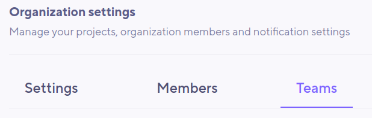
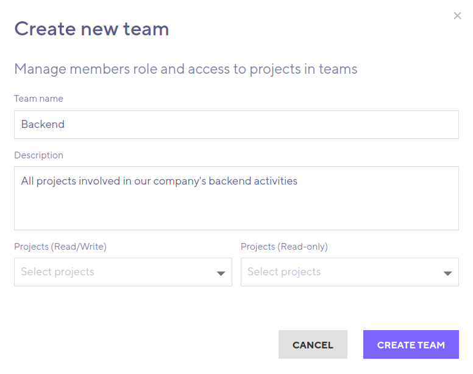
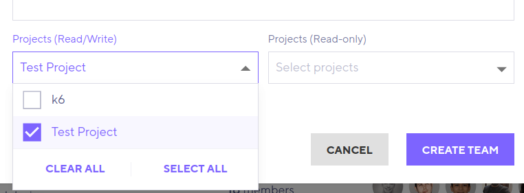
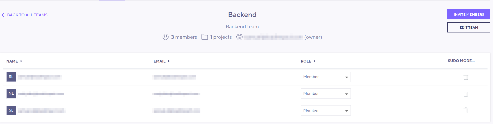

---

title: 'Teams'
excerpt: 'Guide on setting up Teams in k6 Cloud'
---

> ⭐️ Teams are available on Enterprise plans.

## What are Teams?

Teams are an an optional unit of structure between [Organizations](/cloud/project-and-team-management/organizations) and [Projects](/cloud/project-and-team-management/projects). With Teams, you can group the Projects of your Organizations into categories. All Team members gain access to the Projects under that Team. The Team can provide varying [Membership](/cloud/project-and-team-management/members) levels to each Project.

Using Teams can help when administrating k6 Organizations with a large number of members and projects. For example, you could have a "backend" Team that grants read-write access to all backend-related k6-cloud Projects. The Organization-admin can add/remove a member from the Team rather than having to do so for every related Project. 

Team-membership can be mixed with regular, "direct", Project-membership. If access-level differs, you'll use the higher of the two. If you leave the Team, your regular Project-membership will not be affected. 

> Note that when you want to run k6 scrips in the cloud, it's still the [ProjectID](/cloud/project-and-team-management/projects#running-cli-tests-in-a-specific-project) of the Project you need to specify. The Team granting that project membership is never referenced in scripts.

## Using Teams from the UI

To add Teams and Team members via the app, your Organization must first have some [Projects](/cloud/project-and-team-management/projects) and some [Organization Members](/cloud/project-and-team-management). You need **Organization admin**- or **Organization read/write** privileges to add new Teams. 

If your subscription supports Teams, you should be able to access _Teams_ from the left side bar or from the organization settings in the [k6 cloud browser app](https://app.k6.io).

---

A Team must have an organization-unique **name**. You can also add an optional **description**. 

Using the drop downs, add Projects to the Team based on the [Membership level](/cloud/project-and-team-management/members) that should be granted on this Project by the Team. As a reminder, 
- **Project Read/Write** access means Team members will be able to look at, create and edit test-runs in the Project. They will not be able to delete or rename the Project itself.
- **Project Read-only** access allows Team members to look at test data but not modify or create new test-runs.

Once the Team has been created, select it in your list of teams and press _Invite Members_. Only existing members of your Organization can be invited. When adding one or more member, consider what Team-level access they should have. Every batch of members you invite will join with the same Team-level role.

- All Team members gain access to all Projects linked to that Team (according to the Project accesses you set up for the Team)
- **Team Admins** (and the Team **owner**) can modify the Team itself (change name and description) as well as invite/remove members from the Team. 
- **Team members** are read-only and can't modify the Team itself. They only makes use of the Team to access Projects.

> Don't confuse the _Team_ access level with the _Project_ access level granted by the Team!
 Most members just need **read only** Team access.

Once members are added, they appear in the list and Organization admins and Team admins for that Team will be able to add/remove members from it.

