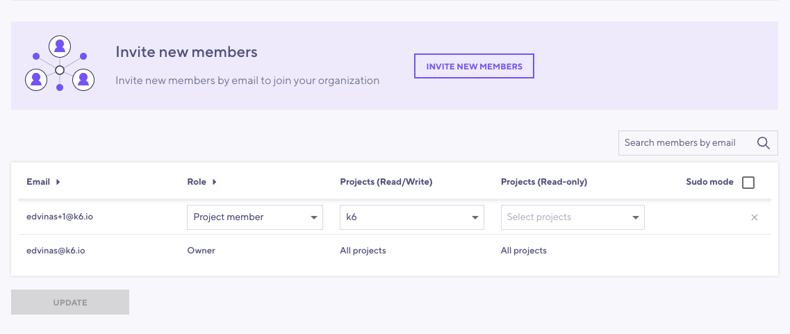
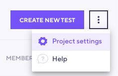
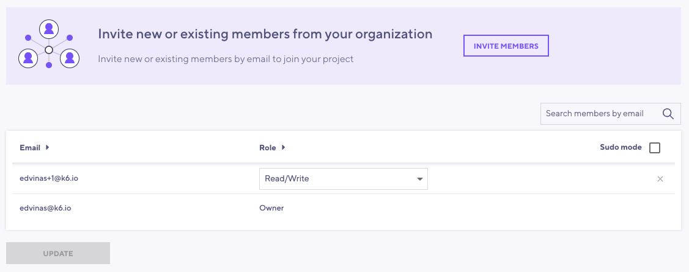

User membership is handled at the organization level. You can invite users with different roles to gain access to the organization or selected projects within the organization.

## Roles

The following roles are supported:

- [Owner](#owner)
- [Admin](#admin)
- [Project member](#project-member): Read/Write or Read-Only.

### Owner

The organization's owner has unrestricted access to the organization data, settings and all its projects and member roles. The owner can pass ownership to another member by using the _Transfer ownership_ link from the organization settings.

### Admin

Admin users can see and edit all projects under the organization, manage members and change the majority of an organization's settings except for its name, subscriptions and billing information. Admins can assign/remove other admins but not change the owner.

### Project member

This role is suitable for cases when you don't want to grant the ability to edit organization or project settings. You can choose what kind of access type you want to grant to your selected projects - Read/Write or Read-Only.

<h4 id="readwrite">Read/Write</h4>

Gives a project member the ability to create, edit, run and schedule tests in a particular project.

<h4 id="read-only">Read-Only</h4>

Lets a project member view only tests and test runs in a particular project. They cannot modify them in any way.

> ⚠️ &nbsp; If you only have access to run tests in a specific project, don't forget to specify its projectID when running a cloud test from the k6 CLI. Read more [here](/cloud/project-and-team-management/projects/#running-cli-tests-in-a-specific-project).

## Managing members

There's two places in the k6 Cloud app where you can manage members - [Members settings](/cloud/project-and-team-management/members/#members-settings) under the **Organization settings** or through [Project settings](/cloud/project-and-team-management/members/#project-settings).

### Members settings

To locate **Members settings** click on **Members** link under the **Organization Settings** sub-menu in the top left corner.

Under the **Members settings** you can invite new members to projects under your organization, change access levels or delete currently existing members.

Click on the `Invite new members` button to invite new members to the organization.

In this modal, you can invite new team members:
- Entering one or multiple email addresses (supports a comma-separated list).
- Selecting the organization role: [Admin](#admin) or [Project member](#project-member).
- For `Project members`, selecting their projects and the project role: [Read/Write](#readwrite) or [Read-Only](#read-only).

### Project settings

To locate this view click on the **Project settings** link located in the project dashboard near the `Create new test` button.

In the **Project settings** view you can invite new members, change access levels or delete currently existing members from your selected project.

Click on the `Invite members` button to invite members to the current project

In this modal, you can: 
- Select existing organization members.
- Enter one or multiple email addresses (supports a comma-separated list) to invite new members.
- Select the member role in the selected project: [Read/Write](#readwrite) or [Read-Only](#read-only).