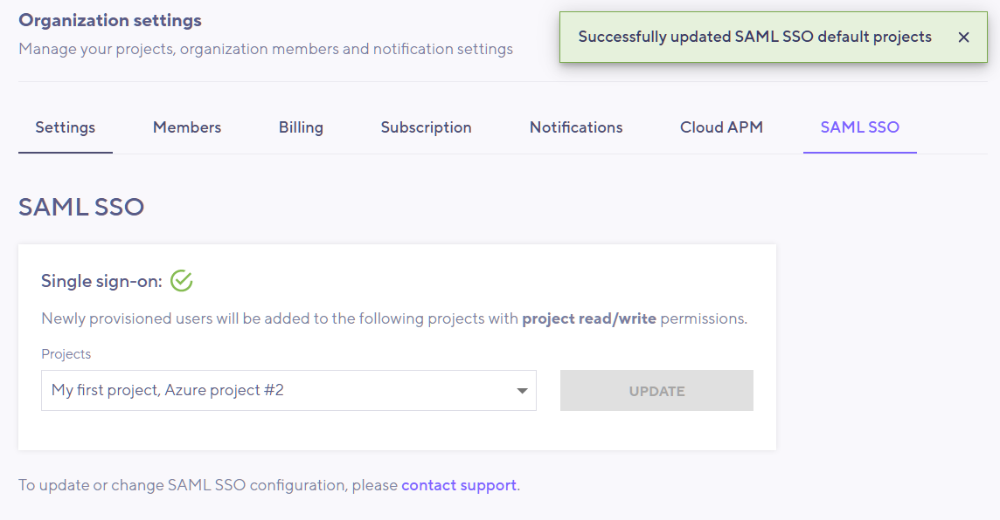

> ⭐️ SAML SSO is available on Enterprise plans.

## What is SAML?

Security Assertion Markup Language (SAML) is an open standard for exchanging authentication and authorization data between parties, in particular, between an Identity Provider (e.g. Azure AD) and a Service Provider (i.e. k6 Cloud). The SAML SSO eases provisioning, management and access of users from a single identity provider, e.g. Okta, Azure AD or others, to multiple service providers.

k6 Cloud makes use of SAML single sign-on (SSO) to facilitate provisioning of new users into the app and later giving them access to various organization(s) and projects, and in turn load tests and test runs.

> __Note__
>
> The SAML 2.0 standard allows k6 Cloud to work practically with any SAML 2.0 identity provider, not just the ones documented here.

Read more over at Wikipedia about [Security Assertion Markup Language](https://en.wikipedia.org/wiki/Security_Assertion_Markup_Language) and [SAML 2.0](https://en.wikipedia.org/wiki/SAML_2.0).

## IdP and SP setup and user provisioning

To setup SAML SSO for your organization, some requirements should be satisfied and some steps should be taken on your IdP and on k6 Cloud. Assuming you already have admin access to your IdP and the k6 Cloud, this is the usual process checklist to enable SAML SSO for your organization on k6 Cloud:

1. Install or setup the SAML SSO application on your IdP.
2. Provide the "IdP Metadata URL" to the customer success team.
3. Update the application on the IdP with the provided token from the customer success team.
4. Optionally request to enforce SAML SSO on all existing and new users. This effectively disables username/password authentication for all users, even the owner.
5. Assign users to the IdP application.
6. Optionally choose default projects for newly provisioned users to land in on k6 Cloud.
7. Users can now be provisioned to k6 Cloud web app once they have access to and click on the application icon on their IdP dashboard.
8. Once the user is provisioned (created and joined to the correct organization/project on k6 Cloud), they can use both IdP- and SP-initiated to sign in. This means that in addition to the clicking on the k6 Cloud application on their IdP dashboard, the user can also use SAML SSO button available on the k6 Cloud web app.

> ⚠️ __Invite users via k6 Cloud web app doesn't work with SAML SSO__
>
> Once SAML SSO is enabled on the k6 Cloud for your organization, you must not invite team members through the k6 Cloud web app, rather they should use these following methods to be provisioned and to sign in:
> 
> - Username/password and SAML SSO (mixed): 
>   This is limited to the owner and the users created in advance via invitation with username/password.
> - SAML SSO: 
>   All new users should be solely created via SAML SSO provisioning.
>
> 💡 __What is SAML SSO provisioning?__
> 
> SAML SSO provisioning is the first time a user signs in to k6 Cloud web app via SAML SSO from their IdP dashboard. This process causes the user to be created, joined to its organization and assigned to the default project(s). After this process the user can use IdP- and SP-initiated SAML SSO.

## Supported IdPs

Currently the following IdPs are supported and setup instructions for each of them are provided on their own page.

* [Azure Active Directory](/cloud/project-and-team-management/saml-sso/azure-ad)
* [Okta](/cloud/project-and-team-management/saml-sso/okta)

## Assigning default project(s) to newly provisioned users

When new users are provisioned into k6 Cloud, they are automatically joined to your organization and will be assigned the default project of your organization, usually called "My first project". However, you can change these default settings and choose which projects to assign to newly provisioned users.

It is recommended to update the list of projects as early as possible in the setup process before any new users are provisioned, so that you can have pre-defined projects assigned to the users. Please note that this feature doesn't work retroactively, that is, already existing (provisioned) users on k6 Cloud won't be affected by this change.

Follow these steps to update list of default projects for new users:

1. Make sure you correctly setup the SAML organization with the help of the customer success team. You can use your admin account to test the setup.
2. Go to your organization setting and choose the SAML SSO tab:

As you can see below, the default project is already selected:

3. From the drop-down you can choose the default project(s) newly provisioned users will be assigned, then click on update button:

4. Now the users assigned to the IdP application can sign in to k6 Cloud and they'll be automatically added to the specified project(s) in step 3 with __project read/write__ permissions.
